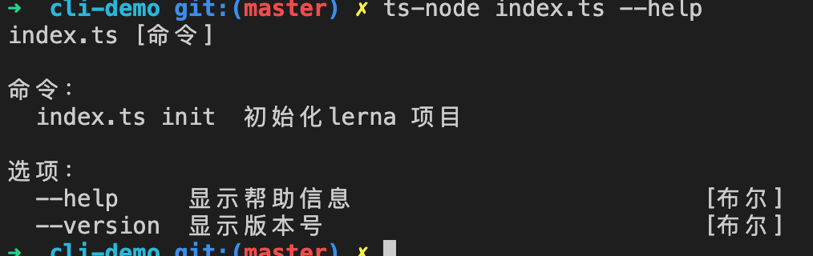
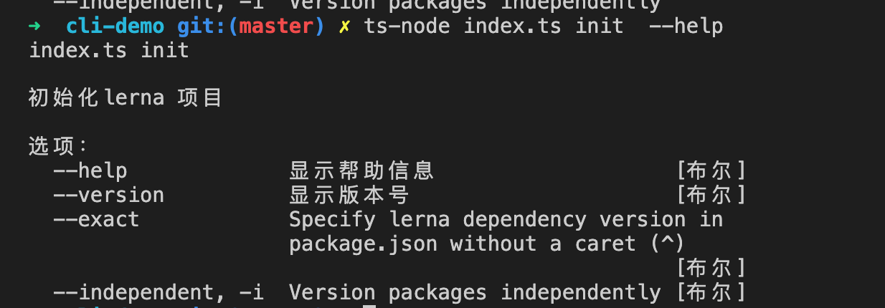
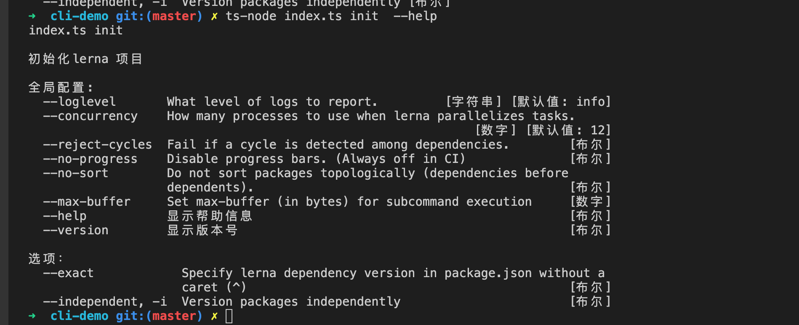

本文主要讲述如何从零编写一个cli

写cli的第一步就是处理参数解析，一般有如下几种库
* yargs
* commander
* minimist
综合比较下来`yargs`对于处理复杂的cli应用更为方便，且typescript的支持更为友好。`commander`则对新人较为友好，而minimist主要专注于参数解析，没有提供额外的功能。

首先需要定义如下几个概念
* command
* positional
* options
考察如下的命令
```ts
$ btx run -p @btx/cra -r build 
```
其中
* command: run
* options: -p @btx/cra 和 -r
* positional: build

下面我们通过一步步实现lerna的cli功能来展示yargs的功能，我们把我们的程序叫做lerna-lite
### command
首先是最起初的command支持,即支持`lerna init`命令
```ts
import yargs from 'yargs'
yargs.command({
  command: 'init',
  describe: '初始化lerna 应用',
  handler(){
    console.log('init lerna')
  }
}).argv
```
效果如下



### options
接下来再带上些参数
```ts
yargs.command({
  command: 'init',
  describe: '初始化lerna 项目',
  builder(yargs) {
    return yargs.options({
      exact: {
        describe: "Specify lerna dependency version in package.json without a caret (^)",
        type: "boolean",
      },
      independent: {
        describe: "Version packages independently",
        alias: "i",
        type: "boolean",
      },
    })
  },
  handler() {
    console.log('init lerna')
  }
}).help().version().argv
```
通过command的builder选项，我们可以为我们的指令配置options，options里可以包含如下的一些配置
```ts
{
  describe: // 选项说明
  alias: // 选项缩写
  type: // 选项的类型，包括 boolean | string | number | array | count 等
  default: // 默认值
  hidden: // 是否展示该选项
  requiresArg: // 要求该选项必须显示的指定值
}
```
最后的效果如下

我们发现存在一个问题就是init命令的选项和help和version搞在了一起，难以分清哪些是init特有的选项，我们可以通过group将其进行分组,我们将globalOptions的选项全部移到globalOptions.ts里,然后通过group将选项拆分
```ts
// globalOptions.ts
export function globalOptions(){
  return yargs.options(opts).group(globalKeys, '全局配置:').options("ci", {
    hidden: true,
    type: "boolean"
  })
}
```
最后效果如下

可以清楚的看到全局配置和局部配置分离,我们可以进一步的丰富处理的体验
```ts
globalOptions(yargs)
.usage("Usage: $0 <command> [options]") // 使用方式提示
.demandCommand(1, "A command is required, Pass -help to see all available commands and options") // 要求必须包含command， lerna-lite 会报错，必须是lerna-lite xxx这种才能正常
.recommendCommands() // 当我们输错命令的时候，会根据我们输错的单词，提示最接近的正确指令
.strict() // 不允许输入没有配置的options
.help()
.version()
.command(initCommand()).argv
```

