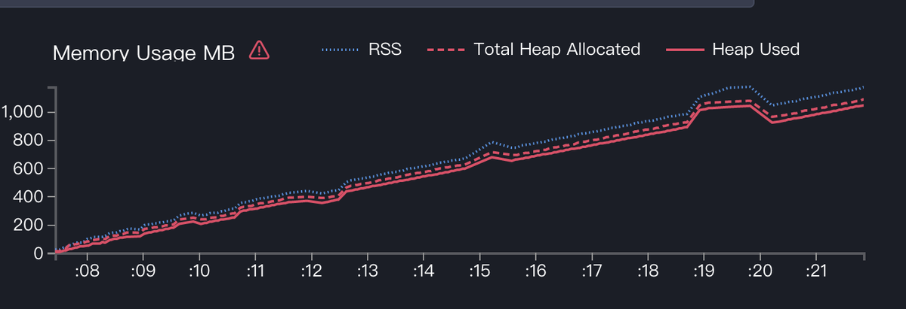
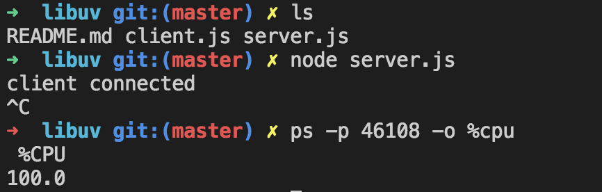

### 常见的线上问题：

1. 504 超时了
2. 500 internal server error
3. 内存泄漏
4. cpu 上涨但还能继续服务
5. cpu 上涨到 100%且拒绝服务
6. 压测 qps 太低，高延迟、低吞吐

### 线上调试困难原因

1. 难以复现
2. 生产环境和本地环境不同，难以进行线下调试
3. 尽早修复线上，保留现场调试

## 调试工具
node.js 调试工具的发展


https://github.com/nodejs/diagnostics

调试工具主要分为四类

- [Tracing](https://github.com/nodejs/diagnostics/blob/master/tracing)
- [Profiling](https://github.com/nodejs/diagnostics/blob/master/profiling)
- [Heap and Memory Analysis](https://github.com/nodejs/diagnostics/blob/master/heap-memory)
- [Step Debugging](https://github.com/nodejs/diagnostics/blob/master/debugging)

Tracing
### AsyncHooks:
对于同步调用可以轻松的获取调用栈
```ts
    function a(){
      b()
    }
    function b(){
      c()
    }
    function c(){
      console.log(new Error().stack)
    }
    a()
```
打印结果如下
```ts
    Error
        at c (/Users/yj/projects/node-debug/examples/async_hooks/app_sync.js:8:15)
        at b (/Users/yj/projects/node-debug/examples/async_hooks/app_sync.js:5:3)
        at a (/Users/yj/projects/node-debug/examples/async_hooks/app_sync.js:2:3)
        at Object.<anonymous> (/Users/yj/projects/node-debug/examples/async_hooks/app_sync.js:12:1)
        at Module._compile (internal/modules/cjs/loader.js:689:30)
        at Object.Module._extensions..js (internal/modules/cjs/loader.js:700:10)
        at Module.load (internal/modules/cjs/loader.js:599:32)
        at tryModuleLoad (internal/modules/cjs/loader.js:538:12)
        at Function.Module._load (internal/modules/cjs/loader.js:530:3)
        at Function.Module.runMain (internal/modules/cjs/loader.js:742:12)
```
可以看出 a -> b -> c 的调用链，利于问题的排查，但是对于异步调用却很难获取调用链，如下面的代码
```ts
    function a(){
      setTimeout(crash,1000);
    }
    function b(){
      setTimeout(crash, 1000);
    }
    function crash () {
      console.log(new Error().stack)
    }

    a()
```
调用结果为
```ts
    Error
        at Timeout.crash [as _onTimeout] (/Users/yj/projects/node-debug/examples/async_hooks/app.js:9:15)
        at ontimeout (timers.js:436:11)
        at tryOnTimeout (timers.js:300:5)
        at listOnTimeout (timers.js:263:5)
        at Timer.processTimers (timers.js:223:10)
```
我们看不出来是 a 还是 b 调用了 crash 函数，对于复杂的应用，没有调用链将导致问题很难排查，借助于 async hooks 我们可以获取异步调用的调用链，甚至可以进一步的获取每个异步请求的调用时间，便于排查问题。
```ts
    const hooks = require('async_hooks')
    const stacks = []

    hooks
      .createHook({
        // save the stack when we do something async
        init: (id, type, trigger) => (stacks[id] = new Error('hooks get error stack').stack)
      })
      .enable()

    function a(){
      setTimeout(crash,1000);
    }
    function b(){
      setTimeout(crash, 1000);
    }

    function crash() {
        console.log(stacks[hooks.executionAsyncId()])
        throw new Error('an async error')
    }

    a()
```
调用结果为
```ts
    Error: hooks get error stack
        at AsyncHook.init (/Users/yj/projects/node-debug/examples/async_hooks/app_with_async_hooks.js:7:48)
        at emitInitNative (internal/async_hooks.js:137:43)
        at emitInitScript (internal/async_hooks.js:336:3)
        at initAsyncResource (internal/timers.js:50:5)
        at new Timeout (internal/timers.js:82:3)
        at setTimeout (timers.js:414:19)
        at a (/Users/yj/projects/node-debug/examples/async_hooks/app_with_async_hooks.js:12:3)
        at Object.<anonymous> (/Users/yj/projects/node-debug/examples/async_hooks/app_with_async_hooks.js:23:1)
        at Module._compile (internal/modules/cjs/loader.js:689:30)
        at Object.Module._extensions..js (internal/modules/cjs/loader.js:700:10)
    /Users/yj/projects/node-debug/examples/async_hooks/app_with_async_hooks.js:20
        throw new Error('an async error')
        ^

    Error: an async error
        at Timeout.crash [as _onTimeout] (/Users/yj/projects/node-debug/examples/async_hooks/app_with_async_hooks.js:20:11)
        at ontimeout (timers.js:436:11)
        at tryOnTimeout (timers.js:300:5)
        at listOnTimeout (timers.js:263:5)
        at Timer.processTimers (timers.js:223:10)
```
我们根据上述日志，可以从`hooks get error stack`里看出是 a 调用了 crash。node-clinic bubbleprof 正是利用了 async_hooks 实现了异步请求的调用链查询。

> node 12 已经开始支持`[--async-stack-traces](https://v8.dev/blog/fast-async#improved-developer-experience)`这个特性，原生的可以追踪异步调用栈了

### Dtrace
Dtrace 原理是系统|框架|业务通过 probe 提供打点信息，Dtrace 使用 D 脚本对这些打点信息进行统计处理，进而获取整个系统的性能状况。Dtrace 在操作系统、Node.js、web 框架和业务层等层面都有这不错的支持。

- 操作系统原生提供的 probe,可使用[dtrace toolkits](http://www.brendangregg.com/dtrace.html)统计系统相关的信息如 memory allocation, syscalls 等。
- node.js 也提供了一些 probe 可使用[nhttpsnoop](https://github.com/joyent/nhttpsnoop)统计 node.js 相关的信息如 http req/res, gc 等。
- web 框架如[restify](https://github.com/restify/node-restify)也提供了 probe 如 router-start,router-done,handler-start,handler-done 等用于分析 router 和 handler 的执行时间
- 日志也可以提供 probe:如 [node-bunyan](https://github.com/trentm/node-bunyan) 通过 dtrace 来查看日志
- 业务代码可以使用[dtrace-provider](https://github.com/chrisa/node-dtrace-provider):来自行生成 probe

下面以 dtrace-provider 为例，来介绍如何在业务层使用 dtrace 进行性能分析
app.js
```ts
    var data = {
      name: 'Dave',
      url: 'http://www.daveeddy.com',
      favoritebands: [
        'The Reign of Kindo',
        'As I Lay Dying',
        'Between the Buried and me'
      ]
    };

    ////////////////////////////////////////////
    // dtrace setup
    var provider = 'node-json';
    var dtp = require('dtrace-provider').createDTraceProvider(provider);
    dtp.addProbe('stringify-entry');
    dtp.addProbe('stringify-return');
    dtp.addProbe('parse-entry');
    dtp.addProbe('parse-return');

    function noop() { return []; }

    // override stringify
    var stringify = JSON.stringify.bind(JSON);
    JSON.stringify = function() {
      dtp.fire('stringify-entry', noop);
      var r = stringify.apply(JSON, arguments);
      dtp.fire('stringify-return', noop);
      return r;
    };

    // override parse
    var parse = JSON.parse.bind(JSON);
    JSON.parse = function() {
      dtp.fire('parse-entry', noop);
      var r = parse.apply(JSON, arguments);
      dtp.fire('parse-return', noop);
      return r;
    };

    dtp.enable();
    /////////////////////////////////////////////
    // usage

    var interval = 5;
    console.log('repeating every %d seconds, provider = %s, pid = %d',
        interval,
        provider,
        process.pid);

    function go() {
      console.log('tick');
      var s = JSON.stringify(data);
      var d = JSON.parse(s);
    }
    setInterval(go, interval * 1000);
    go();
```

我们在代码里通过 dtrace-provider 提供了一些 probe，包括 parse-entry,parse-return,stringify-entry,stringify-return。
接下来就可以通过这些 probe 结合 dtrace 脚本统计出每次 JSON.stringify 和 JSON.parser 的性能数据了

json-latency.d
```ts
    #!/usr/sbin/dtrace -s
    /* print something for every probe */
    node-json*::: {}

    node-json*:::parse-entry
    {
            self->parse = timestamp;
    }
    node-json*:::parse-return
    /self->parse/
    {
            this->delta = timestamp - self->parse;
            printf("JSON.parse() took %dns\n", this->delta);
            self->parse = 0;
    }

    node-json*:::stringify-entry
    {
            self->stringify = timestamp;
    }
    node-json*:::stringify-return
    /self->stringify/
    {
            this->delta = timestamp - self->stringify;
            printf("JSON.stringify() took %dns\n", this->delta);
            self->stringify = 0;
    }
```
运行 app.js 和 json-latency.d
```sh
    $ node app.js
    $ sudo ./json-latency.d
```
执行结果如下
```shell
    ➜  json-timing git:(master) ✗ sudo ./json-latency.d
    Password:
    dtrace: script './json-latency.d' matched 8 probes
    CPU     ID                    FUNCTION:NAME
      3   6276  stringify-entry:stringify-entry
      1   6277 stringify-return:stringify-return
      1   6277 stringify-return:stringify-return JSON.stringify() took 68818ns

      1   6278          parse-entry:parse-entry
      1   6279        parse-return:parse-return
      1   6279        parse-return:parse-return JSON.parse() took 27875ns

      2   6276  stringify-entry:stringify-entry
      2   6277 stringify-return:stringify-return
      2   6277 stringify-return:stringify-return JSON.stringify() took 29855ns

      2   6278          parse-entry:parse-entry
      2   6279        parse-return:parse-return
      2   6279        parse-return:parse-return JSON.parse() took 30796ns

      2   6276  stringify-entry:stringify-entry
      2   6277 stringify-return:stringify-return
      2   6277 stringify-return:stringify-return JSON.stringify() took 22408ns

      2   6278          parse-entry:parse-entry
      2   6279        parse-return:parse-return
      2   6279        parse-return:parse-return JSON.parse() took 32430ns
```
我们可以精确的看出每次 JSON.stringify 和 JSON.parse 的结果。通过 Dtrace 可以进一步的生成进程运行时的火焰图。

> 在 Mac osx sierra 版本后，默认开启了 SIP 权限，导致默认情况下 Dtrace 不可用，需要手动关闭 SIP 权限的限制才可以使用 Dtrace。

v8 trace_events
可用于追踪 v8 的 gc log，async_hooks 等信息，详细见[https://nodejs.org/api/tracing.html](https://nodejs.org/api/tracing.html)
Profiling
当程序出现性能瓶颈或者出现异常时，我们除了根据源码去推测可能的性能瓶颈之外，通过测试工具直观的展现程序的性能瓶颈就更好了，下面介绍一些进行性能分析的工具。
火焰图(cpu 性能分析）
火焰图是由 linux 性能优化大师 Bredan Gregg 发明的，通过火焰图我们可以直观的看出哪些函数可能存在性能瓶颈。
\*\*


1. X 轴不表示时间刻度，而表示时间长度，也就是占用的 CPU 时间；
2. Y 轴从上到下，越接近底部表示越接近系统的底层，对于 Node.js 来说，上层是 js 代码，下层是 C 代码；
3. 每一层上，每个条幅越宽，表示它在整个运行周期中，占用的 CPU 越多；
4. 点击任何一个条幅，图像会自动将它置于最底部，同时只留下它之上的条幅，并且放大至全图；

**一般来说，你只需要注意标示出你程序相关的最宽条幅即可，因为往往它就是程序中存在的瓶颈。**
有多个可以生成火焰图的工具，例如

- node-clinic flame
- dtrace + stackvis
- perf + flamegraph
- 0x

下面我们通过 0x 来展示如何使用火焰图来分析性能瓶颈
app.js
```ts
    "use strict";

    const restify = require("restify");
    const server = restify.createServer();

    function sleepA(ms) {
      const future = Date.now() + ms;
      while (Date.now() < future);
    }
    function sleepB(ms) {
      const future = Date.now() + ms;
      while (Date.now() < future);
    }
    function a() {
      for (let i = 0; i < 1e8; i++) {}
    }
    function b() {
      for (let i = 0; i < 1e5; i++) {}
    }

    server.get("/", function handle(req, res, next) {
      sleepA(30);
      a();
      b();
      sleepB(60);
      res.send({});
      next();
    });

    server.listen(3000, () => {
      console.log("listen at: http://127.0.0.1:3000/");
    });

    process.on("SIGINT", function() {
      console.error("Caught SIGINT, shutting down.");
      server.close();
    });
```
​

运行 0x 和 autocannon 进行压测生成火焰图
```shell

    NODE_ENV=production 0x -P 'autocannon http://localhost:3000/' ./app.js
```
autocannon 会为我们自动生成服务器的 latency 和 qps 指标
\*\*


根据上图可以看出 pct99 的 latency 为 1191ms，而 qps 只有 10 左右
同时其生成火焰图如下
\*\*


根据火焰图可以看出 sleepA 占据了 32.6%的 cpu 时间，而 sleepB 占据了 65.1%的 cpu 时间，这也符合两者 1:2 的比例，这两个函数是整个系统的性能瓶颈。
我们试着优化 sleepB 函数，将其改成异步的形式
```ts
    "use strict";
    const restify = require("restify");
    const server = restify.createServer();
    function sleep(ms){
      return new Promise((resolve) => {
        setTimeout(resolve,ms);
      })
    }
    async function sleepA(ms) {
      const future = Date.now() + ms;
      while (Date.now() < future);
    }
    async function sleepB(ms) {
      return sleep(ms);
    }
    server.get("/", async function handle(req, res, next) {
      await sleepA(30);
      a();
      b();
      await sleepB(60);
      res.send({});
      next();
    });
```
看看此时的 qps 和 latency 指标
\*\*


和火焰图
\*\*


我们可以看到 qps 已经增加到 30 左右，latency 也减小到 300ms 左右，97%的 cpu 时间都花在了 sleepA 上，进一步的将 sleepA 也异步化，得到新的指标和火焰图
\*\*


此时的 qps 已经上涨到了 100 左右，latency 也减小到了 100ms，性能瓶颈也变成了 b 函数（占了 11%的 cpu），通过这样反复的优化和调试，我们可以实现程序的最终优化。
v8-profiler
除了使用火焰图进行性能瓶颈分析，由于 node.js 使用的是 v8 引擎，v8 也暴露了一些 profiler 的 API，我们可以通过[v8-profiler](https://github.com/node-inspector/v8-profiler)(由于 node8 以上不支持 v8-profiler,需要换成[v8-profiler-node8](https://www.npmjs.com/package/v8-profiler-node8))模块，进行性能分析，而且不同于 0x 只能适用于开发情况下的调试，v8-profiler 可以支持生产环境下实时生成 profiler 数据以供分析。下面介绍如何使用 v8-profiler 分析 cpu 的情况。
```ts
    const fs = require("fs");
    const crypto = require("crypto");
    const app = require("express")();
    const Bluebird = require("bluebird");
    const profiler = require("v8-profiler-node8");
    app.get("/encrypt", (req, res, next) => {
      const password = req.query.password || "test";
      const salt = crypto.randomBytes(128).toString("base64");
      const encryptedPassword = crypto
        .pbkdf2Sync(password, salt, 10000, 64, "sha512")
        .toString("hex");
      res.end(encryptedPassword);
    });
    app.get("/cpu_profile", async (req, res, next) => {
      profiler.startProfiling("CPU profile");
      await Bluebird.delay(30000);
      const profile = profiler.stopProfiling();
      profile
        .export()
        .pipe(fs.createWriteStream(`cpuprofile-${Date.now()}.cpuprofile`))
        .on("finish", () => profile.delete());
      res.end("ok");
    });

    app.listen(3000, () => {
      console.log("listen at: http://127.0.0.1:3000");
    });
```
进行性能压测生成 profile 文件
```ts
    $ node app.js
    $ curl localhost:3000/cpu_profiler 触发profile
    $ ab -c 20 -n 20000 "http://localhost:3000/encrypt?password=123456" // 立即使用ab进行压测
```
会生成`cpuprofile-1549972461693.cpuprofile`文件，使用 chrome devtools 的`javascript profiler`查看该 profiler 文件结果如下。


从上述 profiler 文件可以看出 pbkd2sync 扎拒了 96.37%的 cpu 时间，明显是性能瓶颈。这样就可以在线上就行 profiler 了
v8-profiler 主要存在如下两个问题：

- 由于 v8-profiler 只支持 JS API 的形式触发 profile，一旦 event_loop 进入死循环状态（或者 js 持续运算状态），这将导致无法通过路由触发 profiler。我们需要其他方案来获取来进行 profile。
- v8-profiler 只能对 v8 进行 profile，无法分析其他 node 依赖的代码如 libuv。

perf-profile
v8-profiler 只能对 v8 的代码进行 profile，而有时候性能瓶颈并不在 v8 上如（libuv 里），这时我们需要借助其他工具进行 profile。

- Dtrace，Mac，Solaris 和 IllumOS，Linux4.9 上可用，Dtrace 除了可以用于进行 tracing 也可以用来进行对程序进行 profile
- Perf： Perf 是 Linux 系统上常用的性能观测工具，perf 可以执行静态和动态跟踪（基于 tracepoint、kprobe 和 uprobe）和 profiling。

下面我们通过 perf 来分析程序
app.js
```ts

    "use strict";

    const restify = require("restify");
    const server = restify.createServer();

    function sleepA(ms) {
      const future = Date.now() + ms;
      while (Date.now() < future);
    }
    function sleepB(ms) {
      const future = Date.now() + ms;
      while (Date.now() < future);
    }
    function a() {
      for (let i = 0; i < 1e3; i++) {}
    }
    function b() {
      for (let i = 0; i < 1e5; i++) {}
    }

    server.get("/", function handle(req, res, next) {
      sleepA(30);
      a();
      b();
      sleepB(60);
      res.send({});
      next();
    });

    server.listen(3000, () => {
      console.log("listen at: http://127.0.0.1:3000/");
    });

    process.on("SIGINT", function() {
      console.error("Caught SIGINT, shutting down.");
      server.close();
    });
```
​

启动程序并进行压测
```shell
    $ node --perf_basic_prof # 这将会生成一个/tmp/pef-{pid}.map的文件
    $ ab -n 10000 -c 20 localhost:3000/  #使用ab进行压测
```

使用 perf 生成火焰图
```shell
    $ sudo perf record -F 99 -p `pgrep -n node` -- sleep 30 # -F 为采样频率，-p为进程pid，-g启用callgraph记录，--sleep 指定记录30s
    $ sudo chown root /tmp/perf-{pid}.map # 将map权限修改为root，否则后续命令会报错
    $ sudo perf script > perf.stacks
    $ git clone http://github.com/brendangregg/FlameGraph ~/FlameGraph # 下载生成火焰图工具
    $ ~/FlameGraph/stackcollapse-perf.pl --kernel < ./perf.stacks | ~/FlameGraph/flamegraph.pl --colors=js --hash > flamegraph.svg
```
生成的火焰图如下


相比 v8-profiler 生成的火焰图，我们不仅能 js 的数据还能够看到 c++ native 和操作系统 system call（ [\_\_vdso_gettimeofday](https://elixir.bootlin.com/linux/v4.7/ident/__vdso_gettimeofday))的相关数据，这将更加有助于我们分析程序。
heap-profiling
当存在内存泄漏的情况下，我们可以通过工具抓取 v8 堆内存快照进行分析。v8-profiler 和 node-memwatch 等工具都提供了抓取对内存快照的功能。下面介绍两件工具的使用
heapdump

app.js
```ts
     require('heapdump')
    const leaks = [];

    class LeakingClass {
      constructor() {
        this.name = Math.random().toString(36);
        this.age = Math.floor(Math.random() * 100);
      }
    }

    setInterval(function pushleak(){
      for (let i = 0; i < 10000; i++) {
        leaks.push(new LeakingClass());
      }

      console.warn("Leaks: %d", leaks.length);
    }, 10);
```


启动程序一段时间后，使用 kill -USR2 pid 生成 heapdump
```shell
    $ node app.js
    $ kill -USR2 pid # 第一次生成heapsnapshot
    $ kill -USR2 pid # 过30s后第二次生成heapsnapshot
```
生成 heapdump 文件`heapdump-xxx1.heapsnapshot`和`heapdump-xxx2.heapsnapshot`，使用 chrome 的 devtools 的 memory 功能加第一个 dump 文件
\*\*


根据快照文件我们发现 LeakingClass 占据了大量空间，但这并不能保证 LeakingClass 存在内存泄漏，我们可以使用 chrome 的 comparison 对两次快照进行对比，对比结果如下


我们发现第二次快照比第一次快照多了大量的 LeakingClass 对象，这样就基本可以断定 LeakingClass 存在内存泄漏。
使用 heapdump 虽然能够获取快照，但是并不能自动监测到内存泄漏，通过 node-memwatch 模块可以自动的帮忙我们监听内存泄漏事件(连续 5 次 GC 后都是增长）。我们通常将 node-memwatch 和 heapdump 配合使用，使用 node-memwatch 监测内存泄漏，内存泄漏后使用 heapdump 生成内存快照文件，然后使用 chrome devtools 对比快照文件，从而分析内存泄漏的地方。

app.js
```ts
    const memwatch = require('memwatch-next')
    const heapdump = require('heapdump')
    const http = require('http')
    const server = http.createServer((req, res) => {
      for (let i = 0; i < 10000; i++) {
        server.on('request', function leakEventCallback() {})
      }
      res.end('Hello World')
      global.gc()
    }).listen(3000)
    dump()
    memwatch.on('leak', () => {
      dump()
    })
    function dump() {
      const filename = `${__dirname}/heapdump-${process.pid}-${Date.now()}.heapsnapshot`
      heapdump.writeSnapshot(filename, () => {
        console.log(`${filename} dump completed.`)
      })
    }
```
运行程序和压测
```shell
    $ node --expose-gc app.js # 添加expose-gc参数，可以通过js主动触发gc，方便调试
    $ ab -c 1 -n 5 http://localhost:3000/ # ab压测
```
这时会生成两个 heap 快照，使用 chrome devtools 进行对比,可以发现 leakEventCallback 存在内存泄漏。


### Heap and Memory Analysis
Headp && Memory Analysis 的关键是获取正在运行进程（或者死去的进程）的快照现场，从而根据快照现场进行调试
#### Core Dump
什么是 coredump

> 当程序运行的过程中异常终止或崩溃，操作系统会将程序当时的内存状态记录下来，保存在一个文件中，这种行为就叫作 Core Dump（中文翻译成 “核心转储”)。我们可以认为 Core Dump 是 “内存快照”，但实际上，除了内存信息之外，还有些关键的程序运行状态也会同时 dump 下来，例如寄存器信息（包括程序指针、栈指针等）、内存管理信息、其他处理器和操作系统状态和信息。Core Dump 对于编程人员诊断和调试程序是非常有帮助的，因为有些程序中的错误是很难重现的，例如指针异常，而 Core Dump 文件可以再现程序出错时的情景。

coredump 生成比较快，有多种方式可以触发 coredump，其配合 lldb 可以查看 c++堆栈，配合 llnode|mdb 等插件可以查看 js 堆栈，非常方便调试。

> 由于 coredump 文件比较大（1G+),所以系统一般默认不会生成 coredump 文件，防止占满磁盘，需要手动打开限制
> $You can't use 'macro parameter character #' in math mode ulimit -c # 查看 corefile的最大尺寸限制，默认为0
>     $ ulimit -c unlimited # 不限制 corefile 的尺寸，相当于开启生成 coredump 的权限
> linux 和 mac 生成 coredump 的文件路径不一样，Mac 下生成在`/cores`目录里，而 linux 是在当前目录。

coredump 有几种生成方式

1.  使用 gcore
```shell
    \$ gcore pid
```
2.  主动调用 process.abort
```shell
    // app.js
    process.abort()
```
3.  node --abort-on-uncaught-exception
```shell
    // app.js
    throw new Error()
    \$ node --abort-on-uncaught-exception
```
4.  gencore（避免生成 core dump 时拒绝服务）
```ts
    const gencore = require('gencore')
    console.log('pid:', process.pid)
    gencore.createCore((err, result) => {
    console.log('result',result)
    })
```
5.  也可以不生成 coredump 获取进程快照，lldb 可以通过`lldb --attach-pid=pid` attach 到正在执行的进程，也可 lldb 启动后使用 attach 指令 attach 到相关进程。被 attach 的线程会暂停执行，因此只适合用于开发环境调试，不太适合线上调试。


> 对于线上某个实例已经拒绝服务，我们即想保留现场，同时有不希望影响线上的服务时，可以进入实例容器内执行`sd down $TCE_PSM $PORT0`下掉该实例的服务注册，防止流量打到该实例上。

有了 coredump 后就可以进行分析了。下面介绍如何通过 llnode 进行 coredump 分析
llnode
llnode 是一个 lldb 的 plugin，其可以根据 coredump 的反编译出 js 的信息，方便 node.js 的调试，可以用来查看 js 堆栈、js 栈和堆里的对象、js 源码。
llnode 的安装使用
llnode 作为 lldb 的一个插件，既可以通过全局的安装`npm install -g llnode`使用 llnode 命令运行，也可以本地安装 llnode，然后使用 lldb 加载 llnode plugin 使用
### 全局安装
```shell
    $ npm install -g llnode  # 全局安装llnode
    $ llnode `which node` -c /cores/core.{pid} # 使用全局的llnode命令
    $ v8 bt
```
### 本地安装
```shell
    $ npm install llnode # 本地安装
    $ lldb -c /cores/core.{pid} # 使用lldb加载coredump文件
    $ (lldb) plugin load node_modules/llnode/llnode.dylib # 加载本地安装的llnode plugin
    $ v8 bt
```
llnode 使用
llnode 支持以下几条命令：

- bt: 查看堆栈
- findjsinstances: 查看内存中所有的 js 实例
- findjsobjects: 查看所有类型的对象
- findrefs
- inspect
- nodeinfo
- print
- source

app.js

```ts
    const http = require('http');
    const host = "127.0.0.1"
    const port = 1338

    server = http.createServer(function myRequestListener(req, res) {
      res.writeHead(200, {'Content-Type': 'text/plain'});
      res.end('Hello World\n');
      if(req.url === '/bug'){
        res.not_a_function()
      }
    }).listen(port, host);

    console.log(`Server process ${process.pid} running at http://${host}:${port}/`);
```
运行程序生成 coredump
```shell
    node --abort-on-uncaught-exception app.js
```
访问指定路径触发程序奔溃
```shell
    curl localhost:1338/bug
```
生成 core 文件`/cores/core.226`
加载 core 文件
```shell
    llnode node -c /cores/core.79927
```
运行`v8 bt`获取异常调用栈
```shell
    (llnode) v8 bt
     * thread #1: tid = 0x0000, 0x0000000100c33652 node`v8::base::OS::Abort() + 18, stop reason = signal SIGSTOP
      * frame #0: 0x0000000100c33652 node`v8::base::OS::Abort() + 18
        frame #1: 0x0000000100633636 node`v8::internal::Isolate::Throw(v8::internal::Object*, v8::internal::MessageLocation*) + 838
        frame #2: 0x00000001007d5e7f node`v8::internal::Runtime_ThrowCalledNonCallable(int, v8::internal::Object**, v8::internal::Isolate*) + 127
        frame #3: 0x000038fa163dbe3d <exit>
        frame #4: 0x000038fa1638ad14 <internal>
        frame #5: 0x000038fa163918d5 myRequestListener(this=0x2306afe82f51:<Object: Server>, 0x23068f435519:<Object: IncomingMessage>, 0x23068f437911:<Object: ServerResponse>) at /Users/yj/projects/node-debug/llnode/uncaught_exception/app.js:5:54 fn=0x00002306afef8da1
        frame #6: 0x000038fa163918d5 emit(this=0x2306afe82f51:<Object: Server>, 0x23064ceee0d1:<String: "request">) at events.js:140:44 fn=0x00002306b08c46b1
        frame #7: 0x000038fa1638a5c3 <adaptor>
        frame #8: 0x000038fa163918d5 parserOnIncoming(this=0x2306f52026f1:<undefined>, 0x2306afe82f51:<Object: Server>, 0x23068f42fbf1:<Object: Socket>, 0x23068f434461:<Object: Object>, 0x23068f435519:<Object: IncomingMessage>, 0x2306f52028c9:<true>) at (external).js:606:26 fn=0x00002306afefbfe1
        frame #9: 0x000038fa163918d5 parserOnHeadersComplete(this=0x23068f433389:<Object: HTTPParser>, <Smi: 1>, <Smi: 1>, 0x23068f434de1:<Array: length=43>, <Smi: 1>, 0x2306afe83871:<String: "/">, 0x2306f52026f1:<undefined>, 0x2306f52026f1:<undefined>, 0x2306f52029a1:<false>, 0x2306f52028c9:<true>) at (external).js:64:33 fn=0x000023068f408dc1
        frame #10: 0x000038fa1638ee75 <internal>
        frame #11: 0x000038fa163892c1 <entry>
        frame #12: 0x0000000100524166 node`v8::internal::(anonymous namespace)::Invoke(v8::internal::Isolate*, bool, v8::internal::Handle<v8::internal::Object>, v8::internal::Handle<v8::internal::Object>, int, v8::internal::Handle<v8::internal::Object>*, v8::internal::Handle<v8::internal::Object>, v8::internal::Execution::MessageHandling, v8::internal::Execution::Target) + 1014
        frame #13: 0x0000000100523cd6 node`v8::internal::Execution::Call(v8::internal::Isolate*, v8::internal::Handle<v8::internal::Object>, v8::internal::Handle<v8::internal::Object>, int, v8::internal::Handle<v8::internal::Object>*) + 166
        frame #14: 0x00000001001c5a1c node`v8::Function::Call(v8::Local<v8::Context>, v8::Local<v8::Value>, int, v8::Local<v8::Value>*) + 460
        frame #15: 0x000000010003a348 node`node::InternalMakeCallback(node::Environment*, v8::Local<v8::Object>, v8::Local<v8::Function>, int, v8::Local<v8::Value>*, node::async_context) + 146
        frame #16: 0x000000010000dce9 node`node::AsyncWrap::MakeCallback(v8::Local<v8::Function>, int, v8::Local<v8::Value>*) + 129
        frame #17: 0x00000001000997d1 node`node::(anonymous namespace)::Parser::Proxy<int (node::(anonymous namespace)::Parser::*)(), &(node::(anonymous namespace)::Parser::on_headers_complete())>::Raw(http_parser*) + 595
        frame #18: 0x0000000100c0dd87 node`http_parser_execute + 943
        frame #19: 0x000000010009916d node`node::(anonymous namespace)::Parser::Execute(char*, unsigned long) + 87
        frame #20: 0x0000000100098da9 node`node::(anonymous namespace)::Parser::OnStreamRead(long, uv_buf_t const&) + 195
        frame #21: 0x00000001000e4a00 node`node::LibuvStreamWrap::OnUvRead(long, uv_buf_t const*) + 850
        frame #22: 0x00000001009aa58f node`uv__stream_io + 1245
        frame #23: 0x00000001009b1c95 node`uv__io_poll + 1934
        frame #24: 0x00000001009a2711 node`uv_run + 315
        frame #25: 0x0000000100042115 node`node::Start(v8::Isolate*, node::IsolateData*, std::__1::vector<std::__1::basic_string<char, std::__1::char_traits<char>, std::__1::allocator<char> >, std::__1::allocator<std::__1::basic_string<char, std::__1::char_traits<char>, std::__1::allocator<char> > > > const&, std::__1::vector<std::__1::basic_string<char, std::__1::char_traits<char>, std::__1::allocator<char> >, std::__1::allocator<std::__1::basic_string<char, std::__1::char_traits<char>, std::__1::allocator<char> > > > const&) + 976
        frame #26: 0x0000000100041612 node`node::Start(uv_loop_s*, std::__1::vector<std::__1::basic_string<char, std::__1::char_traits<char>, std::__1::allocator<char> >, std::__1::allocator<std::__1::basic_string<char, std::__1::char_traits<char>, std::__1::allocator<char> > > > const&, std::__1::vector<std::__1::basic_string<char, std::__1::char_traits<char>, std::__1::allocator<char> >, std::__1::allocator<std::__1::basic_string<char, std::__1::char_traits<char>, std::__1::allocator<char> > > > const&) + 326
        frame #27: 0x00000001000410f3 node`node::Start(int, char**) + 711
        frame #28: 0x0000000100001034 node`start + 52
    (llnode)
```
通过调用栈我们可以看到最后的 js 调用是在 frame 5 的`myRequestListener`里，我们可以选择 frame 5，并查看对应的 js 源码
```shell
    (llnode) frame select 5
    frame #5: 0x000038fa163918d5
    ->  0x38fa163918d5: movq   -0x18(%rbp), %r14
        0x38fa163918d9: movq   -0x20(%rbp), %r9
        0x38fa163918dd: shrq   $0x20, %r9
        0x38fa163918e1: movzbl (%r14,%r9), %ebx
    (llnode) v8 source list 5
      5 server = http.createServer(function myRequestListener(req, res) {
      6   res.writeHead(200, {'Content-Type': 'text/plain'});
      7   res.end('Hello World\n');
      8   if(req.url === '/bug'){
    (llnode)
```
此时我们已经定位到出错的源码位置了，我们可以进一步的定位触发出错的条件，即查看`req`和`res`的值
根据上述的调用栈我们知道了`IncomingRequest`的地址为`0x23068f435519`，通过`v8 inspect` 查看此时的 req
```shell
    (llnode) inspect 0x23068f435519
    0x23068f435519:<Object: IncomingMessage properties {
        ._readableState=0x23068f435611:<Object: ReadableState>,
        .readable=0x2306f52028c9:<true>,
        ._events=0x23068f435b41:<Object: Object>,
        ._eventsCount=<Smi: 0>,
        ._maxListeners=0x2306f52026f1:<undefined>,
        .socket=0x23068f42fbf1:<Object: Socket>,
        .connection=0x23068f42fbf1:<Object: Socket>,
        .httpVersionMajor=<Smi: 1>,
        .httpVersionMinor=<Smi: 1>,
        .httpVersion=0x23068f436f61:<String: "1.1">,
        .complete=0x2306f52029a1:<false>,
        .headers=0x23068f436181:<Object: Object>,
        .rawHeaders=0x23068f434de1:<Array: length=43>,
        .trailers=0x23068f436371:<Object: Object>,
        .rawTrailers=0x23068f4363a9:<Array: length=0>,
        .aborted=0x2306f52029a1:<false>,
        .upgrade=0x2306f52029a1:<false>,
        .url=0x2306afe83871:<String: "/bug">,
        .method=0x23068f409371:<String: "GET">,
        .statusCode=0x2306f52022b1:<null>,
        .statusMessage=0x2306f52022b1:<null>,
        .client=0x23068f42fbf1:<Object: Socket>,
        ._consuming=0x2306f52029a1:<false>,
        ._dumped=0x2306f52029a1:<false>}>
```
根据上述信息，我们可以得知是访问`/bug`路径触发了程序奔溃
node-report
llnode 的是要需要依赖 lldb，给正在运行的进程生成 coredump 依赖于 gcore，而 gcore 一般需要 sudo 权限，因此 llnode 对生产环境有一定的要求，node-report 是一个更为轻便的查看当前快照信息的方法。其生成的信息是文本信息，因此可以直接阅读，且包含了运行进程的关键信息，其相比于 v8-profiler 只能手动触发的方式，其可以通过信号进行触发（因此方便在程序进入死循环的时候使用），其支持多种触发方式（exception, fatal error, signal js api)，因此对于某些问题，node-report 足够定位问题了。
其包含如下关键信息

- Event Summary
- Node.js and OS versions
- JavaScript stack trace
- Native stack trace
- Head and GC statistics
- Resource Usage
- libuv handle summary
- Environment variables
- OS ulimit settings

Step Debugging
暂时忽略
Node.js 性能指标
除了通过错误日志，明显的网络延时等方面能够反映出问题，从基本的一些指标信息，我们也能够看出一些问题。
\*\*


如上图所示，Node.js 有四个核心指标

- CPU 使用率
- 内存使用率
- EventLoop 的延时
- Active 的 Handler 数量

根据这些指标的状况，可以大致推测可能存在的性能问题。下面是常见几类问题的各指标图片。


### CPU Usage
下图展示了一个 Node 进程的 CPU 使用率状况（多核的情况下，使用率可以超过 100%）。
\*\*


上图可以看出 cpu 使用率很高，如果对应的 event_loop 延时也很大，那么此时应用可能存在问题。
\*\*


上图的 CPU 使用率大部分都很低，接近于 0，则说明系统可能在 IO 很慢，导致 Node.js 进程一直等待 IO 操作完成，比如数据库查询很慢或者下游的接口 latency 很大。
单独的 CPU 指标并不能完全反映问题，图标 1 的 cpu 很高即可能是系统的 qps 很大导致系统很繁忙，也可能是单个请求的处理时间很长，因此需要结合内存和 event_loop 延时等数据综合分析。
### Memory Usage
下图展示了一个 node 进程的内存使用状况，其含有三条线，分别表示内存的三个指标


- RSS(Resident Set Size): RSS 表示进程的常驻内存，其值通常是最大的，其相比 THA 还包括一些堆外内存（包括 JS 代码，堆栈，已经基本类型，如整数、布尔值等和内存池用于存储 Buffer）。

- THA(Total Heap Allocated)：堆中总共申请的内存量，堆里用于存储引用指向的对象、包括字符串、对象、函数闭包等。

- HU (Heap Used)：目前堆中的使用量，这表示尚未被 gc 的所有的字符串、对象、闭包等的总量，我们主要关注 HU。



想上图一样，HU 如果持续增长通常表示存在内存泄漏，还可能存在另一种情况内存急速下降，且同时 event loop delay 变大，这时可能是内存 GC 导致了 event loop delay 的增大。
### Event Loop delay
下图展示了一个 node 进程因为同步调用执行太长导致 event loop 被阻塞的情形。


上图中 Y 轴表示以以当前节点为结束点的 event loop 的延时状况，如果图表中出现了水平线则说明 node 已经处于被阻塞的状态，因此获取不到 event_loop 延时信息，这时候我们要结合 cpu 和 memory 的图表进行观察，如果此时 cpu 也一直维持在较高水平，则很有可能一些同步代码耗时较长导致了 event loop 的延时较大。
###  Active Handles


当 Node.js 将实际的异步工作代理给系统处理时，如通过 libuv 处理文件读写和数据库查询等操作，其会存储一个 handle，一个"active handle"表示一个委托的任务上我执行完毕。
Active Handle 图标大致告诉我们当前进程状态下有多少异步任务尚未执行完成。其通常会随着请求变化。
常见问题调试
下面通过几个例子演示如何使用上述的调试工具进行调试
CPU-bound 性能问题(JS, GC, worker pool)
有很多种场景会导致 CPU 100%，

- js 陷入死循环或者持续运算（如 JSON.parse 大对象，JSDOM 解析大对象）
- 持续 gc
- worker pool 过载

### IO-bound 性能问题（db,network,filesystem)
todo
### 内存泄漏
我们使用 llnode 进行内存泄漏分析
app.js
```ts
    const leaks = []
    function LeakingClass() {
      this.name = Math.random().toString(36)
      this.age = Math.floor(Math.random() * 100)
    }
    setInterval(() => {
      for (let i = 0; i < 100; i++) {
        leaks.push(new LeakingClass)
      }

      console.warn('Leaks: %d', leaks.length)
    }, 1000)
```
运行程序
```shell
    $ node app.js
```
运行 gcore 生成 coredump
```shell
    $ ulimit -c unlimited
    $ sudo gcore 'pgrep -n node'
```
生成 core 文件 /cores/cores.79927
加载 core 文件
```shell
    $ llnode node -c /cores/core.79927
```
运行`v8 findjsobjects`查看所有对象实例及总内存大小:
```shell
    (llnode) findjsobjects
     Instances  Total Size Name
     ---------- ---------- ----
            ...
             54       1808 ContextifyScript
            197      11032 NodeError
            407      13024 (Array)
            537      31488 Object
           1100      44000 LeakingClass
           8292      46976 (String)
     ---------- ----------
          10716     158848
```
可以看出： LeakingClass 有 1100 个实例，占了总内存 44000Bytes，使用`v8 findjsinstances` 查看所有的`LeadkingClass`实例:
```shell
    (llnode) v8 findjsinstances LeakingClass
    0x126c951c4c51:<Object: LeakingClass>
    0x126c951c4e31:<Object: LeakingClass>
    0x126c951c4f09:<Object: LeakingClass>
    ....
```
查看实例的具体内容
```shell
    (llnode) v8 i 0x126c951c4c51
    0x126c951c4c51:<Object: LeakingClass properties {
        .name=0x126c951c4cc9:<String: "0.u9mfcnfookp">,
        .age=<Smi: 5>}>
    (llnode) v8 i 0x126c951c4e31
    0x126c951c4e31:<Object: LeakingClass properties {
        .name=0x126c951c4ea9:<String: "0.d9up9iqyi1u">,
        .age=<Smi: 33>}>
```
可以查看每个 LeakingClass 实例的 name 和 age 字段的值
使用`v8 findrefs` 查看引用
```shell
    (llnode) v8 findrefs 0x126c951c4c51
    0x126c951c0e31: (Array)[0]=0x126c951c4c51
    (llnode) v8 i 0x126c951c0e31
    0x126c951c0e31:<Array: length=1289 {
        [0]=0x126c951c4c51:<Object: LeakingClass>,
        [1]=0x126c951c4e31:<Object: LeakingClass>,
        [2]=0x126c951c4f09:<Object: LeakingClass>,
        [3]=0x126c951c4fc9:<Object: LeakingClass>,
        [4]=0x126c951c5089:<Object: LeakingClass>,
        [5]=0x126c951c5149:<Object: LeakingClass>,
        [6]=0x126c951c5209:<Object: LeakingClass>,
        [7]=0x126c951c52c9:<Object: LeakingClass>,
        [8]=0x126c951c5349:<Object: LeakingClass>,
        [9]=0x126c951c53c9:<Object: LeakingClass>,
        [10]=0x126c951c5449:<Object: LeakingClass>,
        [11]=0x126c951c54c9:<Object: LeakingClass>,
        [12]=0x126c951c5549:<Object: LeakingClass>,
        [13]=0x126c951c55c9:<Object: LeakingClass>,
        [14]=0x126c951c5649:<Object: LeakingClass>,
        [15]=0x126c951c56c9:<Object: LeakingClass>}>
    (llnode) v8 findrefs 0x126c951c0e31
    0x126c951c0db1: Context.leaks=0x126c951c0e31
    (llnode)
```
通过 LeakingClass 实例的内存地址，使用`v8 findrefs`找到了对应数组的地址，进一步使用`v8 findrefs`找到了该数组是`leaks`数组
Out of Memory(OOM)
使用 llnode 分析 oom
app.js
```ts
    class LeakingClass {
      constructor() {
        this.name = Math.random().toString(36);
        this.age = Math.floor(Math.random() * 100);
      }
    }

    setInterval(function pushleak(){
      for (let i = 0; i < 10000; i++) {
        leaks.push(new LeakingClass());
      }

      console.warn("Leaks: %d", leaks.length);
    }, 10);
```
运行程序生成 coredump,node 支持通过`--max-old-space-size` 控制 node 内存分配的上线，为了调试方便，我们设置其为 8M。

    node --max-old-space-size=8 --abort-on-uncaught-exception  ./outof_memory/app.js

生成 coredump 文件 `/cores/cores.47265`，加载 coredump 文件,执行`v8 bt`查看 oom 时的 js 调用栈。
```shell
    (llnode) v8 bt
     * thread #1: tid = 0x0000, 0x00007fffcdcc7d42 libsystem_kernel.dylib`__pthread_kill + 10, stop reason = signal SIGSTOP
      * frame #0: 0x00007fffcdcc7d42 libsystem_kernel.dylib`__pthread_kill + 10
        frame #1: 0x00007fffcddb55bf libsystem_pthread.dylib`pthread_kill + 90
        frame #2: 0x00007fffcdc2d420 libsystem_c.dylib`abort + 129
        frame #3: 0x000000010003b132 node`node::Abort() + 34
        frame #4: 0x000000010003b32f node`node::OnFatalError(char const*, char const*) + 74
        frame #5: 0x00000001001a89a5 node`v8::internal::V8::FatalProcessOutOfMemory(v8::internal::Isolate*, char const*, bool) + 741
        frame #6: 0x0000000100573dc2 node`v8::internal::Heap::FatalProcessOutOfMemory(char const*) + 18
        frame #7: 0x000000010057d2c4 node`v8::internal::Heap::AllocateRawWithRetryOrFail(int, v8::internal::AllocationSpace, v8::internal::AllocationAlignment) + 180
        frame #8: 0x000000010054c5c6 node`v8::internal::Factory::NewFixedArrayWithFiller(v8::internal::Heap::RootListIndex, int, v8::internal::Object*, v8::internal::PretenureFlag) + 102
        frame #9: 0x00000001004f39ee node`v8::internal::(anonymous namespace)::ElementsAccessorBase<v8::internal::(anonymous namespace)::FastPackedObjectElementsAccessor, v8::internal::(anonymous namespace)::ElementsKindTraits<(v8::internal::ElementsKind)2> >::GrowCapacity(v8::internal::Handle<v8::internal::JSObject>, unsigned int) + 190
        frame #10: 0x000000010078e9ef node`v8::internal::Runtime_GrowArrayElements(int, v8::internal::Object**, v8::internal::Isolate*) + 383
        frame #11: 0x00000984627dbe3d <exit>
        frame #12: 0x000009846286e943 pushleak(this=0x34b7d3b0ea41:<Object: Timeout>) at /Users/yj/projects/node-debug/llnode/outof_memory/app.js:10:30 fn=0x000034b7d3b0ea01
        frame #13: 0x00000984627918d5 ontimeout(this=0x34b7c6b026f1:<undefined>, 0x34b7d3b0ea41:<Object: Timeout>, <Smi: 162>) at timers.js:98:18 fn=0x000034b7d3b0eaf1
        frame #14: 0x00000984627918d5 tryOnTimeout(this=0x34b7c6b026f1:<undefined>, 0x34b7d3b0ea41:<Object: Timeout>, 0x34b7c6b026f1:<undefined>) at timers.js:98:18 fn=0x000034b7d3b0eca1
        frame #15: 0x000009846278a5c3 <adaptor>
        frame #16: 0x00000984627918d5 listOnTimeout(this=0x34b7c6b026f1:<undefined>, 0x34b7d3b0ee21:<Object: Timer>, <Smi: 162>) at timers.js:98:18 fn=0x000034b7d3b0ede1
        frame #17: 0x00000984627918d5 processTimers(this=0x34b7d3b0ee21:<Object: Timer>, <Smi: 162>) at timers.js:98:18 fn=0x000034b7d3b0ee41
        frame #18: 0x000009846278ee75 <internal>
        frame #19: 0x00000984627892c1 <entry>
        frame #20: 0x0000000100524166 node`v8::internal::(anonymous namespace)::Invoke(v8::internal::Isolate*, bool, v8::internal::Handle<v8::internal::Object>, v8::internal::Handle<v8::internal::Object>, int, v8::internal::Handle<v8::internal::Object>*, v8::internal::Handle<v8::internal::Object>, v8::internal::Execution::MessageHandling, v8::internal::Execution::Target) + 1014
        frame #21: 0x0000000100523cd6 node`v8::internal::Execution::Call(v8::internal::Isolate*, v8::internal::Handle<v8::internal::Object>, v8::internal::Handle<v8::internal::Object>, int, v8::internal::Handle<v8::internal::Object>*) + 166
        frame #22: 0x00000001001c5a1c node`v8::Function::Call(v8::Local<v8::Context>, v8::Local<v8::Value>, int, v8::Local<v8::Value>*) + 460
        frame #23: 0x000000010003a348 node`node::InternalMakeCallback(node::Environment*, v8::Local<v8::Object>, v8::Local<v8::Function>, int, v8::Local<v8::Value>*, node::async_context) + 146
        frame #24: 0x000000010000dce9 node`node::AsyncWrap::MakeCallback(v8::Local<v8::Function>, int, v8::Local<v8::Value>*) + 129
        frame #25: 0x00000001000e9fcd node`node::(anonymous namespace)::TimerWrap::OnTimeout(uv_timer_s*) + 325
        frame #26: 0x000000010099f507 node`uv__run_timers + 38
        frame #27: 0x00000001009a266e node`uv_run + 152
        frame #28: 0x0000000100042115 node`node::Start(v8::Isolate*, node::IsolateData*, std::__1::vector<std::__1::basic_string<char, std::__1::char_traits<char>, std::__1::allocator<char> >, std::__1::allocator<std::__1::basic_string<char, std::__1::char_traits<char>, std::__1::allocator<char> > > > const&, std::__1::vector<std::__1::basic_string<char, std::__1::char_traits<char>, std::__1::allocator<char> >, std::__1::allocator<std::__1::basic_string<char, std::__1::char_traits<char>, std::__1::allocator<char> > > > const&) + 976
        frame #29: 0x0000000100041612 node`node::Start(uv_loop_s*, std::__1::vector<std::__1::basic_string<char, std::__1::char_traits<char>, std::__1::allocator<char> >, std::__1::allocator<std::__1::basic_string<char, std::__1::char_traits<char>, std::__1::allocator<char> > > > const&, std::__1::vector<std::__1::basic_string<char, std::__1::char_traits<char>, std::__1::allocator<char> >, std::__1::allocator<std::__1::basic_string<char, std::__1::char_traits<char>, std::__1::allocator<char> > > > const&) + 326
        frame #30: 0x00000001000410f3 node`node::Start(int, char**) + 711
        frame #31: 0x0000000100001034 node`start + 52
```
我们从 frame12 可以看出，oom 时，js 正在调用 pushleak 函数，其对应内存地址为`0x000034b7d3b0ea01`,通过`v8 inspect -s 0x000034b7d3b0ea01`查看函数源码位置
```shell
    (llnode) v8 inspect -s 0x000034b7d3b0ea01
    0x34b7d3b0ea01:<function: pushleak at /Users/yj/projects/node-debug/llnode/outof_memory/app.js:10:30
      context=0x%016llx:<Context: {
        (previous)=0x34b7bd283dc1:<Context>,
        (scope_info)=0x34b7a1e56051:<ScopeInfo: for function >,
        leaks=0x34b7d3b16cf9:<Array: length=76300>,
        LeakingClass=0x34b7d3b16969:<function: LeakingClass at /Users/yj/projects/node-debug/llnode/outof_memory/app.js:4:14>}>
      source:
    function pushleak(){
      for (let i = 0; i < 10000; i++) {
        leaks.push(new LeakingClass());
      }

      console.warn("Leaks: %d", leaks.length);
    }
    >
```
此时定位到了内存泄漏的源码位置，但是这并不能保证 oom 是这里导致的，（有可能这里是压死骆驼的最后一颗稻草），需要通过`v8 findjsobjects`进一步分析当时的内存情况。
```shell
    (llnode) v8 findjsobjects
     Instances  Total Size Name
     ---------- ---------- ----
              1         24 WebAssembly
              1         24 console
              1         32 (Object)
              1         40 WriteWrap
              1         56 AssertionError
              1         56 Comparison
              1         56 Dirent
              1         56 DirentFromStats
              1         56 FastBuffer
              1         56 Immediate
              1         56 Script
              1         56 SystemError
              1         56 TextDecoder
              1         56 TextEncoder
              1         56 TickObject
              1         56 URL
              1         56 URLContext
              1         56 URLSearchParams
              1        104 Stack
              1        120 Console
              1        128 TimersList
              1        176 Timeout
              2         48 (anonymous)
              2         48 process
              2         64 Signal
              2         64 Timer
              2        160 FixedQueue
              2        176 FixedCircularBuffer
              2        208 ImmediateList
              2        208 WriteStream
              2        272 Module
              2        576 ReadableState
              2        608 WritableState
              3         96 TTY
              3        280 BufferList
             21       1512 (ArrayBufferView)
             52       4576 NativeModule
             53       1696 ContextifyScript
            141       4512 (Array)
            197      11032 NodeError
            490      28920 Object
          76302    3052096 LeakingClass
          82801      39224 (String)
```
我们发现此时，内存里有大量的 LeakingClass 对象，进一步通过`v8 findjsinstance`，查看这些对象的地址
```shell
    (llnode) v8 findjsinstances -n 10 LeakingClass
    0x34b706e022c1:<Object: LeakingClass>
    0x34b706e02311:<Object: LeakingClass>
    0x34b706e02361:<Object: LeakingClass>
    0x34b706e023b1:<Object: LeakingClass>
    0x34b706e02401:<Object: LeakingClass>
    0x34b706e02451:<Object: LeakingClass>
    0x34b706e024a1:<Object: LeakingClass>
    0x34b706e024f1:<Object: LeakingClass>
    0x34b706e02541:<Object: LeakingClass>
    0x34b706e02591:<Object: LeakingClass>
    ..........
    (Showing 1 to 10 of 76302 instances)
```
选取一个实例地址`0x34b706e022c1`通过不断地使用`v8 findrefs` 查找引用实例的根对象
```shell
    (llnode) v8 findrefs 0x34b706e022c1
    0x34b7d3b16cf9: (Array)[33902]=0x34b706e022c1
    (llnode) v8 findrefs 0x34b7d3b16cf9
    0x34b7d3b0e9c1: Context.leaks=0x34b7d3b16cf9
    (llnode) v8 findrefs 0x34b7d3b0e9c1
    (llnode)
```
我们可以确定造成 oom 的对象正是上面代码里的 leaks 数组导致的。
使用 node-report 分析 oom
node-report 可以在程序出现 fatalerror(如 node 的 internal error 以及 oom 等)的时候，自动生成 node-report 文件，方便后续调试,只需要在代码前引入 node-report 即可

    require('node-report')
    ...

node-report 包含如下一些内容

- js 和 c++ native 的调用栈（可用于死循环诊断）
- 堆的统计信息
- 操作系统信息
- 资源利用率
- 加载的库

生成的文件如下

    ====================================== Node Report ===========================

    Event: Allocation failed - JavaScript heap out of memory, location: "CALL_AND_RETRY_LAST"
    Filename: node-report.20190211.155756.90374.001.txt
    Dump event time:  2019/02/11 15:57:56
    Module load time: 2019/02/11 15:57:56
    Process ID: 90374
    Command line: node --max-old-space-size=8 --abort-on-uncaught-exception ./outof_memory/app_report.js

    Node.js version: v10.14.2
    (http_parser: 2.8.0, v8: 6.8.275.32-node.45, uv: 1.23.2, zlib: 1.2.11,
     ares: 1.15.0, modules: 64, nghttp2: 1.34.0, napi: 3, openssl: 1.1.0j, icu: 62.1,
     unicode: 11.0, cldr: 33.1, tz: 2018e)

    node-report version: 2.2.2 (built against Node.js v10.14.2, 64 bit)

    OS version: Darwin 16.5.0 Darwin Kernel Version 16.5.0: Fri Mar  3 16:52:33 PST 2017; root:xnu-3789.51.2~3/RELEASE_X86_64

    Machine: bogon x86_64

    ================================================================================
    ==== JavaScript Stack Trace ====================================================

    No stack trace available

    ================================================================================
    ==== Native Stack Trace ========================================================

     0: [pc=0x10269b5be] nodereport::OnFatalError(char const*, char const*) [/Users/yj/projects/node-debug/node_modules/node-report/api.node]
     1: [pc=0x1001a89a5] v8::internal::V8::FatalProcessOutOfMemory(v8::internal::Isolate*, char const*, bool) [/usr/local/bin/node]
     2: [pc=0x100573dc2] v8::internal::Heap::FatalProcessOutOfMemory(char const*) [/usr/local/bin/node]
     3: [pc=0x10057d2c4] v8::internal::Heap::AllocateRawWithRetryOrFail(int, v8::internal::AllocationSpace, v8::internal::AllocationAlignment) [/usr/local/bin/node]
     4: [pc=0x10054c5c6] v8::internal::Factory::NewFixedArrayWithFiller(v8::internal::Heap::RootListIndex, int, v8::internal::Object*, v8::internal::PretenureFlag) [/usr/local/bin/node]
     5: [pc=0x1004f39ee] v8::internal::(anonymous namespace)::ElementsAccessorBase<v8::internal::(anonymous namespace)::FastPackedObjectElementsAccessor, v8::internal::(anonymous namespace)::ElementsKindTraits<(v8::internal::ElementsKind)2> >::GrowCapacity(v8::internal::Handle<v8::internal::JSObject>, unsigned int) [/usr/local/bin/node]
     6: [pc=0x10078e9ef] v8::internal::Runtime_GrowArrayElements(int, v8::internal::Object**, v8::internal::Isolate*) [/usr/local/bin/node]
     7: [pc=0x22c3a15be3d]

    ================================================================================
    ==== JavaScript Heap and Garbage Collector =====================================

    Heap space name: read_only_space
        Memory size: 524,288 bytes, committed memory: 43,904 bytes
        Capacity: 515,584 bytes, used: 35,200 bytes, available: 480,384 bytes
    Heap space name: new_space
        Memory size: 1,048,576 bytes, committed memory: 17,408 bytes
        Capacity: 1,031,168 bytes, used: 0 bytes, available: 1,031,168 bytes
    Heap space name: old_space
        Memory size: 9,146,368 bytes, committed memory: 8,875,320 bytes
        Capacity: 8,635,384 bytes, used: 8,635,384 bytes, available: 0 bytes
    Heap space name: code_space
        Memory size: 1,048,576 bytes, committed memory: 852,928 bytes
        Capacity: 567,712 bytes, used: 567,712 bytes, available: 0 bytes
    Heap space name: map_space
        Memory size: 536,576 bytes, committed memory: 353,568 bytes
        Capacity: 270,072 bytes, used: 270,072 bytes, available: 0 bytes
    Heap space name: large_object_space
        Memory size: 2,195,456 bytes, committed memory: 2,195,456 bytes
        Capacity: 28,818,320 bytes, used: 859,536 bytes, available: 27,958,784 bytes

    Total heap memory size: 14,499,840 bytes
    Total heap committed memory: 12,338,584 bytes
    Total used heap memory: 10,367,904 bytes
    Total available heap memory: 29,470,336 bytes

    Heap memory limit: 42,651,115

    ================================================================================
    ==== Resource Usage ============================================================

    Process total resource usage:
      User mode CPU: 0.276666 secs
      Kernel mode CPU: 0.036063 secs
      Average CPU Consumption : 31.2729%
      Maximum resident set size: 39,577,452,544 bytes
      Page faults: 1 (I/O required) 10382 (no I/O required)
      Filesystem activity: 0 reads 2 writes

    Event loop thread resource usage:
      User mode CPU: 0.189344 secs
      Kernel mode CPU: 0.028860 secs
      Average CPU Consumption : 21.8204%

    ================================================================================
    ==== Node.js libuv Handle Summary ==============================================

    (Flags: R=Ref, A=Active)
    Flags  Type      Address             Details
    [-A]   async     0x0000000103004330
    [-A]   check     0x00007fff5fbfd198
    [R-]   idle      0x00007fff5fbfd210
    [--]   prepare   0x00007fff5fbfd288
    [--]   check     0x00007fff5fbfd300
    [-A]   async     0x0000000101741fe8
    [R-]   tty       0x0000000103101308  width: 128, height: 17, file descriptor: 20, write queue size: 0, readable, writable
    [-A]   signal    0x00000001027106e0  signum: 28 (SIGWINCH)
    [R-]   tty       0x0000000102711738  width: 128, height: 17, file descriptor: 22, write queue size: 0, readable, writable
    [-A]   async     0x00000001026a3080
    [R-]   timer     0x0000000102712370  repeat: 0, timeout expired: 1 ms ago
    [-A]   timer     0x0000000103212e08  repeat: 0, timeout in: 7987 ms

    ================================================================================
    ==== System Information ========================================================

    Environment variables
      npm_config_save_dev=
      ....

    Resource limits                        soft limit      hard limit
      core file size (blocks)                       0       unlimited
      data seg size (kbytes)                unlimited       unlimited
      file size (blocks)                    unlimited       unlimited
      max locked memory (bytes)             unlimited       unlimited
      max memory size (kbytes)              unlimited       unlimited
      open files                                65536       unlimited
      stack size (bytes)                      8388608        67104768
      cpu time (seconds)                    unlimited       unlimited
      max user processes                          709            1064
      virtual memory (kbytes)               unlimited       unlimited

    Loaded libraries
      /usr/local/bin/node
     ...

    ================================================================================

从中可以看出 oom 时的一些内存信息，进一步的诊断仍然要依赖于 llnode
event loop 阻塞导致 cpu 100%
使用 llnode 调试
app.js
```ts
    const Koa = require("koa");
    const Router = require("koa-router");
    const { JSDOM } = require("jsdom");
    const app = new Koa();
    const router = new Router();
    router.get("/jsdom", async function jsdomHandler(ctx, next){
      const content = Math.random()
        .toString(36)
        .repeat(10000000);
      const root = new JSDOM(content);
      ctx.body = root
    });
    router.get("/loop", async function loop_handle(ctx,next) {
      class MyRecord {
        constructor() {
          this.name = "foo";
          this.id = 128;
          this.account = 98454324;
        }
      }
      const list = [];
      for (let i = 0; i < 10000000000; i++) {
        for (const j = 0; i < 1000; i++) {
          list.push(new MyRecord());
        }
        for (const j = 0; i < 1000; i++) {
          list[j].id += 1;
          list[j].account += 2;
        }
        for (const j = 0; i < 1000; i++) {
          list.pop();
        }
      }
    });
    router.get('/', async function mainHandle(ctx,next) {
      ctx.body = `
      <a href="/loop">loop</a>
      <a href="/jsdom">jsdom</a>
      `
    })
    app.use(router.routes()).use(router.allowedMethods())
    app.listen(3000, () => {
      console.log(`pid: ${process.pid} listen at http://localhost:3000`);
    });
```
​

启动应用
```shell
    ➜  node-debug git:(master) ✗ node llnode/cpu_100/app.js
    pid: 14330 listen at http://localhost:3000
```
访问路由触发 cpu 计算
```shell
    curl localhost:3000 // 正常访问
    curl localhost:3000/loop // 触发eventLoop里js运算
    curl localhost:3000/ // 无法正常访问，拒绝服务
```
使用`llnode attach --pid 14330` 到正在运行的进程,使用`v8 bt`查看 js 调用栈
```shell
    (llnode) v8 bt
     * thread #1: tid = 0x1e7b57, 0x00007fffcdcc7bf2 libsystem_kernel.dylib`__psynch_cvwait + 10, queue = 'com.apple.main-thread', stop reason = signal SIGSTOP
      * frame #0: 0x00007fffcdcc7bf2 libsystem_kernel.dylib`__psynch_cvwait + 10
        frame #1: 0x00007fffcddb38a7 libsystem_pthread.dylib`_pthread_cond_wait + 769
        frame #2: 0x0000000100c30af1 node`v8::base::ConditionVariable::~ConditionVariable() + 81
        frame #3: 0x00000001005761df node`v8::internal::Heap::Scavenge() + 7135
        frame #4: 0x00000001005721a0 node`v8::internal::Heap::PerformGarbageCollection(v8::internal::GarbageCollector, v8::GCCallbackFlags) + 1888
        frame #5: 0x0000000100570914 node`v8::internal::Heap::CollectGarbage(v8::internal::AllocationSpace, v8::internal::GarbageCollectionReason, v8::GCCallbackFlags) + 1556
        frame #6: 0x000000010057d1ac node`v8::internal::Heap::AllocateRawWithLigthRetry(int, v8::internal::AllocationSpace, v8::internal::AllocationAlignment) + 60
        frame #7: 0x000000010057d22f node`v8::internal::Heap::AllocateRawWithRetryOrFail(int, v8::internal::AllocationSpace, v8::internal::AllocationAlignment) + 31
        frame #8: 0x000000010054cb74 node`v8::internal::Factory::NewFillerObject(int, bool, v8::internal::AllocationSpace) + 36
        frame #9: 0x00000001007d4a44 node`v8::internal::Runtime_AllocateInNewSpace(int, v8::internal::Object**, v8::internal::Isolate*) + 100
        frame #10: 0x000017ac4a6dbe3d <exit>
        frame #11: 0x000017ac4a6eecdd loop_handle(this=0x25768a1ad11:<Global proxy>, 0x257611ac739:<Object: Object>, 0x257611ac6f9:<function: next at /Users/yj/projects/node-debug/node_modules/koa-compose/index.js:44:58>) at /Users/yj/projects/node-debug/llnode/cpu_100/app.js:13:47 fn=0x00000257b077fb01
        frame #12: 0x000017ac4a6918d5 dispatch(this=0x257cef826f1:<undefined>, <Smi: 1>) at /Users/yj/projects/node-debug/node_modules/koa-compose/index.js:37:23 fn=0x00000257611ac7f9
        frame #13: 0x000017ac4a6918d5 next(this=0x257cef826f1:<undefined>) at /Users/yj/projects/node-debug/node_modules/koa-compose/index.js:44:58 fn=0x00000257611ac839
        frame #14: 0x000017ac4a6918d5 (anonymous)(this=0x25768a1ad11:<Global proxy>, 0x257611ac739:<Object: Object>, 0x257611ac839:<function: next at /Users/yj/projects/node-debug/node_modules/koa-compose/index.js:44:58>) at /Users/yj/projects/node-debug/node_modules/koa-router/lib/router.js:342:25 fn=0x00000257611ac8f1
        frame #15: 0x000017ac4a6918d5 dispatch(this=0x257cef826f1:<undefined>, <Smi: 0>) at /Users/yj/projects/node-debug/node_modules/koa-compose/index.js:37:23 fn=0x00000257611ac7f9
        frame #16: 0x000017ac4a6918d5 (anonymous)(this=0x257cef826f1:<undefined>, 0x257611ac739:<Object: Object>, 0x257611ac9e1:<unknown>) at /Users/yj/projects/node-debug/node_modules/koa-compose/index.js:33:19 fn=0x00000257611ac9a1
        frame #17: 0x000017ac4a6918d5 dispatch(this=0x25768a1ad11:<Global proxy>, 0x257611ac739:<Object: Object>, 0x257611ac9e1:<unknown>) at /Users/yj/projects/node-debug/node_modules/koa-router/lib/router.js:317:35 fn=0x00000257b077fc09
        frame #18: 0x000017ac4a6918d5 dispatch(this=0x257cef826f1:<undefined>, <Smi: 0>) at /Users/yj/projects/node-debug/node_modules/koa/node_modules/koa-compose/index.js:35:23 fn=0x00000257611acb19
        frame #19: 0x000017ac4a6918d5 (anonymous)(this=0x257cef826f1:<undefined>, 0x257611ac739:<Object: Object>, 0x257cef826f1:<undefined>) at /Users/yj/projects/node-debug/node_modules/koa/node_modules/koa-compose/index.js:31:19 fn=0x00000257b077fc81
        frame #20: 0x000017ac4a68a5c3 <adaptor>
        frame #21: 0x000017ac4a6918d5 handleRequest(this=0x257b077fcc1:<Object: EventEmitter>, 0x257611ac739:<Object: Object>, 0x257b077fc81:<function: (anonymous) at /Users/yj/projects/node-debug/node_modules/koa/node_modules/koa-compose/index.js:31:19>) at /Users/yj/projects/node-debug/node_modules/koa/lib/application.js:145:16 fn=0x00000257ee50c769
        frame #22: 0x000017ac4a6918d5 handleRequest(this=0x257b077fe21:<Object: Server>, 0x257611accd9:<Object: IncomingMessage>, 0x257611acc19:<Object: ServerResponse>) at /Users/yj/projects/node-debug/node_modules/koa/lib/application.js:131:27 fn=0x00000257b077fda9
        frame #23: 0x000017ac4a6918d5 emit(this=0x257b077fe21:<Object: Server>, 0x2579846e0c1:<String: "request">) at events.js:140:44 fn=0x0000025759044679
        frame #24: 0x000017ac4a68a5c3 <adaptor>
        frame #25: 0x000017ac4a6918d5 parserOnIncoming(this=0x257cef826f1:<undefined>, 0x257b077fe21:<Object: Server>, 0x257611ace49:<Object: Socket>, 0x257611acdf1:<Object: Object>, 0x257611accd9:<Object: IncomingMessage>, 0x257cef828c9:<true>) at (external).js:606:26 fn=0x00000257ff50bdf1
        frame #26: 0x000017ac4a6918d5 parserOnHeadersComplete(this=0x257611ad0b1:<Object: HTTPParser>, <Smi: 1>, <Smi: 1>, 0x257611ad0d1:<Array: length=43>, <Smi: 1>, 0x257611ac8d1:<String: "/loop">, 0x257cef826f1:<undefined>, 0x257cef826f1:<undefined>, 0x257cef829a1:<false>, 0x257cef828c9:<true>) at (external).js:64:33 fn=0x00000257ff5111e9
        frame #27: 0x000017ac4a68ee75 <internal>
        frame #28: 0x000017ac4a6892c1 <entry>
        frame #29: 0x0000000100524166 node`v8::internal::(anonymous namespace)::Invoke(v8::internal::Isolate*, bool, v8::internal::Handle<v8::internal::Object>, v8::internal::Handle<v8::internal::Object>, int, v8::internal::Handle<v8::internal::Object>*, v8::internal::Handle<v8::internal::Object>, v8::internal::Execution::MessageHandling, v8::internal::Execution::Target) + 1014
        frame #30: 0x0000000100523cd6 node`v8::internal::Execution::Call(v8::internal::Isolate*, v8::internal::Handle<v8::internal::Object>, v8::internal::Handle<v8::internal::Object>, int, v8::internal::Handle<v8::internal::Object>*) + 166
        frame #31: 0x00000001001c5a1c node`v8::Function::Call(v8::Local<v8::Context>, v8::Local<v8::Value>, int, v8::Local<v8::Value>*) + 460
        frame #32: 0x000000010003a348 node`node::InternalMakeCallback(node::Environment*, v8::Local<v8::Object>, v8::Local<v8::Function>, int, v8::Local<v8::Value>*, node::async_context) + 146
        frame #33: 0x000000010000dce9 node`node::AsyncWrap::MakeCallback(v8::Local<v8::Function>, int, v8::Local<v8::Value>*) + 129
        frame #34: 0x00000001000997d1 node`node::(anonymous namespace)::Parser::Proxy<int (node::(anonymous namespace)::Parser::*)(), &(node::(anonymous namespace)::Parser::on_headers_complete())>::Raw(http_parser*) + 595
        frame #35: 0x0000000100c0dd87 node`http_parser_execute + 943
        frame #36: 0x000000010009916d node`node::(anonymous namespace)::Parser::Execute(char*, unsigned long) + 87
        frame #37: 0x0000000100098da9 node`node::(anonymous namespace)::Parser::OnStreamRead(long, uv_buf_t const&) + 195
        frame #38: 0x00000001000e4a00 node`node::LibuvStreamWrap::OnUvRead(long, uv_buf_t const*) + 850
        frame #39: 0x00000001009aa58f node`uv__stream_io + 1245
        frame #40: 0x00000001009b1c95 node`uv__io_poll + 1934
        frame #41: 0x00000001009a2711 node`uv_run + 315
        frame #42: 0x0000000100042115 node`node::Start(v8::Isolate*, node::IsolateData*, std::__1::vector<std::__1::basic_string<char, std::__1::char_traits<char>, std::__1::allocator<char> >, std::__1::allocator<std::__1::basic_string<char, std::__1::char_traits<char>, std::__1::allocator<char> > > > const&, std::__1::vector<std::__1::basic_string<char, std::__1::char_traits<char>, std::__1::allocator<char> >, std::__1::allocator<std::__1::basic_string<char, std::__1::char_traits<char>, std::__1::allocator<char> > > > const&) + 976
        frame #43: 0x0000000100041612 node`node::Start(uv_loop_s*, std::__1::vector<std::__1::basic_string<char, std::__1::char_traits<char>, std::__1::allocator<char> >, std::__1::allocator<std::__1::basic_string<char, std::__1::char_traits<char>, std::__1::allocator<char> > > > const&, std::__1::vector<std::__1::basic_string<char, std::__1::char_traits<char>, std::__1::allocator<char> >, std::__1::allocator<std::__1::basic_string<char, std::__1::char_traits<char>, std::__1::allocator<char> > > > const&) + 326
        frame #44: 0x00000001000410f3 node`node::Start(int, char**) + 711
        frame #45: 0x0000000100001034 node`start + 52
    (llnode)
```
我们根据调用栈可以查看到程序 hang 在了`frame 11` 里的 loop_handle，进一步查看函数对应源码
```shell
    0x257b077fb01:<function: loop_handle at /Users/yj/projects/node-debug/llnode/cpu_100/app.js:13:47
      context=0x%016llx:<Context: {
        (previous)=0x25759003dc1:<Context>,
        (scope_info)=0x25701ad61c1:<ScopeInfo: for function >,
        JSDOM=0x257b077da11:<function: JSDOM at /Users/yj/projects/node-debug/node_modules/jsdom/lib/api.js:32:14>}>
      source:
    function loop_handle(ctx,next) {
      class MyRecord {
        constructor() {
          this.name = "foo";
          this.id = 128;
          this.account = 98454324;
        }
      }
      const list = [];
      for (let i = 0; i < 10000000000; i++) {
        for (const j = 0; i < 1000; i++) {
          list.push(new MyRecord());
        }
        for (const j = 0; i < 1000; i++) {
          list[j].id += 1;
          list[j].account += 2;
        }
        for (const j = 0; i < 1000; i++) {
          list.pop();
        }
      }
    }
    >
    (llnode)
```
同理可以访问`/jsdom`触发 jsdom 的解析，同样发现整个服务卡住了，通过 v8 bt 查看如下
```shell
    (llnode) v8 bt
     * thread #1: tid = 0x1ea4de, 0x00007fffcdcc7c22 libsystem_kernel.dylib`__psynch_mutexwait + 10, queue = 'com.apple.main-thread', stop reason = signal SIGSTOP
      * frame #0: 0x00007fffcdcc7c22 libsystem_kernel.dylib`__psynch_mutexwait + 10
        frame #1: 0x00007fffcddb2e6e libsystem_pthread.dylib`_pthread_mutex_lock_wait + 100
        frame #2: 0x00000001005dfdb0 node`v8::internal::StoreBuffer::FlipStoreBuffers() + 32
        frame #3: 0x00000001005dfd45 node`v8::internal::StoreBuffer::StoreBufferOverflow(v8::internal::Isolate*) + 21
        frame #4: 0x000015b492f09f88 <stub>
        frame #5: 0x000015b492f7b9ee getNextToken(this=0x121f516fead9:<Object: Tokenizer>) at /Users/yj/projects/node-debug/node_modules/parse5/lib/tokenizer/index.js:249:17 fn=0x0000121f5bc4e3b9
        frame #6: 0x000015b492f118d5 _runParsingLoop(this=0x121f516feb99:<Object: Parser>, 0x121f832822b1:<null>) at /Users/yj/projects/node-debug/node_modules/parse5/lib/parser/index.js:418:20 fn=0x0000121f08436289
        frame #7: 0x000015b492f118d5 parse(this=0x121f516feb99:<Object: Parser>, 0x121fddd02201:<String: "0.dj21ultvs6p0.d...">) at /Users/yj/projects/node-debug/node_modules/parse5/lib/parser/index.js:339:10 fn=0x0000121f084361a9
        frame #8: 0x000015b492f118d5 parse(this=0x121fd482e021:<Object: Object>, 0x121fddd02201:<String: "0.dj21ultvs6p0.d...">, 0x121f516fee21:<Object: Object>) at /Users/yj/projects/node-debug/node_modules/parse5/lib/index.js:7:31 fn=0x0000121fcd5d3a51
        frame #9: 0x000015b492f118d5 _parseWithParse5(this=0x121f516feea1:<Object: HTMLToDOM>, 0x121fddd02201:<String: "0.dj21ultvs6p0.d...">, 0x121f832829a1:<false>, 0x121f516fec09:<Object: EventTargetImpl>, 0x121f516fee21:<Object: Object>) at /Users/yj/projects/node-debug/node_modules/jsdom/lib/jsdom/browser/htmltodom.js:51:19 fn=0x0000121f07e63541
        frame #10: 0x000015b492f118d5 _doParse(this=0x121f516feea1:<Object: HTMLToDOM>) at /Users/yj/projects/node-debug/node_modules/jsdom/lib/jsdom/browser/htmltodom.js:47:11 fn=0x0000121f07e63509
        frame #11: 0x000015b492f0a5c3 <adaptor>
        frame #12: 0x000015b492f118d5 appendToDocument(this=0x121f516feea1:<Object: HTMLToDOM>, 0x121fddd02201:<String: "0.dj21ultvs6p0.d...">, 0x121f516fec09:<Object: EventTargetImpl>) at /Users/yj/projects/node-debug/node_modules/jsdom/lib/jsdom/browser/htmltodom.js:41:19 fn=0x0000121f07e634d1
        frame #13: 0x000015b492f118d5 JSDOM(this=0x121f516ff249:<Object: JSDOM>, 0x121fddd02201:<String: "0.dj21ultvs6p0.d...">, 0x121f832826f1:<undefined>) at /Users/yj/projects/node-debug/node_modules/jsdom/lib/api.js:32:14 fn=0x0000121f12ffe261
        frame #14: 0x000015b492f0a5c3 <adaptor>
        frame #15: 0x000015b492f0d023 <constructor>
        frame #16: 0x000015b49320ba7d <stub>
        frame #17: 0x000015b492f118d5 jsdomHandler(this=0x121f63b9ad11:<Global proxy>, 0x121f516ff381:<Object: Object>, 0x121f516ff341:<function: next at /Users/yj/projects/node-debug/node_modules/koa-compose/index.js:44:58>) at /Users/yj/projects/node-debug/llnode/cpu_100/app.js:6:49 fn=0x0000121f12ffecd9
        frame #18: 0x000015b492f118d5 dispatch(this=0x121f832826f1:<undefined>, <Smi: 1>) at /Users/yj/projects/node-debug/node_modules/koa-compose/index.js:37:23 fn=0x0000121f516ff441
        frame #19: 0x000015b492f118d5 next(this=0x121f832826f1:<undefined>) at /Users/yj/projects/node-debug/node_modules/koa-compose/index.js:44:58 fn=0x0000121f516ff481
        frame #20: 0x000015b492f118d5 (anonymous)(this=0x121f63b9ad11:<Global proxy>, 0x121f516ff381:<Object: Object>, 0x121f516ff481:<function: next at /Users/yj/projects/node-debug/node_modules/koa-compose/index.js:44:58>) at /Users/yj/projects/node-debug/node_modules/koa-router/lib/router.js:342:25 fn=0x0000121f516ffd89
        frame #21: 0x000015b492f118d5 dispatch(this=0x121f832826f1:<undefined>, <Smi: 0>) at /Users/yj/projects/node-debug/node_modules/koa-compose/index.js:37:23 fn=0x0000121f516ff441
        frame #22: 0x000015b492f118d5 (anonymous)(this=0x121f832826f1:<undefined>, 0x121f516ff381:<Object: Object>, 0x121f516ffe79:<unknown>) at /Users/yj/projects/node-debug/node_modules/koa-compose/index.js:33:19 fn=0x0000121f516ffe39
        frame #23: 0x000015b492f118d5 dispatch(this=0x121f63b9ad11:<Global proxy>, 0x121f516ff381:<Object: Object>, 0x121f516ffe79:<unknown>) at /Users/yj/projects/node-debug/node_modules/koa-router/lib/router.js:317:35 fn=0x0000121f12fd3131
        frame #24: 0x000015b492f118d5 dispatch(this=0x121f832826f1:<undefined>, <Smi: 0>) at /Users/yj/projects/node-debug/node_modules/koa/node_modules/koa-compose/index.js:35:23 fn=0x0000121f516fffb1
        frame #25: 0x000015b492f118d5 (anonymous)(this=0x121f832826f1:<undefined>, 0x121f516ff381:<Object: Object>, 0x121f832826f1:<undefined>) at /Users/yj/projects/node-debug/node_modules/koa/node_modules/koa-compose/index.js:31:19 fn=0x0000121f12fcb9a9
        frame #26: 0x000015b492f0a5c3 <adaptor>
        frame #27: 0x000015b492f118d5 handleRequest(this=0x121f12ffe749:<Object: EventEmitter>, 0x121f516ff381:<Object: Object>, 0x121f12fcb9a9:<function: (anonymous) at /Users/yj/projects/node-debug/node_modules/koa/node_modules/koa-compose/index.js:31:19>) at /Users/yj/projects/node-debug/node_modules/koa/lib/application.js:145:16 fn=0x0000121f0a59f561
        frame #28: 0x000015b492f118d5 handleRequest(this=0x121f12fcba21:<Object: Server>, 0x121f516ffc19:<Object: IncomingMessage>, 0x121f516ffb59:<Object: ServerResponse>) at /Users/yj/projects/node-debug/node_modules/koa/lib/application.js:131:27 fn=0x0000121f12fcb9e9
        frame #29: 0x000015b492f118d5 emit(this=0x121f12fcba21:<Object: Server>, 0x121ffa96e0c1:<String: "request">) at events.js:140:44 fn=0x0000121f8dcc4679
        frame #30: 0x000015b492f0a5c3 <adaptor>
        frame #31: 0x000015b492f118d5 parserOnIncoming(this=0x121f832826f1:<undefined>, 0x121f12fcba21:<Object: Server>, 0x121fe7d07171:<Object: Socket>, 0x121fe7d08779:<Object: Object>, 0x121f516ffc19:<Object: IncomingMessage>, 0x121f832828c9:<true>) at (external).js:606:26 fn=0x0000121f45fde261
        frame #32: 0x000015b492f118d5 parserOnHeadersComplete(this=0x121fe7d08351:<Object: HTTPParser>, <Smi: 1>, <Smi: 1>, 0x121f516884c9:<Array: length=43>, <Smi: 1>, 0x121f516ffd69:<String: "/jsdom">, 0x121f832826f1:<undefined>, 0x121f832826f1:<undefined>, 0x121f832829a1:<false>, 0x121f832828c9:<true>) at (external).js:64:33 fn=0x0000121f45fe1461
        frame #33: 0x000015b492f0ee75 <internal>
        frame #34: 0x000015b492f092c1 <entry>
        frame #35: 0x0000000100524166 node`v8::internal::(anonymous namespace)::Invoke(v8::internal::Isolate*, bool, v8::internal::Handle<v8::internal::Object>, v8::internal::Handle<v8::internal::Object>, int, v8::internal::Handle<v8::internal::Object>*, v8::internal::Handle<v8::internal::Object>, v8::internal::Execution::MessageHandling, v8::internal::Execution::Target) + 1014
        frame #36: 0x0000000100523cd6 node`v8::internal::Execution::Call(v8::internal::Isolate*, v8::internal::Handle<v8::internal::Object>, v8::internal::Handle<v8::internal::Object>, int, v8::internal::Handle<v8::internal::Object>*) + 166
        frame #37: 0x00000001001c5a1c node`v8::Function::Call(v8::Local<v8::Context>, v8::Local<v8::Value>, int, v8::Local<v8::Value>*) + 460
        frame #38: 0x000000010003a348 node`node::InternalMakeCallback(node::Environment*, v8::Local<v8::Object>, v8::Local<v8::Function>, int, v8::Local<v8::Value>*, node::async_context) + 146
        frame #39: 0x000000010000dce9 node`node::AsyncWrap::MakeCallback(v8::Local<v8::Function>, int, v8::Local<v8::Value>*) + 129
        frame #40: 0x00000001000997d1 node`node::(anonymous namespace)::Parser::Proxy<int (node::(anonymous namespace)::Parser::*)(), &(node::(anonymous namespace)::Parser::on_headers_complete())>::Raw(http_parser*) + 595
        frame #41: 0x0000000100c0dd87 node`http_parser_execute + 943
        frame #42: 0x000000010009916d node`node::(anonymous namespace)::Parser::Execute(char*, unsigned long) + 87
        frame #43: 0x0000000100098da9 node`node::(anonymous namespace)::Parser::OnStreamRead(long, uv_buf_t const&) + 195
        frame #44: 0x00000001000e4a00 node`node::LibuvStreamWrap::OnUvRead(long, uv_buf_t const*) + 850
        frame #45: 0x00000001009aa58f node`uv__stream_io + 1245
        frame #46: 0x00000001009b1c95 node`uv__io_poll + 1934
        frame #47: 0x00000001009a2711 node`uv_run + 315
        frame #48: 0x0000000100042115 node`node::Start(v8::Isolate*, node::IsolateData*, std::__1::vector<std::__1::basic_string<char, std::__1::char_traits<char>, std::__1::allocator<char> >, std::__1::allocator<std::__1::basic_string<char, std::__1::char_traits<char>, std::__1::allocator<char> > > > const&, std::__1::vector<std::__1::basic_string<char, std::__1::char_traits<char>, std::__1::allocator<char> >, std::__1::allocator<std::__1::basic_string<char, std::__1::char_traits<char>, std::__1::allocator<char> > > > const&) + 976
        frame #49: 0x0000000100041612 node`node::Start(uv_loop_s*, std::__1::vector<std::__1::basic_string<char, std::__1::char_traits<char>, std::__1::allocator<char> >, std::__1::allocator<std::__1::basic_string<char, std::__1::char_traits<char>, std::__1::allocator<char> > > > const&, std::__1::vector<std::__1::basic_string<char, std::__1::char_traits<char>, std::__1::allocator<char> >, std::__1::allocator<std::__1::basic_string<char, std::__1::char_traits<char>, std::__1::allocator<char> > > > const&) + 326
        frame #50: 0x00000001000410f3 node`node::Start(int, char**) + 711
        frame #51: 0x0000000100001034 node`start + 52
```
我们发现在`frame 17`里 js 执行到了`jsDomHandler`里，其中 frame5 到 frame16 是 JSDOM 的内部调用，查看 frame5 里的函数地址`0x0000121f5bc4e3b9`,查看 jsdom 当前卡在了什么地方
```shell
    (llnode) v8 i -s 0x0000121f5bc4e3b9
    0x121f5bc4e3b9:<function: getNextToken at /Users/yj/projects/node-debug/node_modules/parse5/lib/tokenizer/index.js:249:17
      context=0x%016llx:<Context: {
        (previous)=0x121fd4828399:<Context>,
        (scope_info)=0x121fcd5b7909:<ScopeInfo>,
        Tokenizer=0x121f5bc44129:<function: Tokenizer at /Users/yj/projects/node-debug/node_modules/parse5/lib/tokenizer/index.js:215:16>}>
      source:
    function getNextToken() {
            while (!this.tokenQueue.length && this.active) {
                this.consumedAfterSnapshot = 0;

                const cp = this._consume();

                if (!this._ensureHibernation()) {
                    this\[this.state\](cp);
                }
            }

            return this.tokenQueue.shift();
        }
    >
```
发现此时 jsdom 执行到了`getNextToken`，为了判断程序是否是一直卡在这里继续执行线程，过一段时间再重新 attach 线程，查看新的进程栈
```shell
    (llnode) thread continue
    Resuming thread 0x1ea4de in process 20669
    Process 20669 resuming
    (llnode) attach 20669
    There is a running process, detach from it and attach?: [Y/n] y
    Process 20669 detached
    Process 20669 stopped
    * thread #1, queue = 'com.apple.main-thread', stop reason = signal SIGSTOP
        frame #0: 0x00007fffcdcc7c0a libsystem_kernel.dylib`__psynch_mutexdrop + 10
    libsystem_kernel.dylib`__psynch_mutexdrop:
    ->  0x7fffcdcc7c0a <+10>: jae    0x7fffcdcc7c14            ; <+20>
        0x7fffcdcc7c0c <+12>: movq   %rax, %rdi
        0x7fffcdcc7c0f <+15>: jmp    0x7fffcdcc0caf            ; cerror_nocancel
        0x7fffcdcc7c14 <+20>: retq

    (llnode) v8 bt
     * thread #1: tid = 0x1ea4de, 0x00007fffcdcc7c0a libsystem_kernel.dylib`__psynch_mutexdrop + 10, queue = 'com.apple.main-thread', stop reason = signal SIGSTOP
      * frame #0: 0x00007fffcdcc7c0a libsystem_kernel.dylib`__psynch_mutexdrop + 10
        frame #1: 0x00007fffcddb2d9c libsystem_pthread.dylib`_pthread_mutex_unlock_drop + 60
        frame #2: 0x00000001009ad31b node`uv_mutex_unlock + 9
        frame #3: 0x00000001000b1333 node`node::BackgroundTaskRunner::PostTask(std::__1::unique_ptr<v8::Task, std::__1::default_delete<v8::Task> >) + 35
        frame #4: 0x00000001000b210c node`node::NodePlatform::CallOnBackgroundThread(v8::Task*, v8::Platform::ExpectedRuntime) + 28
        frame #5: 0x00000001005dfe8f node`v8::internal::StoreBuffer::FlipStoreBuffers() + 255
        frame #6: 0x00000001005dfd45 node`v8::internal::StoreBuffer::StoreBufferOverflow(v8::internal::Isolate*) + 21
        frame #7: 0x000015b492f09f88 <stub>
        frame #8: 0x000015b492f7b9ee getNextToken(this=0x121f516fead9:<Object: Tokenizer>) at /Users/yj/projects/node-debug/node_modules/parse5/lib/tokenizer/index.js:249:17 fn=0x0000121f5bc4e3b9
        frame #9: 0x000015b492f118d5 _runParsingLoop(this=0x121f516feb99:<Object: Parser>, 0x121f832822b1:<null>) at /Users/yj/projects/node-debug/node_modules/parse5/lib/parser/index.js:418:20 fn=0x0000121f08436289
        frame #10: 0x000015b492f118d5 parse(this=0x121f516feb99:<Object: Parser>, 0x121fddd02201:<String: "0.dj21ultvs6p0.d...">) at /Users/yj/projects/node-debug/node_modules/parse5/lib/parser/index.js:339:10 fn=0x0000121f084361a9
        frame #11: 0x000015b492f118d5 parse(this=0x121fd482e021:<Object: Object>, 0x121fddd02201:<String: "0.dj21ultvs6p0.d...">, 0x121f516fee21:<Object: Object>) at /Users/yj/projects/node-debug/node_modules/parse5/lib/index.js:7:31 fn=0x0000121fcd5d3a51
        frame #12: 0x000015b492f118d5 _parseWithParse5(this=0x121f516feea1:<Object: HTMLToDOM>, 0x121fddd02201:<String: "0.dj21ultvs6p0.d...">, 0x121f832829a1:<false>, 0x121f516fec09:<Object: EventTargetImpl>, 0x121f516fee21:<Object: Object>) at /Users/yj/projects/node-debug/node_modules/jsdom/lib/jsdom/browser/htmltodom.js:51:19 fn=0x0000121f07e63541
        frame #13: 0x000015b492f118d5 _doParse(this=0x121f516feea1:<Object: HTMLToDOM>) at /Users/yj/projects/node-debug/node_modules/jsdom/lib/jsdom/browser/htmltodom.js:47:11 fn=0x0000121f07e63509
        frame #14: 0x000015b492f0a5c3 <adaptor>
        frame #15: 0x000015b492f118d5 appendToDocument(this=0x121f516feea1:<Object: HTMLToDOM>, 0x121fddd02201:<String: "0.dj21ultvs6p0.d...">, 0x121f516fec09:<Object: EventTargetImpl>) at /Users/yj/projects/node-debug/node_modules/jsdom/lib/jsdom/browser/htmltodom.js:41:19 fn=0x0000121f07e634d1
        frame #16: 0x000015b492f118d5 JSDOM(this=0x121f516ff249:<Object: JSDOM>, 0x121fddd02201:<String: "0.dj21ultvs6p0.d...">, 0x121f832826f1:<undefined>) at /Users/yj/projects/node-debug/node_modules/jsdom/lib/api.js:32:14 fn=0x0000121f12ffe261
        frame #17: 0x000015b492f0a5c3 <adaptor>
        frame #18: 0x000015b492f0d023 <constructor>
        frame #19: 0x000015b49320ba7d <stub>
        frame #20: 0x000015b492f118d5 jsdomHandler(this=0x121f63b9ad11:<Global proxy>, 0x121f516ff381:<Object: Object>, 0x121f516ff341:<function: next at /Users/yj/projects/node-debug/node_modules/koa-compose/index.js:44:58>) at /Users/yj/projects/node-debug/llnode/cpu_100/app.js:6:49 fn=0x0000121f12ffecd9
        frame #21: 0x000015b492f118d5 dispatch(this=0x121f832826f1:<undefined>, <Smi: 1>) at /Users/yj/projects/node-debug/node_modules/koa-compose/index.js:37:23 fn=0x0000121f516ff441
        frame #22: 0x000015b492f118d5 next(this=0x121f832826f1:<undefined>) at /Users/yj/projects/node-debug/node_modules/koa-compose/index.js:44:58 fn=0x0000121f516ff481
        frame #23: 0x000015b492f118d5 (anonymous)(this=0x121f63b9ad11:<Global proxy>, 0x121f516ff381:<Object: Object>, 0x121f516ff481:<function: next at /Users/yj/projects/node-debug/node_modules/koa-compose/index.js:44:58>) at /Users/yj/projects/node-debug/node_modules/koa-router/lib/router.js:342:25 fn=0x0000121f516ffd89
        frame #24: 0x000015b492f118d5 dispatch(this=0x121f832826f1:<undefined>, <Smi: 0>) at /Users/yj/projects/node-debug/node_modules/koa-compose/index.js:37:23 fn=0x0000121f516ff441
        frame #25: 0x000015b492f118d5 (anonymous)(this=0x121f832826f1:<undefined>, 0x121f516ff381:<Object: Object>, 0x121f516ffe79:<unknown>) at /Users/yj/projects/node-debug/node_modules/koa-compose/index.js:33:19 fn=0x0000121f516ffe39
        frame #26: 0x000015b492f118d5 dispatch(this=0x121f63b9ad11:<Global proxy>, 0x121f516ff381:<Object: Object>, 0x121f516ffe79:<unknown>) at /Users/yj/projects/node-debug/node_modules/koa-router/lib/router.js:317:35 fn=0x0000121f12fd3131
        frame #27: 0x000015b492f118d5 dispatch(this=0x121f832826f1:<undefined>, <Smi: 0>) at /Users/yj/projects/node-debug/node_modules/koa/node_modules/koa-compose/index.js:35:23 fn=0x0000121f516fffb1
        frame #28: 0x000015b492f118d5 (anonymous)(this=0x121f832826f1:<undefined>, 0x121f516ff381:<Object: Object>, 0x121f832826f1:<undefined>) at /Users/yj/projects/node-debug/node_modules/koa/node_modules/koa-compose/index.js:31:19 fn=0x0000121f12fcb9a9
        frame #29: 0x000015b492f0a5c3 <adaptor>
        frame #30: 0x000015b492f118d5 handleRequest(this=0x121f12ffe749:<Object: EventEmitter>, 0x121f516ff381:<Object: Object>, 0x121f12fcb9a9:<function: (anonymous) at /Users/yj/projects/node-debug/node_modules/koa/node_modules/koa-compose/index.js:31:19>) at /Users/yj/projects/node-debug/node_modules/koa/lib/application.js:145:16 fn=0x0000121f0a59f561
        frame #31: 0x000015b492f118d5 handleRequest(this=0x121f12fcba21:<Object: Server>, 0x121f516ffc19:<Object: IncomingMessage>, 0x121f516ffb59:<Object: ServerResponse>) at /Users/yj/projects/node-debug/node_modules/koa/lib/application.js:131:27 fn=0x0000121f12fcb9e9
        frame #32: 0x000015b492f118d5 emit(this=0x121f12fcba21:<Object: Server>, 0x121ffa96e0c1:<String: "request">) at events.js:140:44 fn=0x0000121f8dcc4679
        frame #33: 0x000015b492f0a5c3 <adaptor>
        frame #34: 0x000015b492f118d5 parserOnIncoming(this=0x121f832826f1:<undefined>, 0x121f12fcba21:<Object: Server>, 0x121fe7d07171:<Object: Socket>, 0x121fe7d08779:<Object: Object>, 0x121f516ffc19:<Object: IncomingMessage>, 0x121f832828c9:<true>) at (external).js:606:26 fn=0x0000121f45fde261
        frame #35: 0x000015b492f118d5 parserOnHeadersComplete(this=0x121fe7d08351:<Object: HTTPParser>, <Smi: 1>, <Smi: 1>, 0x121f516884c9:<Array: length=43>, <Smi: 1>, 0x121f516ffd69:<String: "/jsdom">, 0x121f832826f1:<undefined>, 0x121f832826f1:<undefined>, 0x121f832829a1:<false>, 0x121f832828c9:<true>) at (external).js:64:33 fn=0x0000121f45fe1461
        frame #36: 0x000015b492f0ee75 <internal>
        frame #37: 0x000015b492f092c1 <entry>
        frame #38: 0x0000000100524166 node`v8::internal::(anonymous namespace)::Invoke(v8::internal::Isolate*, bool, v8::internal::Handle<v8::internal::Object>, v8::internal::Handle<v8::internal::Object>, int, v8::internal::Handle<v8::internal::Object>*, v8::internal::Handle<v8::internal::Object>, v8::internal::Execution::MessageHandling, v8::internal::Execution::Target) + 1014
        frame #39: 0x0000000100523cd6 node`v8::internal::Execution::Call(v8::internal::Isolate*, v8::internal::Handle<v8::internal::Object>, v8::internal::Handle<v8::internal::Object>, int, v8::internal::Handle<v8::internal::Object>*) + 166
        frame #40: 0x00000001001c5a1c node`v8::Function::Call(v8::Local<v8::Context>, v8::Local<v8::Value>, int, v8::Local<v8::Value>*) + 460
        frame #41: 0x000000010003a348 node`node::InternalMakeCallback(node::Environment*, v8::Local<v8::Object>, v8::Local<v8::Function>, int, v8::Local<v8::Value>*, node::async_context) + 146
        frame #42: 0x000000010000dce9 node`node::AsyncWrap::MakeCallback(v8::Local<v8::Function>, int, v8::Local<v8::Value>*) + 129
        frame #43: 0x00000001000997d1 node`node::(anonymous namespace)::Parser::Proxy<int (node::(anonymous namespace)::Parser::*)(), &(node::(anonymous namespace)::Parser::on_headers_complete())>::Raw(http_parser*) + 595
        frame #44: 0x0000000100c0dd87 node`http_parser_execute + 943
        frame #45: 0x000000010009916d node`node::(anonymous namespace)::Parser::Execute(char*, unsigned long) + 87
        frame #46: 0x0000000100098da9 node`node::(anonymous namespace)::Parser::OnStreamRead(long, uv_buf_t const&) + 195
        frame #47: 0x00000001000e4a00 node`node::LibuvStreamWrap::OnUvRead(long, uv_buf_t const*) + 850
        frame #48: 0x00000001009aa58f node`uv__stream_io + 1245
        frame #49: 0x00000001009b1c95 node`uv__io_poll + 1934
        frame #50: 0x00000001009a2711 node`uv_run + 315
        frame #51: 0x0000000100042115 node`node::Start(v8::Isolate*, node::IsolateData*, std::__1::vector<std::__1::basic_string<char, std::__1::char_traits<char>, std::__1::allocator<char> >, std::__1::allocator<std::__1::basic_string<char, std::__1::char_traits<char>, std::__1::allocator<char> > > > const&, std::__1::vector<std::__1::basic_string<char, std::__1::char_traits<char>, std::__1::allocator<char> >, std::__1::allocator<std::__1::basic_string<char, std::__1::char_traits<char>, std::__1::allocator<char> > > > const&) + 976
        frame #52: 0x0000000100041612 node`node::Start(uv_loop_s*, std::__1::vector<std::__1::basic_string<char, std::__1::char_traits<char>, std::__1::allocator<char> >, std::__1::allocator<std::__1::basic_string<char, std::__1::char_traits<char>, std::__1::allocator<char> > > > const&, std::__1::vector<std::__1::basic_string<char, std::__1::char_traits<char>, std::__1::allocator<char> >, std::__1::allocator<std::__1::basic_string<char, std::__1::char_traits<char>, std::__1::allocator<char> > > > const&) + 326
        frame #53: 0x00000001000410f3 node`node::Start(int, char**) + 711
        frame #54: 0x0000000100001034 node`start + 52
```
此时发现在新的进程栈里还是在执行 getNextToken,证明 getNextToken 执行已经耗费了相当长的时间了，已经是系统的瓶颈了。如果需要进一步的分析瓶颈，需要借助于火焰图了。
使用 node-report 调试
除了可以使用 llnode 来获取当前的 js 调用栈，使用 node-report 也可以获取到程序当前调用栈。
node-report 的使用异常简单，只要在代码入口处 require('node-report'），node@11 已经内置了该模块。
```ts
    require('node-report')
    const fs = require('fs')
    const async_hooks = require('async_hooks')

    async_hooks.createHook({
      init (asyncId, type, triggerAsyncId, resource) {
        fs.writeSync(1, `${type}(${asyncId}): trigger: ${triggerAsyncId}\n`)
      },
      destroy (asyncId) {
        fs.writeSync(1, `destroy: ${asyncId}\n`);
      }
    }).enable()

    async function A () {
      fs.writeSync(1, `A -> ${async_hooks.executionAsyncId()}\n`)
      setTimeout(() => {
        fs.writeSync(1, `A in setTimeout -> ${async_hooks.executionAsyncId()}\n`)
        B()
      })
    }

    async function B () {
      fs.writeSync(1, `B -> ${async_hooks.executionAsyncId()}\n`)
      process.nextTick(() => {
        fs.writeSync(1, `B in process.nextTick -> ${async_hooks.executionAsyncId()}\n`)
        C()
        C()
      })
    }

    function C () {
      fs.writeSync(1, `C -> ${async_hooks.executionAsyncId()}\n`)
      Promise.resolve().then(() => {
        fs.writeSync(1, `C in promise.then -> ${async_hooks.executionAsyncId()}\n`)
      })
    }

    fs.writeSync(1, `top level -> ${async_hooks.executionAsyncId()}\n`)
    A()
```
启动应用
```shell
    ➜  node-debug git:(master) ✗ node llnode/cpu_100/app_report.js
    pid: 62815 listen at http://localhost:3000
```
访问路由触发 cpu 计算
```shell
    curl localhost:3000 // 正常访问
    curl localhost:3000/loop // 触发eventLoop里js运算
    curl localhost:3000/ // 无法正常访问，拒绝服务
```
发送信号`SIGUSR2`触发 node-report 上报，生成 node-report 文件
```shell
    kill -SIGUSR2 62815
```
生成文件内容如下：
从下面的 node-report 信息的`JavaScript Stack Trace`,我们可以直接定位到触发 node-report 时，js 正在
```shell
    0: [pc=0x4140066fc9c] loop_handle (/Users/yj/projects/node-debug/examples/cpu_100/app_report.js:23:3)
```
可以直接定位到死循环的地方了
```shell
    ================================================================================
    ==== Node Report ===============================================================

    Event: SIGUSR2, location: "SignalDumpInterruptCallback"
    Filename: node-report.20190211.151255.62815.001.txt
    Dump event time:  2019/02/11 15:12:55
    Module load time: 2019/02/11 15:12:41
    Process ID: 62815
    Command line: node examples/cpu_100/app_report.js

    Node.js version: v10.14.2
    (http_parser: 2.8.0, v8: 6.8.275.32-node.45, uv: 1.23.2, zlib: 1.2.11,
     ares: 1.15.0, modules: 64, nghttp2: 1.34.0, napi: 3, openssl: 1.1.0j, icu: 62.1,
     unicode: 11.0, cldr: 33.1, tz: 2018e)

    node-report version: 2.2.2 (built against Node.js v10.14.2, 64 bit)

    OS version: Darwin 16.5.0 Darwin Kernel Version 16.5.0: Fri Mar  3 16:52:33 PST 2017; root:xnu-3789.51.2~3/RELEASE_X86_64

    Machine: bogon x86_64

    ================================================================================
    ==== JavaScript Stack Trace ====================================================

    JavaScript VM state: <unknown>

     0: [pc=0x4140066fc9c] loop_handle (/Users/yj/projects/node-debug/examples/cpu_100/app_report.js:23:3)
     1: [pc=0x2ae4d9202a53] dispatch (/Users/yj/projects/node-debug/node_modules/koa-compose/index.js:44:32)
     2: [pc=0x2ae4d927f410] next (/Users/yj/projects/node-debug/node_modules/koa-compose/index.js:45:18)
     3: [pc=0x2ae4d9202d84] /Users/yj/projects/node-debug/node_modules/koa-router/lib/router.js:346:16
     4: [pc=0x2ae4d9202a53] dispatch (/Users/yj/projects/node-debug/node_modules/koa-compose/index.js:44:32)
     5: [pc=0x2ae4d92026dc] /Users/yj/projects/node-debug/node_modules/koa-compose/index.js:36:12
     6: [pc=0x2ae4d92086b9] dispatch (/Users/yj/projects/node-debug/node_modules/koa-router/lib/router.js:351:31)
     7: [pc=0x2ae4d92118c1] dispatch (/Users/yj/projects/node-debug/node_modules/koa/node_modules/koa-compose/index.js:42:32)
     8: [pc=0x2ae4d921159c] /Users/yj/projects/node-debug/node_modules/koa/node_modules/koa-compose/index.js:34:12
     9: [pc=0x2ae4d920ec83] handleRequest (/Users/yj/projects/node-debug/node_modules/koa/lib/application.js:151:12)
    10: [pc=0x2ae4d920e235] handleRequest (/Users/yj/projects/node-debug/node_modules/koa/lib/application.js:133:19)
    11: [pc=0x2ae437eda70c] emit (events.js:182:13)
    12: [pc=0x2ae4d923596e] parserOnIncoming (_http_server.js:672:12)
    13: [pc=0x2ae4d9232d92] parserOnHeadersComplete (_http_common.js:109:17)

    ================================================================================
    ==== Native Stack Trace ========================================================

     0: [pc=0x10269c4d2] nodereport::SignalDumpInterruptCallback(v8::Isolate*, void*) [/Users/yj/projects/node-debug/node_modules/node-report/api.node]
     1: [pc=0x1006338cd] v8::internal::Isolate::InvokeApiInterruptCallbacks() [/usr/local/bin/node]
     2: [pc=0x100524f8b] v8::internal::StackGuard::HandleInterrupts() [/usr/local/bin/node]
     3: [pc=0x1007d45b1] v8::internal::Runtime_StackGuard(int, v8::internal::Object**, v8::internal::Isolate*) [/usr/local/bin/node]
     4: [pc=0x4140065be3d]

    ================================================================================
    ==== JavaScript Heap and Garbage Collector =====================================

    Heap space name: read_only_space
        Memory size: 524,288 bytes, committed memory: 43,904 bytes
        Capacity: 515,584 bytes, used: 35,200 bytes, available: 480,384 bytes
    Heap space name: new_space
        Memory size: 33,554,432 bytes, committed memory: 33,554,432 bytes
        Capacity: 16,498,688 bytes, used: 6,686,200 bytes, available: 9,812,488 bytes
    Heap space name: old_space
        Memory size: 22,777,856 bytes, committed memory: 22,556,024 bytes
        Capacity: 22,166,976 bytes, used: 19,946,176 bytes, available: 2,220,800 bytes
    Heap space name: code_space
        Memory size: 1,572,864 bytes, committed memory: 1,035,488 bytes
        Capacity: 1,450,752 bytes, used: 708,544 bytes, available: 742,208 bytes
    Heap space name: map_space
        Memory size: 1,585,152 bytes, committed memory: 1,160,512 bytes
        Capacity: 1,549,720 bytes, used: 837,408 bytes, available: 712,312 bytes
    Heap space name: large_object_space
        Memory size: 2,109,440 bytes, committed memory: 2,109,440 bytes
        Capacity: 1,465,367,368 bytes, used: 773,448 bytes, available: 1,464,593,920 bytes

    Total heap memory size: 62,124,032 bytes
    Total heap committed memory: 60,459,800 bytes
    Total used heap memory: 28,986,976 bytes
    Total available heap memory: 1,478,562,112 bytes

    Heap memory limit: 1,526,909,922

    ================================================================================
    ==== Resource Usage ============================================================

    Process total resource usage:
      User mode CPU: 9.903319 secs
      Kernel mode CPU: 0.436133 secs
      Average CPU Consumption : 73.8532%
      Maximum resident set size: 83,923,828,736 bytes
      Page faults: 17 (I/O required) 20644 (no I/O required)
      Filesystem activity: 0 reads 1 writes

    Event loop thread resource usage:
      User mode CPU: 9.717260 secs
      Kernel mode CPU: 0.364231 secs
      Average CPU Consumption : 72.0106%

    ================================================================================
    ==== Node.js libuv Handle Summary ==============================================

    (Flags: R=Ref, A=Active)
    Flags  Type      Address             Details
    [-A]   async     0x000000010310e1b0
    [-A]   check     0x00007fff5fbfea78
    [R-]   idle      0x00007fff5fbfeaf0
    [--]   prepare   0x00007fff5fbfeb68
    [--]   check     0x00007fff5fbfebe0
    [-A]   async     0x0000000101741fe8
    [R-]   tty       0x0000000103110048  width: 60, height: 19, file descriptor: 36, write queue size: 0, readable, writable
    [-A]   signal    0x0000000103114770  signum: 28 (SIGWINCH)
    [R-]   tty       0x0000000103114938  width: 60, height: 19, file descriptor: 38, write queue size: 0, readable, writable
    [-A]   async     0x00000001026a3080
    [RA]   tcp       0x000000010301dc98  :::3000 (not connected), send buffer size: 131072, recv buffer size: 131072, file descriptor: 39, write queue size: 0
    [-A]   timer     0x000000010301ed48  repeat: 0, timeout in: 4642 ms
    [RA]   tcp       0x00000001027146d8  localhost:3000 connected to localhost:56048, send buffer size: 146808, recv buffer size: 405721, file descriptor: 40, write queue size: 0, readable, writable
    [-A]   timer     0x000000010320db30  repeat: 0, timeout in: 118088 ms
    [-A]   timer     0x00000001027122c0  repeat: 0, timeout in: 3109 ms

    ================================================================================
    ==== System Information ========================================================

    Environment variables
```
​  
​

其包含了如下重要信息
libuv 死循环导致 cpu 100%
除了 js 的执行可能导致 cpu100%,Node 的其他依赖也可能导致 cpu100%,如 libuv，前不久出现的 cpu100%问题
client.js
```ts
    // client.js

    const net = require('net');
    const sock = '/tmp/example.sock';

    const socket = new net.Socket();
    console.log('client pid:', process.pid)

    socket.pause();

    socket.on('end', () => {
        console.info('end');
    });
    socket.on('close', () => {
        console.info('close');
    });
    socket.on('error', (err) => {
        console.error(err);
    });
    socket.on('connect', () => {
        console.info('connect');
    });

    socket.connect(sock);

    setInterval(() => {
        console.info('interval');
    }, 10000);
```
server.js
```ts
    // server.js

    const net = require('net');
    const fs = require('fs');

    const sock = '/tmp/example.sock';

    if (fs.existsSync(sock)) {
        fs.unlinkSync(sock);
    }
    net.createServer().listen(sock).on('connection', function(c) {
        console.info('client connected');
    });
```
复现步骤如下：

- 启动 server：node server.js
- 启动 client：node client.js
- 关闭 server

此时 client 进程的 CPU 占用率会飙升至 100%。
\*\*


                         **



使用 llnode attach 到正在运行的 client 进程，`执行 v8 bt`,查看当前调用栈
```shell
    ➜  libuv git:(master) ✗ llnode --attach-pid=46108
    (lldb) process attach --pid 46108
    Process 46108 stopped
    * thread #1, queue = 'com.apple.main-thread', stop reason = signal SIGSTOP
        frame #0: 0x00000001009aa73a node`uv__stream_io + 1672
    node`uv__stream_io:
    ->  0x1009aa73a <+1672>: testb  $0x10, %bl
        0x1009aa73d <+1675>: je     0x1009aa769               ; <+1719>
        0x1009aa73f <+1677>: movl   $0x1c00, %eax             ; imm = 0x1C00
        0x1009aa744 <+1682>: andl   0x58(%r12), %eax

    Executable module set to "/usr/local/bin/node".
    Architecture set to: x86_64h-apple-macosx.
    (lldb) plugin load '/usr/local/lib/node_modules/llnode/llnode.dylib'
    (lldb) settings set prompt '(llnode) '
    (llnode) v8 bt
    * thread #1, queue = 'com.apple.main-thread', stop reason = signal SIGSTOP
      * frame #0: 0x00000001009aa73a node`uv__stream_io + 1672
        frame #1: 0x00000001009b1c95 node`uv__io_poll + 1934
        frame #2: 0x00000001009a2711 node`uv_run + 315
        frame #3: 0x0000000100042115 node`node::Start(v8::Isolate*, node::IsolateData*, std::__1::vector<std::__1::basic_string<char, std::__1::char_traits<char>, std::__1::allocator<char> >, std::__1::allocator<std::__1::basic_string<char, std::__1::char_traits<char>, std::__1::allocator<char> > > > const&, std::__1::vector<std::__1::basic_string<char, std::__1::char_traits<char>, std::__1::allocator<char> >, std::__1::allocator<std::__1::basic_string<char, std::__1::char_traits<char>, std::__1::allocator<char> > > > const&) + 976
        frame #4: 0x0000000100041612 node`node::Start(uv_loop_s*, std::__1::vector<std::__1::basic_string<char, std::__1::char_traits<char>, std::__1::allocator<char> >, std::__1::allocator<std::__1::basic_string<char, std::__1::char_traits<char>, std::__1::allocator<char> > > > const&, std::__1::vector<std::__1::basic_string<char, std::__1::char_traits<char>, std::__1::allocator<char> >, std::__1::allocator<std::__1::basic_string<char, std::__1::char_traits<char>, std::__1::allocator<char> > > > const&) + 326
        frame #5: 0x00000001000410f3 node`node::Start(int, char**) + 711
        frame #6: 0x0000000100001034 node`start + 52
    (llnode)
```
此时并没有 js 的堆栈，说明并不是 js 执行导致的 cpu 100%
参考文档
* [node-in-debugger](https://github.com/nswbmw/node-in-debugging)
* [exploring-nodejs-coredump-using-llnode](https://developer.ibm.com/node/2016/08/15/exploring-node-js-core-dumps-using-the-llnode-plugin-for-lldb/)
* [http://restify.com/docs/dtrace/](http://restify.com/docs/dtrace/)
* [v8-mat](https://github.com/joyeecheung/v8-mat)
* [dwarf 格式](https://www.ibm.com/developerworks/cn/aix/library/au-dwarf-debug-format/index.html)
* [node production practice](https://www.joyent.com/node-js/production)
* [动态追踪技术漫谈](https://openresty.org/posts/dynamic-tracing/)
* [https://nodejs.org/api/tracing.html](https://nodejs.org/api/tracing.html)
* [async-hooks](https://nodejs.org/api/async_hooks.html)
* [https://clinicjs.org/](https://clinicjs.org/)
* [https://clinicjs.org/blog/introducing-bubbleprof/](https://clinicjs.org/blog/introducing-bubbleprof/)

* https://nodejs.org/en/docs/guides/dont-block-the-event-loop/

* [Node js applications diagnostics under the hood](https://docs.google.com/presentation/d/e/2PACX-1vRNYSpJaYXfRdoYt7AoZ1h3xShmsKbg8tTUkNIOZsl94TN02PQOJ80qSYXZQpnylzPuRsQjl_O8PCQg/pub?start=false&loop=false&delayms=3000&slide=id.p99)
* [https://lldb.llvm.org/lldb-gdb.html](https://lldb.llvm.org/lldb-gdb.html)

* https://github.com/i0natan/nodebestpractices

* [https://us-east.manta.joyent.com/dap/public/talks/NodeSummit2015.pdf](https://us-east.manta.joyent.com/dap/public/talks/NodeSummit2015.pdf)

* https://blog.doctrine.fr/how-doctrine-has-massively-improved-its-node-js-error-analysis-with-async-hooks/
