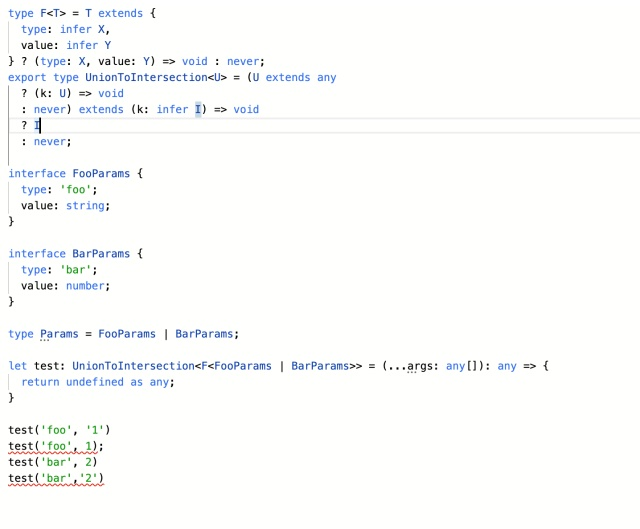

最近经常碰到有同事需要一些实现的复杂的函数类型，即根据函数前序的函数的实参类型确定后续参数的类型。

我们以 [https://zhuanlan.zhihu.com/p/95828198](https://zhuanlan.zhihu.com/p/95828198) 的例子为例

```ts
interface FooParams {
  type: "foo"
  value: string
}

interface BarParams {
  type: "bar"
  value: number
}

type Params = FooParams | BarParams

function test<TParams extends Params>(
  type: TParams["type"],
  value: TParams["value"]
): void {}
```

这里的目的是，第二个参数 value 的类型由第一个参数的实参类型确定，这实际上就是 [ Dependent type](https://link.zhihu.com/?target=https%3A//en.wikipedia.org/wiki/Dependent_type)
_,_ [ @vilicvane](https://www.zhihu.com/people/6592d2c5a3dddd32d607475fe8493b6c)
介绍了一种通过多泛型参数约束的实现， _虽然 Typescript 目前不直接支持 Dependent_type，但是借助于其函数重载和 conditional
type 的支持，我们可以实现一个乞丐版 dependent_type_ [depdentype playground](https://link.zhihu.com/?target=http%3A//www.typescriptlang.org/play/%3Fssl%3D31%26ssc%3D1%26pln%3D1%26pc%3D1%23code/C4TwDgpgBAYgPAFQHxQLxQVCAPYEB2AJgM5QDeAUFFKJAFxQCW%2BAZhAE5QAaANFVADcAhgBsArhAbM2nAJoUAvlAD8UABS1J3HoNESGsgJRoUAgPaNCUBvggCOAbgo4wZ9sBrhoAVXyMz%2BAhmAJL4eOzEEADGwP74cN4o6GreWLgEJFBC%2BCD8qmoA1gzexqimFoT8NnYcxjh4RKSFUqwcUMGl5ZZ57VVQtvbsThTM4SxCUdAwZmYACkLsQgC2pJTUmgwA5Cwzm07UwuJaxMDszADmTgoUI2Ec45NQAEIL84sr5PwbUJsARgt7fiHfT9MRLX6ORQ3TRQN7LUjoaZzBbwqAAH2erxRK2GIggHjwJ2KfgCQVC4UiMTicHgSLhHwxL3Y9OISCS6gAdFyFudiAxsiAANoAXUM-
JyJk%2B1HY%2BLE7HwUDERAgLGYECsQlIAqu0IgJzU212Ok2AEZNoYKITgAadmZNjoTYYnFaDf92PaoAAmC0uv4AnibT3mihAA)



本例的核心思路就是

- 通过 distributive conditional types 和 infer 将 Type Variable 进行拆分映射为不同的函数类型的 union
- 通过 union2intersection 将 函数 union 转换为函数 intersection
- 函数 inersection 可以当做函数重载使用
- 函数重载时只对外暴露 overload signature 并不对外暴露 implementation signature
