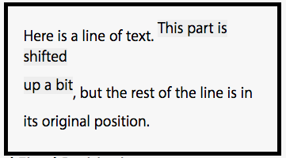
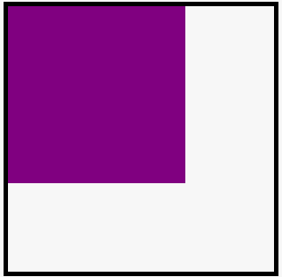

本文翻译自 [ WebCore Rendering
](https://link.zhihu.com/?target=https%3A//webkit.org/blog/114/webcore-
rendering-i-the-basics/) 系列

本文是一系列博文，旨在帮助人们理解 WebCore 的渲染系统。当我完成这些文章我将发布这些文章，它们也可以通过网站的文档区获得。

DOM Tree

一个页面将被解析成一个含有多个节点的树，其被称为文档对象模型(DOM).所有节点的基类为 Node

Node 可以被细分为如下几类，这些与渲染代码相关的节点类型包括

- Document:树的根节点总是 document 。有三个 document 类，Document,HTMLDocument 和 SVGDocument。第一个是用于所有非 SVG 的 XML document 。第二个用于所有继承自 Document 的 HTML document 。第三个用于所有继承自 Document 的 SVG document 。
- Elements：所有出现在 HTML 和 XML 源代码中的标签(tag)都会转化为 element 。从渲染的角度来看， element 是一个带有 tag 的节点，其可以被转化(cast)为一个特定的子类，以便于在渲染时查询必要的信息。
- Text： element 中间出现的原始文本可以被转化为 text 节点。这些 text 节点存储了原始文本，渲染树可以查询这些节点以获得其文本信息

Render Tree

渲染的核心在于 render tree ， render tree 非常类似于 DOM，因为其也是一个对象组成的树，其中每个对象都对应于 document ，
elements 或者 text 节点。这个渲染树可以包含与 DOM 无对应的额外的对象。

render tree 的基类是 RenderObject， DOM 节点的 RenderObject 可以通过 Node 的 renderer()方法获得。

以下是遍历 render tree 时常用的方法

    RenderObject *firstChild() const;
    RenderObject *lastChild() const;
    RenderObject *previsousSibling() const;
    RenderObject *nextSibling() const;

下面是一个用于遍历所有孩子节点的循环。这是 render tree 代码中最常用的遍历方法

    for(RenderObject *child=firstChild();child;child=child->nextSibling()){
      ...
    }

## Creating the Render Tree

Render 树的生成是通过一个在 DOM 树上的 attachment 的操作完成的。当一个 document 被解析和添加 DOM 节点时， DOM
节点上一个叫做 attach 的方法被调用了

    void attach()

attach 方法计算了 DOM 节点的样式信息。如果 CSS 的 display 属性为 none 或者其为一个 display 属性为 none 的后代，那么并不会生成 renderer。节点的子类和 CSS 的 display 属性一起来决定改为节点生成什么样的 renderer。

attach 是一个自顶向下的递归操作。一个父节点总是在其后代生成 renderer 之前生成 renderer。

Destroying Render Tree

当 DOM 节点从 document 中移除或 document 被移除(比如当 tab/window
被关闭了）时 renderers 就销毁了。DOM 节点上一个叫做 detach 的方法被调用以销毁 renderer。

detach 是一个自底向上的递归操作。后代节点的销毁总是在于父节点之前。

Accessing Style Information

在 attach 过程中，DOM 查询 CSS 以获得元素的样式信息。获得的样式信息存储在一个叫做 RenderStyle 的对象中。

每一个 WebKit 支持的 CSS 属性都可以通过该对象查询。RenderStyle 是一个引用计数对象。如果一个 DOM 节点生成了一个 renderer，其将通过 setStyle 方法设置该 renderer 的样式信息

    void setStyle(RenderStyle* )

这些 renderer 添加了对 RenderStyle 的一个引用，这样就能维持样式信息直到其重新获得一个样式或者被销毁。

RenderStyle 可以通过 RenderObject 的 style 方法来获取

    RenderStyle*  style() const

## The CSS Box Model

RenderObject 的一个主要子类就是 RenderBox。该子类代表了符合 CSS 盒子模型的对象。这包括含有
border,padding,margins,width,height 的任何对象。现在一些没有符合 CSS 盒子模型的对象（比如 SVG
对象）仍然是 RenderBox 的子类。这是一个错误，将在以后对 render tree 的代码重构中进行修复。

[ 该图
](https://link.zhihu.com/?target=https%3A//www.w3.org/TR/CSS21/box.html%23box-
dimensions) 来自于 CSS2.1 标准，描述了 CSS 盒子。以下方法可以用来获取 border/margin/padding/
的值。除非为了获得原始的样式信息这里不应该调用 RenderStyle，因为 RenderObject 实际的计算值可能与其大有不同（特别是对于 tables
，其可以覆盖 cells 的 padding 和重叠 cells 的 borders）。

    int marginTop() const;
    int marginBottom() const;
    int marginLeft() const;
    int marginRight() const;

    int paddingTop() const;
    int paddingBottom() const;
    int paddingLeft() const;
    int paddingRight() const;

    int borderTop() const;
    int borderBottom() const;
    int borderLeft() const;
    int borderRight() const;

width 和 height 方法给出了盒子中包含 border 的宽度和高度信息

    int width() const;
    int height() const;

client box 是盒子中除了 borders 和 scrollbars 的区域。其包含了 padding。

    int clientLeft() const { return borderLeft();}
    int clientTop() const { return borderTop();}
    int clientWidth() const;
    int clientHeight() const;

术语 content box 是用来描述 CSS 盒子中除去 borders 和 padding 的区域。

    IntRect contentBox() const;
    int contentWidth() const { return clientWidth() - paddingLeft() - paddingRigth();}
    int contentHeight() const { return clientHeight() - paddingTop() - paddingBottom(); }

当一个盒子拥有一个水平或垂直的滚动条，其被放在 border 和 padding 之间。一个滚动条的尺寸被从 client width 和 client height
中除去了。滚动条不是 content box 的一部分。滚动条区域的尺寸和当前滚动的位置都可以从 RenderObject 获得。我将在单独的章节讲述滚动。

    int scrollLeft() const;
    int scrollTop() const;
    int scrollWidth() const;
    int scrollHeight() const;

盒子也具有 x 和 y 坐标。这些位置是相对于其祖先，其用来决定盒子应该在哪摆放。这条规则有很多特殊情况，而且这也是 render tree
中最令人迷惑的地方。

    int xPos() const;
    int yPos() const;

## Blocks and Inlines

上节我们讲述了 CSS 盒子的基本结构。本节将讨论 RenderBox 的各个子类和 block 和 inline 的概念。

_block flow_ 是一个用于包含行(例如段落）或者包含其他块的框(box),其垂直排列。HTML 中的常见 _block flow_ 包括 _p_
和 di _v_ 。

_inline flow_ 是一个对象，其用于作为行的一部分。HTML 中常见的 flow element 包括 _a_ , _b_ , _i_ 和
_span_ 。

在 WebCore 中，有三个 renderer 类，其涉及到 block 和 inline flows。分别是 RenderBlock 和 RenderInline
和它们的父类 RenderFlow。

一个 inline flow 通过 display 属性可以转化为 block flow（反之亦然)。

    div { display: inline }
    span { display: block}

除了 block 和 inline flow，还有一种元素可以当做 block 或者 inline ： 替换元素。 一个替换元素是一个元素，其并未在 CSS
中指明该如何渲染。这个对象内容该如何渲染交由元素自身决定。常见的替换元素包括 images,form,iframes,plugins 和 applets。

一个替换元素可以作为 block-level 或者 inline-
level。当一个替换元素作为一个 block，其垂直的进行排列就像其代表了自己的段落。当一个替换元素作为 inline，其被视为一个段落中的一行的一部分。替换元素默认是 inline。

表单控制(form
control)是一个特例。它们作为替换元素，但是因为它们由引擎实现，表单实际上是作为 RenderBlock 的子类。因此，替换这个概念并不限制在一个单一的子类，并用 RenderObject 的一个比特位代表。isReplaced 方法可以用来查询一个对象是否为替换元素。

    bool isReplaced() const

Images,plugins,frames,applets 都继承自一个子类，其实现了替换元素的行为。该子类为 RenderReplaced。

The Inline Block

CSS 中国最令人奇怪的是 inline-block 。Inline block 是 block flow 但是其做落于一行中（注：block
flow 强调其内部的 block 垂直排列，并没有强调其自身如何排列）。事实上从外部来看它们就像替换元素一样，但是从内部来看它们是 block flow。CSS
的 display 属性可以用来生成 inline block。如果询问 Inline block
元素是否为替换元素，其会返回 true(即调用该对象的 isReplaced 方法，会返回 true）。

    div { display : inline-block}

## Tables

HTML 中的 Tables 默认为 block-level。但是其可以利用 CSS 的 display 属性转化为 inlines。

    table { display : inline-table }

从外面来看 inline-table 就像替换元素(事实上其 isReplaced 也返回 true）。但是从内部来看其仍然为 table。

在 WebCore 中 RenderTable 类代表了一个 table。其继承自 RenderBlock，原因将在 position 该节讲述。

Text

原始文本用 RenderText 类表示。Text 在 WebCore 中被视为 inline，因为其被置于行内。

Getting Block and Inline Information

判断 block 还是 inline
状态最基本的方法是 isInline。该方法询问一个对象是否被作为行的一部分。其不关心该元素内部是什么样(如 image，inline flow，inline
block，inline-table）。

    bool isInline() const

一个最常见的错误是当考虑 render tree 时总是假设一个对象是认为 isInline 意味着一个对象是 inline flow,text，或者为
inline replaced 元素。但是因为 inline-block 和 inline-table 存在，该方法对于这些对象也会返回 true。

查询一个对象是否为 block 还是 inline flow，应该采用如下方法。

    bool isInlineFlow() const
    bool isBlockFlow() const

这些方法实际上询问的是对象的内部结构。一个 inline-block 实际上是 block flow 而非 inline
flow。其外部是 inline 而内部是 block flow。

我们可以通过如下方法查询 blocks 和 inlines 的具体的类类型。

    bool isRenderBlock() const
    bool isRenderInline() const

isRenderBlock 方法在定位时很有用，因为 block flow 和 table 都作为定位对象的容器。

查询一个元素是否为 inline block 或者 inline table。可以用如下方法。

    bool isInlineBlockOrInlineTable() const

### Children of Block Flows

Block flow 有一个关于其孩子节点的简单的不变式，其 render tree 必须遵守。该规则总结如下。

> block flow 的所有 in-flow 的孩子必须都是 block 或者 block flow 的所有 in-flow 的孩子都必须是 inlines

换句话说就是，一旦你排除了浮动和定位元素，render tree 中所有 block flow
的孩子调用 isInline 时必须都返回 true，或者都返回 false。render tree 为了维护不变量有时会需要修改其结构。

childrenInline 方法被用来查询 block flow 的孩子是 inline 还是 block

    bool childrenInline() const

## The CSS Box Model

inline flow 的所有孩子的有一个更为简单的不变式。

> inline flow 的所有 in flow 孩子必须都是 inlines

Anonymous Blocks

为了维护 block flow 孩子的不变式（只有 inline 孩子或者只有 block 孩子）。render tree 会构造一个匿名块(anoymous
blocks)。考虑如下代码

    <div>
    Some text
    <div>
    Some more text
    </div>
    </div>

上例中，外层的 div 含有两个孩子，一些 text
和一个 div。第一个孩子是 inline 的。但是第二个孩子是 block。因为这样的组合违反了不变式，render
tree 会构造一个匿名块去包含这个文本。该 render tree 因此成为如下这样:

    <div>
    <anonymous block>
    Some text
    </anoymous block>
    <div>
    Some more text
    </div>
    </div>

isAnoymousBlock 方法可以用来查询一个 renderer 是否为 anymous block flow。

    bool isAnonymousBlock() const

当一个 block 有 inline 孩子和一个 block
对象其就会尝试生成匿名块去包裹所有的 inlines。连续的 inlines 可以共用一个公共的匿名块。因此匿名块的数目尽可能小。RenderBlock 有一个 makeChildrenNonInline 方法去完成上述操作。

    void makeChildrenNonInline(RenderObject* insertionPoint)

Blocks inside Inline Flows

HTML 中你能见到最难以忍受的就是将一个 block 放在 inline flow 中。如下所示：

    <i>Italic only <b> italic and bold
    <div>
    Wow,a block!
    </div>
    <div>
    Wow another block
    </div>
    More italic and bold text</b>
    More italic text</i>

上述的两个 div 违反了所有的 bold 元素的孩子都是 inline 这个不变量。render
tree 必须执行一个非常复杂的步骤去修复自身。需要构造三个匿名块。第一个块包含所有的 div 之前的 inlines。第二个匿名块包裹 divs，第三个匿名块包含剩下的 div 之后的 inlines

    <anonymous pre block>
    <i>Italic only <b>italic and bold</b</i>
    </anonymous pre block>
    <anonymous middle block>
    <div>
    Wow, a block!
    </div>
    <div>
    Wow, another block!
    </div>
    </anonymous middle block>
    <anonymous post block>
    <i><b>More italic and bold text</b> More italic text</i>
    </anonymous post block>

注意到 bold 和 italic
renderers 必须拆分为两个 render 对象，因为他们在匿名块之前和之后。对于 bold 元素，其孩子先在 block 之前，然后在 block 内，接着在 Block 之后。render
tree 通过一个 continuation 链连接这些对象。

    RenderFlow* continuation() const
    bool isInlineContinuation() const

在 block 之前的 bold
renderer 可以通过 b 元素的 renderer()方法获得，该 renderer 将中间的匿名块作为其 continuation(),中间匿名块将第二个 bold
renderer 作为其 continuation。这样代码就可以检查代表 DOM 元素的 renderers 的操作就比较简单了。

执行递归切割 inline flow 和生成 continuation 链的方法是 splitFlow。

Layout Basics

当 renderes 被生成并加入到树中时，其并不包含 position 或者 size 信息。决定盒子的位置和大小的过程叫做 layout。所有的 renderer 多有一个 layout 方法。

    void layout()

Layout
是一个递归的操作。一个叫做 FrameView 的类代表了 document 中的视图信息，其也含有一个 layout 方法。frameview 负责管理 renderer
tree 的布局。

FrameView 可以执行两种布局操作。第一种（也是最常见的）就是整个 render tree 的布局。此时 render
tree 的根节点调用其 layout 方法，然后整个 render tree 都得到更新。第二种 layout 类型是 render
tree 的局部更新。第二种用在部分子树的更新不影响全局的情况下。如今 subtree layout 仅被用于 text fields（但是可能在将来被用于
带有 overflow：auto 属性的 block 或者类似结构）。

Dirty Bits

Layout 有一个 dirty bit
系统去决定一个对象是否需要 layout。当有新的 renderers 插入树里时，它们 dirty 自己和其祖先链中的相关连接。有三个单独的 bits 在 render
tree 中使用。

    bool needsLayout() const{
      return m_needsLayout || m_normalChildNeedsLayout ||
      m_postChildNeedsLayout;
    }
    bool selfNeedsLayout() const{
      return m_needsLaytout;
    }
    bool postChildNeedsLayout() const{
      return m_possChildNeedsLayout;
    }
    bool normalChildNeedsLayout() const { return m_normalChildNeedsLayout; }

当 renderer 本身是 dirty 时使用第一位，可以通过 selfNeedsLayout 进行查询，当该 bit 被置 true，相关的祖先 renderers 设置对应的 bits 表示它们有个 dirty 孩子。置为的 bit 类型取决于之前变脏的 link 的定位状态，posChildNeedsLayout 用来表明一个定位的孩子 dirted，normalChildNeedsLayout 被用来指示一个 in
flow 孩子变脏了。通过区别这两种孩子 layout 可以在只有定位元素移动的情况下进行优化。

The Containing Block

”相关联的祖先链(the relevant
ancestor)“指的是什么？当一个对象被标记为需要进行 layout，被 dirted 的祖先链基于 CSS 的包含块概念(containing
block)。包含块也被用来为孩子建立坐标。Renderers 有 xPos 和 yPos 坐标，这些都是相对于包含块。那么到底什么事包含块

[ 这就是包含块的定义
](https://link.zhihu.com/?target=https%3A//www.w3.org/TR/CSS21/visuren.html%23containing-
block)

从 WebCore render tree 角度来讲，我所理解的包含块如下

> 一个 renderer 的包含块是负责决定 renderer 的位置的祖先 k。

换句话来说，当 render tree 发生 layout，该 render 负责定位所有以它作为包含块的 renderers。

render tree 的根元素为 RenderView，该类根据 CSS2.1 规范对应于初始包含快(initial containing
block)。这也是调用 Document 的 render()返回的 render。

初始包含块总是与视口尺寸大小相同。在桌面浏览器里，这就是浏览器窗口的可见区域。其也总是被置于坐标(0,0)处。下图展现了包含块在 document 的定位。黑色带有边框的盒子代表了 RenderView,灰色的盒子代表了整个 document。

​

如果滚动 document，那么初始包含快将会随着移动。其总是在 document 的上部且与视口大小相同。人们总觉得疑惑的地方是他们以为初始包含块应该脱离文档并为视口的一部分。

[ 这是 CSS2.1 中初始包含块的相关规范
](https://link.zhihu.com/?target=https%3A//www.w3.org/TR/CSS21/visudet.html%23containing-
block-details)

这些规则可以总结如下：

- renderer 的 root 元素(如元素）总是把 RenderView 作为其包含块。

- 如果 renderer 的 CSS position 为 relative 或者 static，那么其包含块为最近的 block-level 祖先。

- 如果 renderer 的 CSS position 为 fixed，那么其包含块为 RenderView，技术上来说 RenderView 并不作为视口,因此 RenderView 必须调整 fixed 定位的元素来应对 document 的滚动位置。这种情况下可以简单的把 RenderView 当作视口的包含块。

- 如果一个 renderer 的 position 为 absolute，那么是最近的非 static 定位的 block-level 祖先。如果不存在这样的祖先，那么包含块为 RenderView。

render tree 有两个方便的方法用于查询一个对象的 position 是否为 absolute 或者 fixed 或 relative。

        bool isPositioned() const;
    bool isRelPositioned() const;

代码中术语 positioned 指代 absolute 和 fixed 对象。术语 relPositioned 指代 relative 定位对象。

render tree 有一个方法来获取 renderer 的包含块。

        RenderBlock* containingBlock() const

当一个对象被标注为需要 layout，其遍 container
chain，设置 normalChildNeedsLayoutbit 或者 posChildNeedsLayoutbit。链中的之前连接的 isPositioned 状态决定了该设置哪个 bit 位。container
chain 大致对应于 containing block chain，尽管中间的 inlines
依旧 dirted。因为该差别，一个方法叫做 container 替代 containBlock。

        RenderObject* container() const

所有的 layout 方法以 setNeedsLayout(false)结尾，这样做的原因在于在离开 layout 方法前清空 renderer 的 dirty
bit，因此未来 layout 调用不会误以为该对象仍然 dirty。

Anatomy of a Layout Method

layout 方法类似于下面

    void layout()
    {
      ASSERT(needsLayout());
      //Determin the width and horizontal margins of this object
      ...

      for(RenderObject* child = firstChild();child;child=child-       >nextSibling()){
      //Determine if the child needs to get a relayout despite the bit not being set.
      // place the child
      child->layoutIfNeeded()
    }
    // now the intrinsic height of the object is known because the children are placed
    // Determine the final height
    ...
    setNeedsLayout(false);
    }

我们将在下节详细阐述 layout 方法。

Absolute/Fixed and Relative Positioning

CSS 的 position 属性用来相对于对象的包含块进行定位。其含有四个值：'static','absolute','fixed','relative'。static
定位是默认的定位方式，意味着该对象该对象利用常规的 block 和 line layout 规则进行定位。

Relative Positionning

relative 定位和 static 定位十分类似除了其 CSS 的 left，top，right，bottom 属性可以用来移动对象。isRelPositioned 方法可以用来查询一个 renderer 是否为 relative 定位

    bool isRelPositioned() const

其偏移属性也可以通过下列方法获得

    int relativePositionOffsetX() const;
    int relativePositionOffsetY() const;

relative 定位只不过是 paint-time
translation。就 layout 而言，该对象仍然处于原来的地方。下例利用 relative 偏移了行的一部分。如你所视，这些行就像那个对象仍然处在原位置。（注：这里揭示了 relative 定位与其他定位的显著不同之处，relative 定位并不改变 layout，也即改变 relative 位置并不会触发 reflow 而只会发生 repaint，repaint 效率显著优于 reflow）。

    <div style="border:5px solid black;padding:20px;width:300px">
    Here is a line of text.
    <span style="position:relative:top:-10px;background-color:#eeeeee">
    This part is shifted<br> up a bit.
    </span>
    but the rest of the line is in its original position.
    </div>



Absolute and Fixed Positioning

fixed 定位对象的定位相对于视口。absolute 定位对象相对于包含块，即最近的 position 非 static 的祖先块。如果不存在这样的祖先，那么使用初始包含块(the
RenderView)

isPositioned 可以用来判断一个 renderer 是 absolute 或者为 fixed 定位。

    bool isPositioned() const

当一个对象是 absolute/fixed 定位，其变为 block-level。即使其 CSS display 属性设置为 inline 或者 inline-
block/table,一旦一个对象被定位后，其 display 就变为 block-level。isInline 对于定位元素总是返回 false。

RenderStyle 可以得出 display 值，有时候当需要原始的 display 属性时，可以调用如下属性获得其 display 属性

    EDisplay() display() const;
    EDisplay() originalDisplay() const;

The Positioned Object List

每个块都有一个定位对象列表，其包含了以他作为包含块的所有的 absolute/fixed 定位的 renderers。该块负责定位所有这些定位元素。下列方法可以用来管理定位对象列表。

    void insertPositionedObject(RenderObject*)
    void removePositionedObject(RenderObject*)

layoutOnlyPositionedObjects 方法被用来定位 positioned 对象。如果只有定位对象发生改变，那么该方法返回 true。这表示 layout 方法不必 layout 所有的常规孩子，可以早一点返回。

    bool layoutOnlyPositionedObjects

layoutPositionedObejcts 方法负责定位所有的定位对象，其含有一个 boolean 参数来表示是否需要对所有对象进行 relayout。在某些情况下 relayout 是必须的。

    bool layoutPositionedObjects(bool relayoutChildren)

Coordinates of Positioned Objects

定位元素的坐标是相对于包含块的 padding 边缘的。例如下例指明了绝对定位对象的 left 和 top 坐标为(0,0)会导致对象被放在包含块的左上角。

    <div style="position:relative;border:5px solid black;width:300px;height:300px;">
    <div style="position:absolute;width:200px;height:200px;background-color:purple"></div>
    </div>



在 WebCore 中，坐标位置总是相对于 border 边缘，所以上例中对象的坐标为(5,5)。

当在 CSS 中忽略某坐标，WebCore 必须为定位对象决定一个合适的位置。CSS 对此有一系列复杂的规则，我们将在未来详细讨论。

Inline Relative Positioned Containers

一个 relative
定位的 inline 是可能为其后代定位元素充当包含块的。这是另一个极端复杂的例子。暂时我们只需知道可能存在这种情况，因此代码必须处理好这种情况。

Float

float 是一个意图移动到一个段落的左侧或右侧的 render。段落里的内容都会避让 float 对象。

HTML 中有对应结构表明 float 行为。例如 image 的 align 属性可以用来浮动 image

    

一个浮动元素可以占据多行。本例中，即使浮动元素在一个段落中声明，其也可能突出到段落到下一个段落。

因为 floats 可以影响到多个 blocks，WebCore 利用 block
flows 的一个 float 对象列表来追踪所有的入侵到该 block 的浮动的 renderers。一个浮动元素因此可以在多个 block
flow 的浮动列表里。Line 布局必须要考虑到 float 的位置，以便能收缩自身来避让 float 元素。通过浮动对象列表，block 可以了解其需要避让哪些 floats。

一个浮动对象列表包含了如下数据结构：

    struct FloatingObject{
      enum Type{
        FloatLeft,
        FloatRight,
        };
      FloatingObject(Type type)
        :node(0),
      startY(0),
      endY(0),
      left(0),
      width(0),
      m_type(type),
      ,noPaint(false)
      {
    ​```}
    Type type() {
    return static_cast<type>(m_type)
    }
      RenderObject* node;
      int startY;
      int endY;
      int left;
      int width;
      unsigned m_type:1;
      bool noPaint:1;
    }

如你所视，该结构包含了一个矩形框(top,bottom,left,width)。每个列表项都含有其位置和尺寸（其独立于 float 对象的位置和尺寸）的原因在于这些坐标都是相对于持有对象列表的对象的。这样使得便于查询每个 block 都可以轻易的查询基于自己坐标空间 float 的位置，而不用做一系列转换。

另外 float 的 margins 也被存储在 float 列表项里，因为行框不仅需要避让 box 的 border 也需要避让其 margin。这对于 float 对象很重要，这使得其可以在与行框之间留有空隙。

以下方法作用于 floating 对象列表上：

    void insertFloatingObject(RenderObject*);
    void removeFloatingObject(RenderObject*);
    void clearFloats();
    void positionNewFloats();

前两个函数自不必说，它们用于在列表中插入或删除特定的 float 对象。clearFloats 将会清空 float 对象列表。

当一个对象插入到列表里时，其是未定位的(unpositioned)。其垂直坐标被设置为-1。positionNewFloats 方法被用来摆放所有的 floats。CSS 有一系列关于 floats 该如何摆放的
[ 规则
](https://link.zhihu.com/?target=http%3A//www.w3.org/TR/CSS21/visuren.html%23propdef-
float) 。该方法保证 floats 按照上述规则摆放。

floats 有许多帮助函数。当我讲到 block 和 line 布局时我会进一步阐释它们。

Clearance

CSS 提供了一个方法来指明对象应该处于所有的浮动对象之下，或者所有的左浮动对象之下，或所有的右浮动对象之下。clear 属性指明了这些行为，其值可以为 none,left,right 或 both。

本段落处于上面的 float 对象之下，是因为使用了 clear:left。clearance 在 block 和 line 布局时被计算得到。clear 属性也可以用于 float 对象，以确保其处于所有之前的浮动对象之下(当然这里只 left,right 或者 both）。
