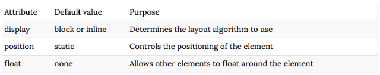
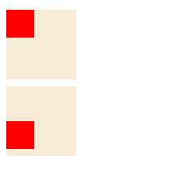
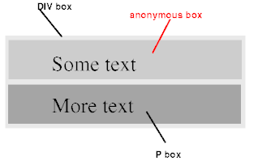
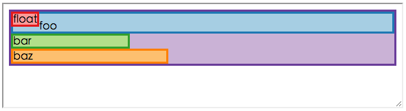
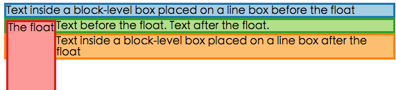
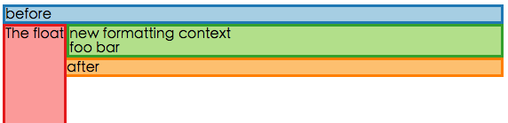
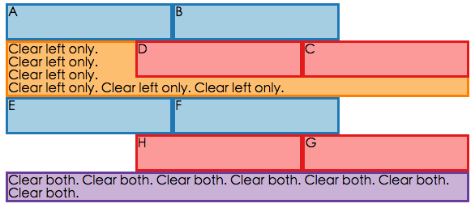
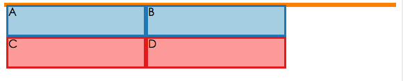
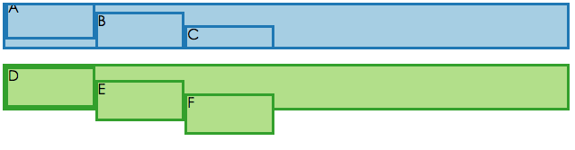

本文主要内容来自于 [ learn CSS layout
](https://link.zhihu.com/?target=http%3A//book.mixu.net/css/) 和 [ CSS2.1 spec
](https://link.zhihu.com/?target=https%3A//www.w3.org/TR/CSS21/) 和 [ 深入理解 CSS 系列
](https://link.zhihu.com/?target=http%3A//www.imooc.com/u/197450/courses%3Fsort%3Dpublish)
和《CSS 权威指南》，主要讲解一些核心的 css 概念(起这么个名字感觉会被人打）

你可能听说过 CSS 常规流(norm
flow)中的 inline 和 block。但是你知道在 CSS 中 block 和 inline 元素的相对位置并不由 display 属性决定吗？其实际上由 formatting
context 决定，其同时受到兄弟元素的影响。

你可能使用过 z-index 来固定元素的相对层叠顺序。但是你知道 z-index 在文档中并不是绝对的顺序，相反其是相对于层叠上下文的？

你可能听过盒子模型。但是你知道事实上存在至少 5 种盒子模型吗？其区别在于如何处理内容大小和 margin：auto 属性，读完本文后你就会知道了。

CSS 布局学起来很难，你从无数的网站学习到很多布局小技巧但是你却从未理解背后的布局算法。

元素的布局信息事实上由位置大小层叠位置决定，你一旦了解了如何决定这些信息，你就理解了布局算法。

## 一：CSS 的盒子位置

CSS 布局的核心在于如何将一系列 HTML 元素映射到一组盒子上，这些盒子的被放在 x-y-z 坐标系里。

盒子的 x-和 y-坐标事实上由布局方案(positioning scheme)决定。本章中，我会详细讨论 CSS2.1 中引入的 positioning
scheme：normal flow，floats 和 absolute positioning。

概念上来说，CSS 布局的最高抽象就是 positioning scheme。一旦 positioning scheme 决定了，其可以进一步的被特殊的 layout
modes 修改，这些 layout modes 包括 display:table，display:inline-
table。即使在 CSS3 的扩展中，其引入了其他的 layout modes 包括 flexbox 和 grid，其仍然处于上述的 positioning
scheme 中(如 display:flex 和 display:inline-flex);

## Positioning schemes

CSS2.1 定义了三种 positioning scheme，其包括：

- normal flow，其包含三种 formatting contexts：block，inline 和 relative formatting context
- floats:其与 normal flow 互动，其构成了现代 CSS grid framework 基础
- absolute positioning，其处理 absolute 和 fixed 元素相对于 normal flow 的定位

positioning scheme 对 x-axis 和
y-axis 元素定位有重大影响。所有的元素除非通过设置 float 和 position 属性从 normal 中移除，默认属于 normal flow。

 通过它们与 normal
flow 元素的交互方式能更好的理解 float 和 absolute positioning，所以我先说明 normal flow。

仔细想下，事实上 layou 存在两方面在起作用：

- 元素的盒子大小和对齐方式，其通常由 display 的属性(width,height,margin)控制
- 一个特定父元素的子元素是如何相对于彼此放置的

一个父元素的子元素的相对位置是通过父元素为子元素建立的 formatting context 控制的，在 normal flow 中，可以使 block
formatting context 或者 inline formatting context。

> 哈哈哈，这里终于到了鼎鼎大名的 bfc(block formatting context），简单来说，bfc 就是 normal
> flow 中的一种 formatting context。所以触发 bfc 这种说法根本来说就是错误的，更为准确的说法应该是建立了一个新的 bfc(establish
> a new block formatting context)。鉴于 bfc 的迷惑性，在 CSS3 中已经被改为 flowing
> root 了。至于其种种神奇的作用(比如阻止 margin collapse）则在于 CSS 中很多的特性均需要满足一定的前提，而对于 margin
> collapse，其条件是 [ collapsing-margins
> ](https://link.zhihu.com/?target=https%3A//www.w3.org/TR/CSS21/box.html%23collapsing-
> margins)

>

> - 两者都为处于同一 bfc 下的 in-flow block-level boxes

> - 两者间不存在 line boxes,clearance,padding,border

> - 都处于垂直相邻的盒子边缘

>

>

> 这里的第一个条件是处于同一 bfc 下的盒子才可能发生 margin
> collapse，那么假如父元素创建了新的 bfc，那么父元素和子元素将不再处于同一 bfc 下（子元素处于父元素创建的新的 bfc 下），则可以阻止发生 margin
> collpase，相反若子元素创建了新的 bfc，那么子元素和父元素仍然处于同一 bfc 下，只是孙子元素处于新的 bfc 下，父元素和子元素仍然发生 margin
> collapse，其效果如下所示

>

>

> ```
>
>   <!DOCTYPE html>
> ```

>     <html lang="en">

> ```
>   <head>
> ```

>         <meta charset="UTF-8">

>         <title>Title</title>

>     </head>

>     <style>

>     .parent{

>         width: 100px;

>         height: 100px;

>         background: antiquewhite;

>         margin: 10px;

>     }

>     .son{

>         width: 40px;

>         height: 40px;

>         background: red;

>         margin-top: 50px;

>     }

>     .demo2 .parent{

>         overflow: hidden;

>     }

>     .demo1 .son{

>         overflow: hidden;

>     }

>     </style>

>     <body>

>         <div class='demo1'>

>             <div class="parent">

>                 <div class="son">

> ```
>               </div>
> ```

>             </div>

>         </div>

> ```
>       <div class="demo2">
> ```

>             <div class="parent">

>                 <div class="son">

> ```
>               </div>
> ```

>             </div>

>         </div>

> ```
>   </body>
> ```

>     </html>

>

> 渲染效果如下

>

> 
> 可以看出子元素创建了新的 bfc 但是并不能阻止 margin collapse

>

> 所以 bfc 并不是高深莫测的东西，其和其他特性的结合才变得有趣。

CSS2.1 规范定义 formatting context 如下：

> normal flow 里的 box 属于一个 formatting context,其是 block 或者 inline，但不能同时都是。block-
> level 盒子参与 bfc(block formatting context)，inline-level 盒子参与 ifc(inline formatting
> context)

父元素（容器）根据子元素是 inline-level 还是 block-level 为其子元素建立 formatting context。术语 inline-
leve 和 block-level 用来强调 display 属性不为 inline 和 block 的盒子仍然可以属于这两种 formatting
context。例如 display:table 元素被认为是 block-level 而 display:inline-table 元素被认为是 inline-
level。

一个 block-level 的元素定义如下

> block-level 元素是那些在文档中视觉表现为 block 的元素（例如 paragraph）。display 属性为‘block’，‘list-
> item'和’table'的元素是 block-level  
>  block-level 的盒子就是参与 bfc 的盒子。每个 block-level 的元素都会生成一个主 block-level
> box，其包含子孙盒子并且生成内容，它也是负责参与 positioning scheme 的盒子。一些 block-
> level 的元素也可能除了主盒子外还生成附加的盒子如‘list-item’元素。这些附加的盒子相对于主盒子放置。

几乎所有的 block 盒子都是 block container。一个 block
container 就是一组其他盒子的 parent 并且有一个特定的 formatting context：

> 除了 table boxes 和替换元素，一个 block-level 的盒子也是一个 block container 盒子。一个 block
> container 盒子或者仅包含 block-level 盒子或者创建了 ifc 即只包含 inline-level 盒子

一个 inline-level 元素定义如下：

> inline-level 元素是那些在源文档中不构成块状内容的元素；这些内容被分散在各行之中（如 inline
> images 和<em>text</em>等）。display 为'inline','inline-table','inline-
> block'的元素是 inline-level 的。inline-level 元素生成 inline-level 盒子，其参与 ifc。  
>  一个 inline 盒子是那些即是 inline-level 的  
>  。。。。todo

我不会讲替换元素和非替换元素的区别，因为其区别很小。最简单的看待替换元素的方法是把它们当做 img 或者 video 元素，即这些元素仅包含一个整体内容（外部环境定义）并且不能像文本内容那样被拆散成多行。

关于上面定义最有趣的地方在于每个盒子包含的 formatting context 要么是’inline formatting conext"要么是"block
formatting context"。这既是说 level 每个父元素的所有参与布局的孩子元素只能使用其中一种 formatting
context。当你将如 text 的 inline-level 元素和如 div 的 block-level 元素混合使用时，这怎么可能办得到。答案就是 inline-
level 元素可以被提升为 block-level 元素。这个机制就是匿名盒子生成。

## Anonymous box generation

匿名盒子生成用于处理当一个父元素即含有 inline-level 盒子也含有 block-level 的情形（此时就会生成匿名盒子）和当标签包含了 inline-
level 元素与包围文本的混合，如 paragraph 里嵌入 em 和 i 标签。

## Anonymous block boxes

规范里给了如下例子，可得

    <div>
        Some text
        <p>More text
    </p></div>

> 如果一个容器盒子（如上面 div 生成的盒子）内部有一个 block-level 盒子（如上面的 P）那么我们强迫其内部有两个 block-level 盒子

规范里提供了如下的描述阐明匿名盒子如何包裹 inline-level 内容



> 当一个 inline 盒子包含一个 in-flow 的 block-level 的盒子，那么 inline 盒子（和其同一行的祖先盒子）会被打散围绕着 block-
> level 盒子（且任何的 block-level 兄弟都是连续的或者被 collapsible whitespace 或者 out-of-flow 元素分割）  
>  todo

简单来说，当一个 inline-level 和 block-level 盒子混杂在一个父元素内部时，inline-level 盒子被拆散围绕在 block-
level 盒子并且其内容被匿名 block-level 盒子包裹。

## Anonymous inline boxes

当一个 block container 包含文本并且这些文本没有被包含在 inline-level 元素里时会生成匿名内联盒子(anonymous inline
boxes)。例如如下标记

    <p>Some <em> emphasized </em> text </p>

会生成两个匿名内联盒子，一个包含“Some"，一个包含”text“.

匿名盒子生成非常重要，因为其决定了该为在 normal flow 中包含 block 和 inline-level 的元素生成何种 formatting
context。许多现实中的 HTML 布局里的一个父元素既含有 block-level 也含有 inline-
level 内容。匿名盒子生成可以保证如果任何的 block-level 被混入 inline-level 的兄弟元素时，那么 inline-
level 盒子会被包裹进一个匿名 block-level 容器内，这也意味着它们将被视为 block-level 元素相对于其他盒子布局。

既然我们知道了如何确定 formatting context，那么我们接下来看如何进行布局。

## Normal flow positioning

在 normal flow 中，一个父盒子内的子盒子是按照 formatting context 布局的。normal flow 中的两个 formatting
context 大致对应于垂直排列和水平排列

## Normal flow: block formatting

规范为 bfc 下如何布局提供了很好的说明

> 在 blocking formatting
> context 中，盒子一个接一个，垂直的，自顶向下的排列。两个相邻的盒子之间的距离由由 margin 属性确定。相邻 block-
> level 盒子的垂直的 margin 可能发生重叠  
>  在 block formatting· context 下，每个盒子的左外边缘触碰到 containing block 的左边缘（对于 right-to-
> left formatting· context，右边缘相邻）。这甚至适用于存在 floats 的情形（尽管一个盒子的 line
> boxes 可能由于 floats 收缩），除非盒子建立了一个新的 block formatting context（此时盒子本身可能由于 floats 收缩）。  
>  下面的 demo 可以解释上面的话

最重要的两个结论是在 bfc 下盒子是垂直排列的，而且每个盒子的左边缘会触碰到 containing box 的左外边（即使在 floats 存在的情况）

下面的代码何以演示这个规则：

    .float {
      float: left;
    }
    .foo {
      padding-top: 10px;
    }
    .bar {
      width: 30%;
    }
    .baz {
      width: 40%;
    }
    <div class="container violet">
      <div class="float red">float</div>
      <div class="foo blue">foo</div>
      <div class="bar green">bar</div>
      <div class="baz orange">baz</div>
    </div>

 上面的例子中

- 每个 block 盒子都在 containing box 的左外边缘
- 即使存在 float 也不影响其在左外边缘的位置，除了会造成文本的偏移
- foo 对应的 block box（没有明确的设置宽度）宽度扩展为容器宽度
- 另外两个设置宽度的盒子，从左边缘扩展
- 另外两个盒子并没有在一行，即使其能够塞进一行

总的来说，bfc 比较简单，用几个段落就可说清，但是 ifc 并非如此

## Normal flow: inline formatting( **TL;DR** )

ifc 相当复杂，更复杂的细节以后再补充。。。

ifc 比较复杂，因为其涉及到将内容拆分为 line boxes，这是一个你不能从标记直接看出来的结构其是根据内容生成的

> 在 ifc 中，盒子在 containing
> box 里被一个接一个，自上而下的水平放置。水平的 margin，borders，和 padding 散布在这些 box 之间。
>
> 这些盒子可以以不同的方式垂直放置：其底部和顶部可能是对齐的。包含这些盒子的方形区域构成了一行即行框(line box)
>
> line box 的宽度由 containing box 的宽度和是否存在 float 决定。line box 的高度由下节的高度计算决定

简单来说，在 ifc 中盒子水平的相邻排放。line box 按需生成；其宽度通常为包含块的高度（减去 floats）而且其高度足够包含其内部所有的盒子。特别的是

> 一个 line box 的高度总是足够包含其含有的所有盒子，[...]当几个 inline-boxes 不能塞进一个 line
> box 时，其总是拆分为几个垂直排列的 line boxes。因此，一个段落由一系列垂直排放的 line boxes 组成。line
> boxes 之间没有垂直的分割（除非特别的指明）并且绝不重叠
>
> 总之，line boxes 的左边缘触及包含快的左边缘且右边缘触及包含块的右边缘。  
>  如果因为存在 float 导致水平空间缩减那么 line boxes 宽度上可能有所差异。  
>  同一 ifc 下的 line boxes 高度上也常有差异（比如一行可能包含高点的图片而另一行可能只有文本）

当 inline box 太大以至于无法塞入一行怎么办？这取决于 inline box 是替换元素还是非替换元素：

> 当一个 inline box 的宽度超出了 line box 的宽度，其将被拆分为几个盒子，并且这几个盒子将散布于各个 line boxes。如果一个 inline
> box 不能够被拆分，那么这个 inline box 将溢出 line box  
>  当一个 inline box 被拆分，其 margin，border 和 padding 在拆分处并没视觉效果

简而言之，当 inline box 超过了 line box 的宽度，其将会尽可能的拆分。当某些规则阻止拆分盒子，那么其将简单的溢出该 line box

关于 ifc 最复杂的情况即 line boxe 是如何处理对齐的。text-align 和 vertical-align 两个属性控制对齐

### Horizontal alignment within line boxes: text-align

text-align 属性控制 inline-box 如何在 line box 内对齐，

> text-align:left 则左对齐，right 则右对齐

注意到其仅适用于当 line box 含有空余空间的情形，而且你不能直接控制 inline-level box 在 line box 中是如何摆放的，标准规定：

> 当 inline-level box 的宽度小于所在 line box 的宽度时，其在 line box 的水平分布取决于‘text-
> align'属性。如果该属性的值为'justify'，那么 UA(user agent)可以伸展 inline boxes 内的空格和文本。

换句话说，text-align 属性仅在 inline content 的内容已经分布在 line boxes 之后才加以应用

> 一块文本就是一组 line boxes。'left','right'和'center'指明了 inline-level 盒子在 line
> box 中是如何对齐的，其对齐是相对于 line box 而非 viewport。对与‘justify’，该性质表明 inline-
> level 盒子如果可能就尽可能通过扩展或缩小 inline box 的内容将其扩散至 line-box 的两侧，否则就按初始值对齐

通常来说，空白会受到 justify 属性影响，然而

> 如果一个元素'white-space'的计算值(computed value)为'pre'或者'pre-
> wrap'，那么该元素的 glyph 或者空白都不受 justify 的影响

### Vertical alignment within line boxes: vertical-align

下面两个属性控制 line box 的垂直对齐

> vertical-align:默认值为 baseline,控制盒子的垂直对齐，仅适用于 inline(和 table-cell)盒子  
>  line-height:默认值为 normal，规定了用于计算 line box height 的 height

vertical-align 控制了 line box 内 inline boxes 的垂直对齐方式，而非 line box 自身的对齐方式。为了理解 inline
box 是如何定位的，你需要首先理解 line box 和 inline box 的高度是如何计算的。

line box 的高度收到下面两个因素影响：

- 其包含的 inline box 的高度
- 其包含的 inline box 的对齐方式

inline box(非替换元素）的高度按下面方式决定

> ‘height'属性并不其起作用，内容区的高度是基于 font 的，但是规范没有规定是如何基于 font 的。UA 可以例如使用 em-box  
>  inline(非替换元素）垂直的 padding，border，margin 与 inline box 的 line-
> height 的计算无关。但是当计算 line-box 的高度时只有 line-height 起作用。  
>  正如你从规范所见，inline box 的 的 height 由'font'和'line-
> height'。特别的是，每个 font 都必须定义一个 baseline，一个 text-top 和一个 text-bottom 位置。inline
> box 内容区域的高度等于 font 的高度乘以 line-height 的属性值  
>  对于一个非替换 inline 元素，'line-height'规定了用于计算 line box 高度的 height

'line-height'的值可以是绝对值也可以是相对于 font height 的相对值。其与父元素的高度并不相关，即使其值为百分数，其值可以取值如下：

> normal:用户代理定义的一个值，其值为相对于 font 的相对值，建议 normal 的取值为 1.0 到 1.2 之间。  
>  length:绝对值用于计算 line box 的 height，负值非法。  
>  number:相对值，相对于元素的 font size，不能取负值  
>  percentage:相对值，相对于元素的 computed font size，不能取负值
>
> 如果一个 inline box 里包含了多个 font 怎么办？  
>  如果存在多个 font，内容区的高度计算并未在规范中定义。但是我们建议内容区高度的计算应该对于（1）em-boxes (2) the maximum
> ascenders and descenders, of all the fonts in the element

规范并未定义该值，但是建议其高度能够容纳所有使用的字体

inline box 的对齐方式由属性'vertiacal'确定，其属性分为两组，第一组相对于父元素 font 的 baseline,content
area,或者是字体相关的 sub 和 super，包括如下属性值

> baseline:  
>  middle:  
>  sub:  
>  super:  
>  text-top:  
>  text-bottom:  
>  percentage:  
>  length:

第二组相对于父元素的 line box，这是一个递归算法，因为 line box 的 height 取决于 vertical alignment 而 vertical
alignment 又取决于 line
box。遇到这种互相递归的算法，肯定需要一个递归基，该算法的递归基就是第一组属性。这也意味着第二组属性值的元素的布局是在第一组属性值元素布局之后。第二组属性包括

> top:  
>  bottom:

总结来说 inline box 有如下属性：

- font size：决定了字体的大小
- line height：决定了 inline box 的高度
- baseline:其由 font 确定

而 line box 的高度计算步骤如下

1. 计算 line box 内的所有 inline boxes 的高度
2. 对所有 vertical-align 属性值为第一组的元素，应用 vertical-align 的属性值进行对齐
3. 对所有 vertical-align 属性值为第二组的元素，应用 vertical-align 的属性值进行对齐

对于 line box 有如下属性：

- font size:继承自父元素
- height:由 line box 内的 inline box 的 height 和 alignment 确定
- baseline:通过'struct'定义：这是一个不可见，零宽的 inline box，其含有 font 和 line height 属性。

一般来书父元素和子元素的 font size 是一样的，因此看不出 line box 基线和 inline box 的基线差别。

> 注：table 也有 vertical-align 属性，但是这个属性的工作方式完全不同，应该把其与这里的 vertical-align 区分开来

### Normal flow: relative positioning

既然我们已经讨论完 bfc 和 ifc 了，接下来可以讨论最后一个 normal flow 布局 relative positioning 了。

Relative positioning 被认为是 normal flow 布局的一部分，因为其与 normal flow 没有太大差异。

> relative:盒子的位置完全基于 normal flow 计算，然后对盒子进行偏移。'position:relative'的属性对于 table-row-
> group,table-header-group,table-footer-group,table-row,table-column-
> group,table-column,table-cell,和 table-caption 元素是未定义的。
>
> 注：我发现理解 relative
> positioning 的最好方式是从渲染的角度考虑，我们发现'position:relative'属性几乎能和其他所有布局方式同时配合使用，而不会发生冲突，而 position:absolute 和 float 却不行（这两者实际发生冲突），原因在于 position:relative 的作用是发生在 paint 阶段，而其他布局则是发生在 layout 阶段。position:relative 是在 layout 阶段完成后，在 paint 阶段进行偏移。（这只是一种理解方式很可能有错误）

## Float positioning scheme

float 本来是用于实现文本环绕图片效果，但是其却成为了现代栅格布局的基础。一旦你理解 normal flow 是如何工作和 inline formatting
context 是如何切割成 line box 的，float 就很好理解了。设置'float'属性可以使得元素使用 float positioning
scheme。

float 可以理解为一个脱离 normal flow 的块状元素。其并不影响其他 block-level 盒子，但是其会影响 block-level 盒子内的 line
box。

> 注：面试中我们经常被问到的一个问题是“请解释下什么是脱离文档流，或者哪些属性会使得元素脱离文档流”，这个问题本身存在问题，规范中没有脱离文档流这种说法，只有 out
> of normal flow 和 in-flow 两种说法，而 out of normal 简单的来说就是不使用 normal flow positioning
> scheme，根据上节所说只有三种 positioning scheme：normal flow,floats,absolution
> positioning,那么 out of flow 即使指采用 float 和 absolution positioning 的元素。
>
> 浮动会使得盒子被移动到当前行的左边或右边。关于浮动最有趣的特性是盒子的内容可以围绕在浮动元素周边（当然也可以通过 clear 属性阻止这种特性）。内容会流动在左浮动元素的右边或右浮动元素的左边

Floats 有如下特性

- Floats 在布局阶段是脱离 normal flow 的，因此其并不影响块状元素的垂直位置。（这个特性说明当考虑存在 float 的布局时，其并不会影响 block-level 元素的布局，我们可以假想 float 元素不存在，当考虑 block-level 元素内容的 line box 布局时再考虑 float 元素的存在
- Floats 与包含容器的左边缘或右边缘对齐
- Floats 自左向右或自右向左，按照其在文档中标记出现的顺序排列。换句话说，对于右浮动元素，第一个右浮动元素放在包含容器的右边缘，第二个右浮动元素则贴近第一个右浮动元素
- Floats 可以影响当前元素或者后续元素 line box 内的 inline-level 内容布局。更准确的说是，浮动会导致当前和后续的 line box 缩短空间为 float 提供空间。
- 因为 Floats 不在 normal 中，其不影响父元素的高度。这就是为什么我们需要'clearfix'的原因
- Floats 可以使用 clear 属性清除

如下例所示

    .float {
      float: left;
      height: 500px;
    }
    .para {
      margin: 0;
    }
    <div class="para blue">Text inside a block-level box placed on a line box before the float</div>
    <div class="para green">Text before the float. <div class="float red">The float</div> Text after the float.</div>
    <div class="para orange">Text inside a block-level box placed on a line box after the float</div>

渲染结果如下

 从上面例子可以看出：

- 所有的 block-level div 都是垂直的排列，就像 float 不存在一样
- float 影响了当前和后续的 line box 的布局，但是没有影响到第一个 div 内 line box 的布局

Floats 并不会影响不在同一 bfc 下的盒子内 line box 布局。这就是说这些元素要么在 float 的一侧，要么放在前面 float 的下面。如下例所示

    .float {
      float: left;
      height: 500px;
    }
    .para {
      margin: 0;
    }
    .new-context {
      margin: 0;
      overflow: auto;
    }
    <div class="para blue">before</div>
    <div class="float red">The float</div>
    <div class="new-context green">new formatting context<br>foo bar</div>
    <div class="para orange">after</div>

渲染效果如下

 我们可以看出

- new-context 建立了新的 formatting context
- float 元素并没有影响 new-context 内的 line box。new-context 紧邻 float 的边缘放置
- float 元素仍然影响了后续 div 的 line box。因为它们没有创建新的 bfc。

> 这里我们又看到了 bfc 的一个应用，如同阻止 margin 重叠一样，这里 bfc 起作用是因为 float 对 line box 的影响只限于同一 bfc 下。

这种特性十分有用，大多数的删格框架都利用了 floats 和 overflow 进行布局。

## Float clearing

CSS 规范允许你通过 clear 属性来清除浮动，如下例所示

    .left, .right {
      width: 35%;
      height: 40px;
    }
    .left {
      float: left;
    }
    .right {
      float: right;
    }
    .clear-left {
      clear: left;
    }
    .clear-both {
      clear: both;
    }
    <div class="left blue">A</div>
    <div class="left blue">B</div>
    <div class="right red">C</div>
    <div class="right red">D</div>
    <div class="clear-left orange">Clear left only. Clear left only. Clear left only. Clear left only. Clear left only. Clear left only.</div>
    <div class="left blue">E</div>
    <div class="left blue">F</div>
    <div class="right red">G</div>
    <div class="right red">H</div>
    <div class="clear-both violet">Clear both. Clear both. Clear both. Clear both. Clear both. Clear both. Clear both.</div>

渲染效果如下


Floats 另一特性是其并不计如父元素的高度计算。如果父元素里除了浮动元素外没有其他元素，那么父元素的高度就为 0，如下例所示：

    .left {
      float: left;
      width: 35%;
      height: 40px;
    }
    <div class="orange">
      <div class="left blue">A</div>
      <div class="left blue">B</div>
      <div class="left red">C</div>
      <div class="left red">D</div>
    </div>

渲染效果如下

 原因在于“content-
based"的高度计算有两种形式，对于 overflow:visible 的 block-
level 元素其高度计算并不记入浮动子元素，而对于 overflow 为其他值的元素或者设置了清除浮动的元素其高度计算记入浮动子元素。关于高度计算更深入的细节在将在盒子模型那一章里讲。

## The clearfix

clearfix 技巧用于清除浮动。其有几种变种，下面讲一下其机理。

clearfix 可以实现如下几种效果

- 其可以阻止在被清除浮动的父元素里的浮动子元素影响其他元素里的 line box
- 其可以使得被清除浮动的父元素高度计算记入浮动子元素的高度

如下例所示

    .left {
      float: left;
      width: 15%;
      height: 40px;
    }
    <div class="row clearfix blue">
      <div class="left blue">A</div>
      <div class="left blue">B</div>
    </div>
    <div class="row clearfix green">
      <div class="left green">C</div>
      <div class="left green">D</div>
    </div>
    <div class="row clearfix orange">
      <div class="left orange">E</div>
      <div class="left orange">F</div>
    </div>

渲染效果如下


我们想实现每个 row 单独成一行有以下三种方法

- 在父元素的末尾处添加一个元素，其带有属性 clear：both
- 使用伪元素方法在父元素的末尾添加一个带有属性 clear：both 的元素
- 使用 overflow:hidden 或者 overflow:auto 让父元素新建 bfc。

代码如下

伪元素法：

    .clearfix:after {
      content: "";
      display: table;
      clear: both;
    }
    .left {
      float: left;
      width: 15%;
      height: 40px;
    }
    <div class="clearfix blue">
      <div class="left blue">A</div>
      <div class="left blue">B</div>
    </div>
    <div class="clearfix green">
      <div class="left green">C</div>
      <div class="left green">D</div>
    </div>
    <div class="clearfix orange">
      <div class="left orange">E</div>
      <div class="left orange">F</div>
    </div>

新建 bfc 法：

    .clearfix {
      overflow: auto;
    }
    .left {
      float: left;
      width: 15%;
      height: 40px;
    }
    <div class="clearfix blue">
      <div class="left blue">A</div>
      <div class="left blue">B</div>
    </div>
    <div class="clearfix green">
      <div class="left green">C</div>
      <div class="left green">D</div>
    </div>
    <div class="clearfix orange">
      <div class="left orange">E</div>
      <div class="left orange">F</div>
    </div>

其中伪元素方法更为常用，因为其避免了元素溢出带来的问题。为一个元素设置 overflow 不为 visible 的属性可能使得内容被剪裁，如下所示：

    .clearfix-overflow {
      overflow: auto;
    }
    .clearfix-pseudo:after {
      content: "";
      display: table;
      clear: both;
    }
    .left {
      float: left;
      width: 15%;
      height: 40px;
    }
    .offset-1 {
      position: relative;
      top: 15px;
    }
    .offset-2 {
      position: relative;
      top: 30px;
    }
    <div class="clearfix-overflow blue">
      <div class="left blue">A</div>
      <div class="left offset-1 blue">B</div>
      <div class="left offset-2 blue">C</div>
    </div>
    <br>
    <div class="clearfix-pseudo green">
      <div class="left green">D</div>
      <div class="left offset-1 green">E</div>
      <div class="left offset-2 green">F</div>
    </div>

渲染效果如下


我们可以看出使用 overflow:auto 造成了子元素溢出的部分受到剪裁，这可能不是我们想要的。

而使用 clear:both 则不会造成这种后果。
