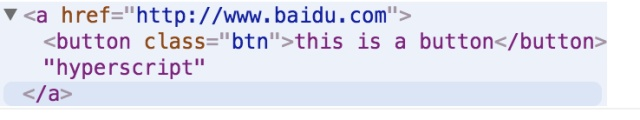

本文根据 [ zpao/building-react-from-scratch
](https://link.zhihu.com/?target=https%3A//github.com/zpao/building-react-
from-scratch) 和 [ Implementation Notes - React
](https://link.zhihu.com/?target=https%3A//reactjs.org/contributing/implementation-
notes.html)

逐步讲解 react 的实现。

## hyperscript（configuration -> dom)

浏览器提供了 DOM API 方便我们生成元素，如通过如下代码即可生成如下的 DOM 元素

    var elem = document.createElement('a');
    elem.href= 'http://www.baidu.com'
    elem.textContent = 'hyperscript'

一个 DOM 元素主要由三部分组成 nodeType，props，和 children 组成，因此只需要提供{nodeType,props,children}既可以构建出想要的 DOM 元素。

> 这里得区分下 attr 和 prop 的区别。 [ angular2 文档
> ](https://link.zhihu.com/?target=https%3A//angular.cn/guide/template-syntax)
> 中有比较好的说明  
>  **attribute 是由 HTML 定义的。property 是由 DOM (Document Object Model) 定义的。**  
>  1.少量 HTML attribute 和 property 之间有着 1:1 的映射，如 id。  
>  2.有些 HTML attribute 没有对应的 property，如 colspan。  
>  3.有些 DOM property 没有对应的 attribute，如 textContent。  
>  4.大量 HTML attribute 看起来映射到了 property…… 但却不像我们想的那样！  
>  **attribute** **_初始化_ ** **DOM property，然后它们的任务就完成了。property
> 的值可以改变；attribute 的值不能改变。**

因此 hyperscript 使用 property 而非 attribute 来构建 DOM 节点，其用法如下

    const h = require('hyperscript')
    const node = h('a', {href: 'http:www.baidu.com'}, 'hyperscript')
    console.log(node.outerHTML)// => '<a href="http://www.baidu.com">hyperscript</a>

## mount （element -> dom)

hyperscript 为了提供便利性提供了很多快捷操作，例如 h('div#id')等价于 h('#id')等价于 h('div',{id:'id'}这带来便利的同时，也使得难以精确定义配置的具体类型，为了更加精确定义配置的格式，我们定义其类型为 ReactElement 其类型定义如下，并把配置对象称为 element。

     type ReactElement = ReactDOMElement;

    type ReactDOMElement = {
      type : string,
      props : {
        children : ReactNodeList,
        className : string,
        etc.
      }
    };
    type ReactNodeList = ReactNode | ReactEmpty;

    type ReactNode = ReactElement | ReactFragment | ReactText;

    type ReactFragment = Array<ReactNode | ReactEmpty>;

    type ReactText = string | number;

    type ReactEmpty = null | undefined | boolean;

而根据 element 生成 DOM 节点的函数称为 mount，其类型定义如下

    mount = (ReactElement) => Dom节点

我们发现 ReactElement 的类型定义是递归的，这就意味这 mount 的实现也是递归的。

mount 的简单实现如下。

    function mount(element) {
      var type = element.type;
      var props = element.props;
      var children = props.children;

      children = children.filter(Boolean); // 对ReactEmpty进行过滤，其不渲染

      var node = document.createElement(type);
      Object.keys(props).forEach(propName => {
        if (propName !== 'children') {
          node.setAttribute(propName, props[propName]);
        }
      });

      // 递归mount children
      children.forEach(childElement => {
        if(typeof childElement === 'string'){
           childNode = mountText(childElement);   //若子节点为ReactText则渲染文本节点
        }else {
           childNode = mount(childElement); //若子节点为Reactelement则递归渲染
        }
        node.appendChild(childNode);
      });
      return node;
    }
    function mountText(text){
     return document.createTextNode(text);
    }
    //测试
    var element1 = {
      type: 'a',
      props: {
        href: 'http://www.baidu.com',
        children: [{
          type: 'button',
          props: {
            class: 'btn',
            children: ['this is a button']
          },
        },
        'hyperscript']
      }
    }
    console.log(mount(element1))

执行结果如下

## 组件 （element -> element）

随着 dom 结构的复杂，配置对象 element 也变得更加复杂，类似函数提供了数据组合的抽象，组件提供了 element 组合的抽象机制用于构建更加复杂的 element 对象。

    function Button(props){
      return {
        type: 'button',
        props: {
         class: 'btn',
         children: [props.text]
       }
      }
    }

此时可以这样调用

    function Button(props){
      return {
        type: 'button',
        props: {
          class: 'btn',
          children: [props.text]
        }
      }
    }

    var element1 = {
      type: 'a',
      props: {
        href: 'http://www.baidu.com',
        children: [
          Button({text:'this is a button'}),
          Button({text:'this is another button'}),
          'hyperscript'
        ]
      }
    }
    var node = mount(element1);

这样需要每次手动调用 Button,这种调用需要手动调用 Button 函数，较为不便，且形式不太统一。为此我们需要修改 ReactElement 的定义和 mount 的实现，使得调用处比较简单一致。修改后的调用方式如下。

    var element1 = {
      type: 'a',
      props: {
        href: 'http://www.baidu.com',
        children: [
          {
            type: Button,
            props: {
              text: 'this is a button'
            }
          },
          {
            type: Button,
            props: {
              text: 'this is another button'
            }
          },
        'hyperscript']
      }
    }
    var node = mount(element1);

修改后的类型定义如下

    type ReactElement = ReactComponentElement | ReactDOMElement;

    type ReactComponentElement<TProps> = {
      type : ReactFunc<TProps>,
      props : TProps
    };
    type ReactFunc<TProps> = TProps => ReactElement

mount 的实现需要处理三种情形

- ReactComponentElement
- ReactDomElement
- ReactText

修改实现如下

    function mount(element){
      if(typeof element === 'string'){
        return mountText(element);
      }
      if(typeof element.type === 'function'){
        return mountComposite(element);
      }
      return mountHost(element);
    }
    function mountHost(element) {
      var type = element.type;
      var props = element.props;
      var children = props.children;

      children = children.filter(Boolean); // 对ReactEmpty进行过滤，其不渲染

      var node = document.createElement(type);
      Object.keys(props).forEach(propName => {
        if (propName !== 'children') {
          node.setAttribute(propName, props[propName]);
        }
      });

      // 递归mount children
      children.forEach(childElement => {
        var childNode = mount(childElement); //若子节点为Reactelement则递归渲染
        node.appendChild(childNode);
      });
      return node;
    }

    function mountText(text){
     return document.createTextNode(text);
    }
    function mountComposite(element){
      element = element.type(element.props);
      return mount(element);  // delegate to mount
    }

至此我们的 mount 已经支持函数组件了，但是 element 的构建还是略显复杂。接下来通过两种方式简化 element 的构建。

## createElement && JSX (简化 element 构建）

children 虽然作为 props 的一部分，但是在 html 中其区别于其他的属性，其支持多种形式，为此通过 createElement 统一其处理。

    function createElement(type,props,...args){
      let children = [].concat(...args);
      props.children = children;
      return { type, props };
    }
    //一、 createElement构建
    var element = createElement(
      'a', {
        href: 'http://www.baidu.com'
      },
      createElement(Button, { text: 'this is a button'}),
      createElement(Button, { text: 'this is another button'}),
      'hyperscript'
    )

至此我们的 element 构建已经比较简洁了，假如也能像写 html 一样构建 element 多好啊，JSX 的作用正是如此。JSX 语法类似 html，其使得我们可以像写 html 一样构建 element。使用 JSX 构建 element 方式如下所示。

    //二、 JSX构建
    var element = (
      <a href="http://www.baidu.com">
        <Button text="this is a button"/>
        <Button text="this is another button"/>
        hyperscript
      </a>
    )

因此只需要使用 babel 通过如下配置将（二）的语法转换为（一）的语法即可。

    {
      "presets": ["env", "react"],
      "plugins": [
        ["transform-react-jsx", {
          "pragma": "createElement" // default pragma is React.createElement
        }]
      ]
    }

至此我们的库使用方法已经很像 React 了。

完整实现如下

    function mount(element){
      if(typeof element === 'string'){
        return mountText(element);
      }
      if(typeof element.type === 'function'){
        return mountComposite(element);
      }
      return mountHost(element);
    }
    function mountHost(element) {
      var type = element.type;
      var props = element.props;
      var children = props.children;

      children = children.filter(Boolean); // 对ReactEmpty进行过滤，其不渲染

      var node = document.createElement(type);
      Object.keys(props).forEach(propName => {
        if (propName !== 'children') {
          node.setAttribute(propName, props[propName]);
        }
      });

      // 递归mount children
      children.forEach(childElement => {
        var childNode = mount(childElement); //若子节点为Reactelement则递归渲染
        node.appendChild(childNode);
      });
      return node;
    }

    function mountText(text){
     return document.createTextNode(text);
    }
    function mountComposite(element){
      element = element.type(element.props);
      return mount(element);  // delegate to mount
    }
    function Button(props){
      return (
        <button class="btn">{props.text}</button>
      )
    }
    function createElement(type,props,...args){
      let children = [].concat(...args);
      props.children = children;
      return { type, props };
    }

    var element = (
      <a href="http://www.baidu.com">
        <Button text="this is a button"/>
        <Button text="this is another button"/>
        hyperscript
      </a>
    )
    var node = mount(element);
    document.body.appendChild(node);

前面 React 已经实现了 Function Component，这节主要实现 Class Component。

Class Component 比 Function Component 要复杂的多。Function
Component 仅仅需要实现 render 功能，而 class Component 功能要多得多。主要功能如下：

- 支持生命周期，包括（componentWillMount，componentDidMount，componentWillReceiveProps, componentWillUpdate,componentDidUpdate,componentWillUnmount)。
- 支持状态更新 setState
- 支持 reconciler（Virtual Dom diff）

为支持 Class Component 需要扩充我们的 ReactElement 的类型定义，扩充定义如下

    type ReactElement = ReactComponentElement | ReactDOMElement;
    type ReactComponentElement<TProps> = {
      type : ReactClassComponent<TProps>|ReactFuncComponent<TProps>,
      props : TProps
    };
    type ReactFuncComponent<TProps> = TProps => ReactElement
    type ReactClassComponent<TProps> = (TProps) => ReactComponent<TProps>;

    type ReactComponent<TProps> = {
      props : TProps,
      render : () => ReactElement
    };

为此，mountComposite 也需要对 Class Component 支持,因此需要我们区分 Function Component 和 class
Component。

## Function or Class

如何判断一个对象是 Function 还是 Class 并非轻而易举。typeof (function(){}) 和 typeof
(class{})均返回'function'，Function 和 Class 一个区别是 Class 必须使用 new 调用，否则会抛异常。因此可以使用如下方法判断。

    isClass(obj){
      function isClass(obj){
      if(typeof obj !== 'function') return false;
      try {
        obj()
        return false;
      }catch(err){
        return true;
      }
    }
    console.log(isClass(function(){}));// false
    console.log(isClass(class{})); // true

上面的方法存在几种缺陷

- obj 本身执行就会抛出异常，这是需要我们精确判断抛出异常是因为 class 的无 new 调用导致的，很不幸规范没规定了抛出的具体异常信息，因此难以判断。
- 更严重的是，这里执行了 obj，加入 obj 本身带有副作用，这将影响程序的执行逻辑。

另一种方法是 Class 的定义含有 class 关键字，可以通过 Function.prototype.toString 进行判断。

    function isClass(v) {
      return typeof v === 'function' && /^\s*class\s+/.test(v.toString());
    }

这里存在的问题是 babel 等转译工具会将 class 转译为函数，并不能保证转译后的函数能通过该判断。

幸运的是我们并不需要判断一个对象是不是 Class，因为 React 的组件都继承自 Component
这个 Class，因此只需要判断对象是否为 Component 的子类即可。通过如下判断即可

    class Component {
    }
    Component.prototype.isReactComponent = true;

    function isClass(type){
      return (
        Boolean(type.prototype) &&
        Boolean(type.prototype.isReactComponent)
      );
    }

接下来就可以实现 mountComposite 了

    function hooks(obj,name,...args){
      obj[name] && obj[name].apply(obj,args);
    }
    function mountComposite(element){
      const { type, props } = element;
      const children = props.children;
      if(isClass(type)){
        var instance = new type(props);
        instance.props = props;
        hooks(instance, 'componentWillMount')
        element = instance.render(element);
      }else {
        element = element.type(element.props);
      }

      return mount(element);  // delegate to mount
    }
    class Link extends Component {
      render(){
        const { children } = this.props
        return (
          <a href="http://www.baidu.com">{children}</a>
        )
      }
    }

    var element = (
      

        <Button text="this is a button"/>
        <Button text="this is another button"/>
        <Link>baidu</Link>
      

    )
    var node = mount(element);
    document.body.appendChild(node);

至此已经可以实现 Class Component 的渲染功能了。

## Element && Component && Instance 区别

至此我们实现的组件均没有状态，只能接受 props 进行渲染，这样每次更新都会造成所有的组件重新渲染，重新生成新的 Dom 节点和 element 对象，效率低下。因此我们希望尽可能复用原有的 DOM 节点，只对其属性进行更新，这样尽可能的减小 Dom 操作。因此需要存储上次生成的 Dom 节点和 element 对象，为此引入了内部实例（internal
Instance）来存储这些状态。

至此我们引入了三个概念， **Element** 、 **Component** 、和 **Internal** **Instance/Component
Instance** 。其区别如下：

- Element：element 是用来描述 Dom 节点或 Instance 的对象，element 分为两种描述 Dom 节点的如{type: 'button', props: { id: 'btn'}}和描述 Instance 的如{type: Button, props: { text: 'this is a button'}}，其仅仅为一个基本对象，不含有任何额外的方法。
- Component：Component 是对 Element 组合的抽象，其用来描述组件树，其输入是 props，输出是组件树，输出的组件树既可以包含描述 Dom 的 Element，也可以包含描述 instance 的 Element，通过 Component 可以将不同的 Element 组合为 Element tree，Component 也分为两种 Function Component 和 Class Component
- Component Instance/Internal Instance：Component Instance 是 Component 的实例，且只有 Class Component 才有实例，instance 用于存储局部状态（this.state 等)和响应生命周期,而 Internal Instance 则是 React 实现的细节，用于存储 Component Instance 以用于更新和卸载操作。

## 函数多态 or 对象多态

之前的实现时 mount 根据传入的 element 类型决定调用不同的 mount 操作。这实际上是利用了函数的多态，对于无状态的操作这很方便，但当引入状态后，函数多态变得难以处理，为此使用面向对象的方式重构代码。

     mount(element){
       if(typeof element === 'string') return mountText();
       if(typeof element.type === 'string') return mountDom();
       if(typeof element.type === 'function') return mountComposite();
    }

可重构为如下形式的代码

    class Mountable {
      mount(){
        throw new Error('must implement mount method');
      }
    }
    class TextComponent extends Mountable{
      mount(){

      }
    }
    class DomComponent extends Mountable {
      mount(){

      }
    }
    class CompositeComponent extends Mountable {
      mount(){
      }
    }
    function instantiateComponent(element) {
      if(typeof element === 'string') return new TextComponent();
      if(typeof element.type === 'string') return new DomComponent();
      if(typeof element.type === 'function') return CompositeComponent();
    }
    function mount(element){
      const rootComponent = instantiateComponent(element);
      return rootComponent.mount();
    }

重构后的就可以在各类型的 instance 上存储数据了。

重构后的代码如下

    class Component {
      render(){
        throw new Error('must implement render method');
      }
    }
    Component.prototype.isReactComponent = true;

    function isClass(type) {
      return (
        Boolean(type.prototype) &&
        Boolean(type.prototype.isReactComponent)
      );
    }

    function hooks(obj,name,...args){
      obj[name] && obj[name].apply(obj,args);
    }

    class DomComponent {
      constructor(element){
        this.currentElement = element;
        this.renderedChildren = [];
        this.node = null;
      }
      getPublicInstance(){
        return this.node;
      }
      mount(){
        const { type, props } = this.currentElement;
        let children  = props.children;
        children = children.filter(Boolean);

        const node = document.createElement(type);
        Object.keys(props).forEach(propName => {
          if(propName !== 'children'){
            node.setAttribute(propName, props[propName])
          }
        })
        const renderedChildren = children.map(instantiateComponent);
        this.renderedChildren = renderedChildren;
        const childNodes = renderedChildren.map(child => child.mount());
        for(let child of childNodes){
          node.appendChild(child);
        }
        this.node = node;
        return node;
      }
    }

    class TextComponent {
      constructor(element){
        this.currentElement = element;
        this.node = null;
      }
      getPublicInstance(){
        return this.node;
      }
      mount(){
        const node = document.createTextNode(this.currentElement);
        this.node = node;
        return node;
      }
    }

    class CompositeComponent {
      constructor(element){
        this.currentElement = element;
        this.publicInstance = null; // public instance
        this.renderedComponent = null;
      }
      getPublicInstance(){
        return this.publicInstance;
      }
      mount(){
        const { type, props } = this.currentElement;
        const children = props.children;
        let instance, renderedElement;
        // delegate to mount
        if(isClass(type)){
          instance  = new type(props);
          instance.props = props;
          hooks(instance, 'componentWillMount');
          renderedElement = instance.render();
          this.publicInstance = instance;
        }else {
          renderedElement = type(props);
        }
        const renderedComponent = instantiateComponent(renderedElement);
        this.renderedComponent = renderedComponent;
        return renderedComponent.mount();
      }
    }
    function instantiateComponent(element) {
      if(typeof element === 'string') return new TextComponent(element); // internal instance
      if(typeof element.type === 'string') return new DomComponent(element);
      if(typeof element.type === 'function') return new CompositeComponent(element);
    }
    function mount(element){
      const rootComponent = instantiateComponent(element);
      return rootComponent.mount();
    }

    function Button(props){
      return (
        <button class="btn">{props.text}</button>
      )
    }
    function createElement(type,props,...args){
      props = Object.assign({},props);
      let children = [].concat(...args);
      props.children = children;
      return { type, props };
    }
    class Link extends Component {
      componentWillMount(){
        console.log('Link will Mount');
      }
      render(){
        const { children } = this.props
        return (
          <a href="http://www.baidu.com">{children}</a>
        )
      }
    }

    const element = (
      

        <Button text="this is a button"/>
        <Button text="this is another button"/>
        <Link>baidu</Link>
      

    )
    const node = mount(element);
    document.body.appendChild(node);

此时 textComponent，DomComponent 和 CompositeComponent 的 mount 逻辑全部从 mount 函数转移到内部的 mount 方法内了。

这里的 CompositeComponent 和 DOMComponent 区别于 Link 这种 Component，CompositeComponent 和 DOMComponent 是 React 内部实现的细节，不提供向外的 API，同理 CompositeComponent 和 Link 的 instance 也不同，为了进行区分，把 CompositeComponent/DOMComponent 的 instance 称为内部实例（internal
instance）而把 Link 这类的实例称为外部实例（public
instance），外部无法访问内部实例，但能通过 getPublicInstace 访问外部实例，也即组件实例，这里可以看出 DOMComponent 和 CompositeComponent 的外部实例返回类型不一致，DOMComponent 返回的是 node 节点而 CompositeComponent 返回的则是组件的实例，且对于 Function
Component 其返回值为 null。其和 React 的 ref 回调返回的实例情况一致。

至此我们可以实现 React 的 render 功能了，其接受一个 element 和 mountNode 节点，将 element 描述的 dom 树渲染到 mountNode 中。

    function render(element, mountNode){
      var rootComponent = instantiateComponent(element); // top-level internal instance
      var node = rootComponent.mount(); // top-level node
      mountNode.appendChild(node);
      var publicInstance = rootComponent.getPublicInstance(); // top-level public instance
      console.log('internal instance:', rootComponent);
      console.log('public instance:', publicInstance);
      return publicInstance;
    }
    render(app, document.querySelector('#root'));

执行后的结果是

从 internal instance 信息可以看出，

- public instance 就是 internal instance 的 node 属性值。
- DOMComposite 的 node 为 public Instance 节点,Function Component 对应的 publicInstance 为 null，Class Component 对应的 publicInstance 是 Link 的实例，其完整的存储了上次渲染产生的结果，这样就可以为后续的更新操作提供便捷。

这里实现的 render 函数与 React
的 render 有重要差别，React 的 render 只有首次 render 时才会进行 mount 操作，后续 render 进行 update 操作，因此我们的 render 也要实现 update 功能。

## Reconciliation

更新实现是 React 的核心，React v15 之前使用 [ stack reconciliation
](https://link.zhihu.com/?target=https%3A//reactjs.org/docs/reconciliation.html)
算法进行更新，v16 则使用了 [ fiber reconciliation
](https://link.zhihu.com/?target=https%3A//github.com/acdlite/react-fiber-
architecture)

本章和下章主要讲解 stack reconciliation 的实现。

因为 update 操作涉及到旧组件实例的 unmount，所以先介绍 unmount 的实现。

unmount 的实现类似于 mount，先卸载子组件后卸载父组件。前面我们在 internal
instance 上已经存储了组件的信息，只需后序遍历组件树进行卸载即可，同时执行 componentWillUnmount 的生命周期。

    function unmountComponentAtNode(mountNode){
      var node = mountNode.firstChild;
      var rootComponent = node._internalInstance; // 读取 internal instance
      rootComponent.unmount();
      mountNode.innerHTML = '';
    }

unmountComponentAtNode 需要读取\_internalInstance 且对\_internalInstance 进行 unmount 操作，这需要我们在 render 里对\_internalInstance 进行存储和 Composite
Component 及 Dom Component 对 unmount 操作进行支持。实现如下：

    function render(element, mountNode){
      if(mountNode.firstChild){ // 若组件已经mount，则卸载以前的组件
        unmountComponentAtNode(mountNode);
      }
      var rootComponent = instantiateComponent(element); // top-level internal instance
      var node = rootComponent.mount(); // top-level node
      mountNode.appendChild(node);
      node._internalInstance = rootComponent; // 存储internal instance供 unmount和update使用
      var publicInstance = rootComponent.getPublicInstance(); // top-level public instance
      return publicInstance;
    }
    class DomComponent {
      unmount(){
        this.renderedChildren.forEach(child => child.unmount()); //递归卸载children组件
      }
    }
    class CompositeComponent {
      unmount(){
        hooks(this.publicInstance, 'componentWillUnmount'); //执行生命周期
        this.renderedComponent.unmount(); // 递归执行renderedComponent
      }
    }

## Update

React 的更新基于两个关键点

- 不同的组件类型认为会生成完全不同的组件树，React 不会尝试去比对他们，而是直接卸载上一个组件树，加载新的组件树。
- 列表的对比是基于 key 值的，不同的 key 值表示不同的组件树，React 会通过替换、删除、增加、更新的方式将一个列表更新成新的列表。

为了支持更新操作我们扩充 internal instance，支持一个新的方法 receive(nextElement)以支持更新操作。

    class CompositeComponent{
       getHostNode() {
        return this.renderedComponent.getHostNode();
       }
      receive(nextElement){
        const prevProps = this.currentElement.props;
        const publicInstance = this.publicInstance;
        const prevRenderedComponent = this.renderedComponent;
        const prevRenderedElement = prevRenderedComponent.currentElement;

        this.currentElement = nextElement;
        const type = nextElement.type;
        const nextProps = nextElement.props;

        let nextRenderedElement;
        if(isClass(type)) {
          hooks(publicInstance, 'componentWillUpdate', nextProps);
          publicInstance.props = nextProps;
          nextRenderedElement = publicInstance.render();
        } else if(typeof type === 'function') {
          nextRenderedElement = type(nextProps);
        }
        if(prevRenderedElement.type === nextRenderedElement.type) {
          prevRenderedComponent.receive(nextRenderedElement);
          hooks(publicInstance,'componentDidUpdate',prevProps);
          return
        }
        const prevNode = prevRenderedComponent.getHostNode();
        prevRenderedComponent.unmount();
        const nextRenderedComponent = instantiateComponent(nextRenderedElement);
        const nextNode = nextRenderedComponent.mount();
        this.renderedComponent = nextRenderedComponent;
        prevNode.parentNode.replaceChild(nextNode, prevNode);
      }
    }
    function findDOMNode(instance){
      return instance.getHostNode();
    }

CompositeComponent 的 receive 实现如上所示，主要逻辑是

- 判断组件类型是否相同，相同则执行更新操作（由于 CompositeComponent 并不负责创建 DOM 节点，所以与 mount 类似，将其 delegate to renderedComponent 执行，依次递归直到 DOMComposite 才负责执行真正的 DOM 更新。
- 如果组件类型不同则卸载旧组件，加载新组件，同时替换旧组件渲染的 DOM 节点为新组件的 DOM 节点，因此我们需要获得旧组件的 DOM 节点，同理 delegate 到 DOM Composite，ReactDOM.findDOMNode(instance)的执行逻辑即如此
- 执行 componentWillUpdate 和 componentDidUpdate 生命周期，Function Component 因为不存在 public instance 也就无法执行所有的生命周期。

我们发现 CompositeComponent 做的更新工作实际很少，实际的 DOM 更新都 delegate 给 DomComponent 了

    class DomComponent{
      getHostNode() {
        return this.node;
      }
      updateDomProperties(prevProps, nextProps) {
        const node = this.node;
        // 删除旧的attribute
        Object.keys(prevProps).forEach(propName => {
          if(propName !== 'children' && !nextProps.hasOwnProperty(propName)) {
            node.removeAttribute(propName);
          }
        })
        // 更新新的attribute
        Object.keys(nextProps).forEach(propName => {
          if(propName !== 'children') {
            node.setAttribute(propName, nextProps[propName])
          }
        })
      }
      updateChildren(prevProps, nextProps) {
        // TODO 粗暴实现
        const children = nextProps.children;
        const node = this.node;
        // 卸载所有旧的组件
        this.renderedChildren.forEach(child => child.unmount())
        this.node.innerHTML = '';
        // 加载新的组件
        const renderedChildren = children.map(instantiateComponent);
        this.renderedChildren = renderedChildren;
        const childNodes = renderedChildren.map(child => child.mount());
        for(let child of childNodes) {
          node.appendChild(child);
        }
      }
      receive(nextElement) {
        const node = this.node;
        const preveElement = this.currentElement;
        const prevProps = preveElement.props;
        const nextProps = nextElement.props;
        this.currentElement = nextElement;

        this.updateDomProperties(prevProps, nextProps);
        this.updateChildren(prevProps, nextProps);
      }
    }

DomComponent 的更新主要包含两部分 attribute 的更新和 children 的更新，attribute 的更新比较简单，删除不存在的 attribute 和替换新的 attribute，而 children 的更新则比较复杂，最为粗暴的实现是卸载所有旧的 children 组件，加载新的 children 组件。这样使得所有的 children 组件没有办法复用之前的 DOM 结构，浪费性能。

较为复杂的实现是依次比对新旧两个 list，类型相同的则进行更新，类型不同则进行替换。

列表比对的结果有四种，对应四种操作：

- 旧列表不存在，新列表存在，对应新增(ADD)操作。
- 旧列表存在，新列表不存在，对应删除(DELETE)操作。
- 旧列表存在，新列表存在，但组件类型不同，对应替换(REPLACE)操作。
- 旧列表存在，新列表存在，且组件类型相同，对应更新(UPDATE),更新原组件即可。

  updateChildren(prevProps, nextProps) {
  const prevChildren = prevProps.children;
  const nextChildren = nextProps.children;
  const prevRenderedChildren = this.renderedChildren;
  const nextRenderedChildren = [];
  const operationQueue = [];
  for(let i=0;i< nextChildren.length;i++){
  const prevChild = prevRenderedChildren[i];
  // insert
  if(!prevChild){
  const nextChild = instantiateComponent(nextChildren[i]);
  const node = nextChild.mount();
  operationQueue.push({
  type: 'ADD',
  node
  })
  nextRenderedChildren.push(nextChild);
  continue;
  }
  const canUpdate = prevChildren[i].type === nextChildren[i].type;
  // replace
  if(!canUpdate){
  const prevNode = prevChild.getHostNode();
  prevChild.unmount();
  const nextChild = instantiateComponent(nextChildren[i]);
  const nextNode = nextChild.mount();
  console.log('prevNode:', prevNode);
  console.log('nextNode:', nextNode);
  operationQueue.push({
  type: 'REPLACE',
  prevNode,
  nextNode
  });
  nextRenderedChildren.push(nextChild);
  continue;
  }
  prevChild.receive(nextChildren[i]);
  nextRenderedChildren.push(prevChild);
  }
  // delete
  for(let j=nextChildren.length;j<prevChildren.length;j++){
  const prevChild = prevRenderedChildren[j];
  const node = prevChild.node;
  prevChild.unmount();
  operationQueue.push({
  type: 'REMOVE', node
  })
  }
  this.renderedChildren = nextRenderedChildren;

      // batch update DOM
      while(operationQueue.length > 0){
        const operation = operationQueue.shift();
        switch(operation.type){
          case 'ADD':
            this.node.appendChild(operation.node);
            break;
          case 'REPLACE':
            this.node.replaceChild(operation.nextNode, operation.prevNode);
            break;
          case 'REMOVE':
            this.node.removeChild(operation.node);
            break;
        }
      }

  }

至此我们已经实现了组件的更新操作，但其仍然存在很大的缺陷。

其对于列表的追加和尾部删除，效率很高如[<A/>,<B/>,<C/>] => [<A/>,<B/>] 或者[<A/>,<B/>] =>
[<A/>,<B/>,<C/>]只需增加或删除尾部的<C/>即可，但对于头部的插入或者删除效率很差，需要替换所有的组件，所有的 DOM 都无法复用。

为此需要一种更高效的算法来尽可能的复用原有的组件，React 通过 key 唯一的标记组件来实现原有组件尽可能的复用。

至此所有代码如下

    class Component {
      render() {
        throw new Error('must implement render method');
      }
    }
    Component.prototype.isReactComponent = true;

    function isClass(type) {
      return (
        Boolean(type.prototype) &&
        Boolean(type.prototype.isReactComponent)
      );
    }
    function createElement(type, props, ...args) {
      props = Object.assign({}, props);
      let children = [].concat(...args);
      props.children = children;
      return { type, props };
    }

    function hooks(obj, name, ...args) {
      obj && obj[name] && obj[name].apply(obj, args);
    }

    class DomComponent {
      constructor(element) {
        this.currentElement = element;
        this.renderedChildren = [];
        this.node = null;
      }
      getPublicInstance() {
        return this.node;
      }
      getHostNode() {
        return this.node;
      }
      unmount() {
        this.renderedChildren.forEach(child => child.unmount());
      }
      updateDomProperties(prevProps, nextProps) {
        const node = this.node;
        // 删除旧的attribute
        Object.keys(prevProps).forEach(propName => {
          if(propName !== 'children' && !nextProps.hasOwnProperty(propName)) {
            node.removeAttribute(propName);
          }
        })
        // 更新新的attribute
        Object.keys(nextProps).forEach(propName => {
          if(propName !== 'children') {
            node.setAttribute(propName, nextProps[propName])
          }
        })
      }
      updateChildren(prevProps, nextProps) {
        const prevChildren = prevProps.children;
        const nextChildren = nextProps.children;
        const prevRenderedChildren = this.renderedChildren;
        const nextRenderedChildren =  [];
        const operationQueue = [];
        for(let i=0;i< nextChildren.length;i++){
          const prevChild = prevRenderedChildren[i];
          // insert
          if(!prevChild){
            const nextChild = instantiateComponent(nextChildren[i]);
            const node = nextChild.mount();
            operationQueue.push({
              type: 'ADD',
              node
            })
            nextRenderedChildren.push(nextChild);
            continue;
          }
          const canUpdate = prevChildren[i].type === nextChildren[i].type;
          // replace
          if(!canUpdate){
            const prevNode = prevChild.getHostNode();
            prevChild.unmount();
            const nextChild = instantiateComponent(nextChildren[i]);
            const nextNode = nextChild.mount();
            console.log('prevNode:', prevNode);
            console.log('nextNode:', nextNode);
            operationQueue.push({
              type: 'REPLACE',
              prevNode,
              nextNode
            });
            nextRenderedChildren.push(nextChild);
            continue;
          }
          prevChild.receive(nextChildren[i]);
          nextRenderedChildren.push(prevChild);
        }
        // delete
        for(let j=nextChildren.length;j<prevChildren.length;j++){
          const prevChild = prevRenderedChildren[j];
          const node = prevChild.node;
          prevChild.unmount();
          operationQueue.push({
            type: 'REMOVE', node
          })
        }
        this.renderedChildren = nextRenderedChildren;

        // batch update DOM
        while(operationQueue.length > 0){
          const operation = operationQueue.shift();
          switch(operation.type){
            case 'ADD':
              this.node.appendChild(operation.node);
              break;
            case 'REPLACE':
              this.node.replaceChild(operation.nextNode, operation.prevNode);
              break;
            case 'REMOVE':
              this.node.removeChild(operation.node);
              break;
          }
        }
      }
      receive(nextElement) {
        const node = this.node;
        const preveElement = this.currentElement;
        const prevProps = preveElement.props;
        const nextProps = nextElement.props;
        this.currentElement = nextElement;

        this.updateDomProperties(prevProps, nextProps);
        this.updateChildren(prevProps, nextProps);
      }
      mount() {
        const { type, props } = this.currentElement;
        let children = props.children;
        children = children.filter(Boolean);

        const node = document.createElement(type);
        Object.keys(props).forEach(propName => {
          if(propName !== 'children') {
            node.setAttribute(propName, props[propName])
          }
        })
        const renderedChildren = children.map(instantiateComponent);
        this.renderedChildren = renderedChildren;
        const childNodes = renderedChildren.map(child => child.mount());
        for(let child of childNodes) {
          node.appendChild(child);
        }
        this.node = node;
        return node;
      }
    }

    class TextComponent {
      constructor(element) {
        this.currentElement = element;
        this.node = null;
      }
      getPublicInstance() {
        return this.node;
      }
      getHostNode() {
        return this.node;
      }
      receive(element){
        this.currentElement = element;
        this.node.textContent = element;
      }
      unmount() {
        this.node = null;
      }
      mount() {
        const node = document.createTextNode(this.currentElement);
        this.node = node;
        return node;
      }
    }

    class CompositeComponent {
      constructor(element) {
        this.currentElement = element;
        this.publicInstance = null;
        this.renderedComponent = null;
      }
      getPublicInstance() {
        return this.publicInstance;
      }
      getHostNode() {
        return this.renderedComponent.getHostNode();
      }
      receive(nextElement) {
        const prevProps = this.currentElement.props;
        const publicInstance = this.publicInstance;
        const prevRenderedComponent = this.renderedComponent;
        const prevRenderedElement = prevRenderedComponent.currentElement;

        this.currentElement = nextElement;
        const type = nextElement.type;
        const nextProps = nextElement.props;

        let nextRenderedElement;
        if(isClass(type)) {
          hooks(publicInstance, 'componentWillUpdate', nextProps);
          publicInstance.props = nextProps;
          nextRenderedElement = publicInstance.render();
        } else if(typeof type === 'function') {
          nextRenderedElement = type(nextProps);
        }
        if(prevRenderedElement.type === nextRenderedElement.type) {
          prevRenderedComponent.receive(nextRenderedElement);
          hooks(publicInstance,'componentDidUpdate',prevProps);
          return
        }
        const prevNode = prevRenderedComponent.getHostNode();
        prevRenderedComponent.unmount();
        const nextRenderedComponent = instantiateComponent(nextRenderedElement);
        const nextNode = nextRenderedComponent.mount();
        this.renderedComponent = nextRenderedComponent;
        prevNode.parentNode.replaceChild(nextNode, prevNode);

      }
      unmount() {
        hooks(this.publicInstance, 'componentWillUnmount');
        this.renderedComponent.unmount();
      }
      mount() {
        const { type, props } = this.currentElement;
        const children = props.children;
        let instance, renderedElement;
        // delegate to mount
        if(isClass(type)) {
          instance = new type(props);
          instance.props = props;
          hooks(instance, 'componentWillMount');
          renderedElement = instance.render();
          this.publicInstance = instance;
        } else {
          renderedElement = type(props);
        }
        const renderedComponent = instantiateComponent(renderedElement);
        this.renderedComponent = renderedComponent;
        return renderedComponent.mount();
      }
    }
    function instantiateComponent(element) {
      if(typeof element === 'string') return new TextComponent(element);
      if(typeof element.type === 'string') return new DomComponent(element);
      if(typeof element.type === 'function') return new CompositeComponent(element);
      throw new Error('wrong element type');
    }
    function mount(element) {
      const rootComponent = instantiateComponent(element);
      return rootComponent.mount();
    }
    function findDOMNode(instance){
      return instance.getHostNode();
    }
    function render(element, mountNode) {
      if(mountNode.firstChild) {
        const prevNode = mountNode.firstChild;
        const prevComponent = prevNode._internalInstance;
        const prevElement = prevComponent.currentElement;
        if(prevElement.type === element.type) {
          prevComponent.receive(element);
          return;
        }
        unmountComponentAtNode(mountNode);
      }
      var rootComponent = instantiateComponent(element); // top-level internal instance
      var node = rootComponent.mount(); // top-level node
      mountNode.appendChild(node);
      node._internalInstance = rootComponent;
      var publicInstance = rootComponent.getPublicInstance(); // top-level public instance
      return publicInstance;
    }
    function unmountComponentAtNode(mountNode) {
      var node = mountNode.firstChild;
      var rootComponent = node._internalInstance; // 读取 internal instance

      rootComponent.unmount();
      mountNode.innerHTML = '';
    }

    const React = {
      render,
      unmountComponentAtNode
    }

    // test example
    class Link extends Component {
      componentWillMount() {
        console.log('Link will Mount');
      }
      componentWillUnmount() {
        console.log('Link will Unmount');
      }
      componentWillUpdate() {
        console.log('Link will update')
      }
      componentDidUpdate() {
        console.log('Link Did update')
      }
      render() {
        const { children } = this.props
        return (
          <a href="http://www.baidu.com">{children}</a>
        )
      }
    }
    function Button(props) {
      return (
        <button class="btn">{props.text}</button>
      )
    }
    class App extends Component {
      componentWillMount() {
        console.log('App will Mount');
      }
      componentWillUnmount() {
        console.log('App will Unmount');
      }
      componentWillUpdate() {
        console.log('App will update')
      }
      componentDidUpdate() {
        console.log('App Did update')
      }
      render() {
        const { content } = this.props;
        if(content === 'toutiao'){
          return (
            

              <Link> { content}</Link>
              <Link> { content}</Link>
            

          )
        }
        return (
          

            <Button text="this is a button" />
            <Link>{content}</Link>
          

        )
      }
    }
    const mountNode = document.querySelector('#root');
    React.render(<App content="baidu"/>, mountNode);
    setTimeout(() => {
      React.render(<App content="toutiao"/>, mountNode);
    }, 1000)
