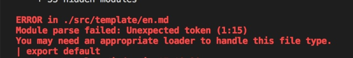
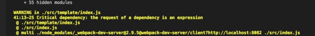

需求1：写一个组件，根据不同的语言渲染不同的合同模板，合同模板的格式是markdown。

template1.js

    
    
    import React from 'react';
    import PropTypes from 'prop-types';
    import ContractEN from './en.md';
    import ContractJA from './ja.md';
    
    export default class Template extends React.Component {
      render() {
        const { language } = this.props;
        let md;
        if(md === 'ja') {
          md = ContractJA;
        } else {
          md = ContractEN;
        }
        return (
          

            <h1 className="contract-header">This is a Contract</h1>
            

              {md}
            

          

        )
      }
    }
    

第一个问题来了，

不支持md，需要配置对应的loader，好办google搜一下，搜到了markdown-loader,webpack配置一下，问题解决。

需求2来了：这个页面也要支持移动端，页面加载要快。

好办，服务端渲染直出页面不就好了。问题又来了，我们现在的服务端是用的babel-node直接运行，代码不经过webpack处理。这样我们的markdown-
loader不就没用了吗。，没有webpack就没有webpack呗，幸好我们还有babel，用个babel插件处理下不就好了吗，搜一下很快搜到一个babel插件babel-
plugin-markdown，三下两除二，babel配置一番，代码跑起来。

问题又来了，服务端渲染的md和客户端渲染的md内容不一样，坑爹，估计这俩用的不是一个md
parser。得了我不用插件还不行吗。markdown不就是字符串吗，我直接导出字符串然后自己用parser解析不就能保证parser是一致的了吗。废话少说开搞。

en.md.js

    
    
    export default `# this is an en contract`

template2.js

    
    
    import React from 'react';
    import PropTypes from 'prop-types';
    import ContractEN from './en.md.js';
    import ContractJA from './ja.md.js';
    import marked from 'marked';
    
    export default class Template extends React.Component {
      render() {
        const { language } = this.props;
        let md;
        if(md === 'ja') {
          md = ContractJA;
        } else {
          md = ContractEN;
        }
        return (
          

            <h1 className="contract-header">This is a Contract</h1>
            

              {marked(md)}
            

          

        )
      }
    }

代码跑起来！搞定万事OK，吃饭去。

需求三来了：XX你的页面在手机端怎么那么慢！你的js包有1M多，怎么那么大。

怎么可能，我的页面可是用了SSR的，页面直出怎么可能慢。打开chrome
devtools，js怎么那么大，看看代码恍然大悟。一个markdown就200多k，同时要支持好多门语言，光md文件大小加起来就1M多了，怎么可能小。既然这些md文件不是同时使用那么我就可以使用高大上的code
split技术啦。webpack3对code split的支持特别良好，只要使用了dynamic import就可以了自动的进行code
split啦。好，代码撸起来。

template3.js

    
    
    import React from 'react';
    import PropTypes from 'prop-types';
    import marked from 'marked';
    
    export default class Template extends React.Component {
      constructor(){
        super();
        this.state = {
          md:''
        }
      }
      componentDidMount() {
        this.getHtml().then(md => {
          this.setState({
            md
          })
        })
      }
      getHtml = () =>{
        const { language } = this.props;
        const path = `./${language}.md.js`
        return import(path).then(module => module.default)
      }
      render() {
        console.log('html:', this.state.md);
        return (
          

            <h1 className="contract-header">This is a Contract</h1>
            

              {marked(this.state.md)}
            

          

        )
      }
    }
    

跑起代码来，又挂了！！！

我了个擦，webpack的dynamic import是假的dynamic
import，居然不支持表达式（其实是支持的，支持部分表达式）。好吧不支持就算了写个逻辑判断一下不就得了（更多语言的话，写个大map就好了）。

    
    
     getHtml = () =>{
        const { language } = this.props;
        
        if(language === 'ja'){
          return import('./ja.md.js').then(module => module.default);
        }else {
          return import('./en.md.js').then(module => module.default);
        }
      }

跑起来，包体积瞬间缩小为100多k了，牛逼！哈哈多刷刷页面欣赏一下劳动成果。等等，服务端渲染怎么挂了。悲催。。。。。，服务端不支持dynamic
import，语法解析就报错了。好吧，幸好我有babel，搜一下果然搜索到一个babel-plugin-dynamic-import-
node,.babelrc配置火速搞起。这下服务端倒是不报错了，但是服务端渲染依然无效。原因很简单，我的this.state.md是在componentDidMount阶段才执行，可是服务端根本就不执行该生命周期。

好吧，我服务端动态加载md不就行了。好久好在服务端的模块机制本来就是动态的，比webpack的dynamic import靠谱多了。代码撸起来

template4.js

    
    
    import React from 'react';
    import PropTypes from 'prop-types';
    import marked from 'marked';
    
    export default class Template extends React.Component {
      constructor(props){
        super(props);
        this.state = {
          md: this.getHtmlSync()
        }
      }
      componentDidMount() {
        this.getHtmlAsync().then(md => {
          this.setState({
            md
          })
        })
      }
      getHtmlAsync = () =>{
        const { language } = this.props;
        
        if(language === 'ja'){
          return import('./ja.md.js').then(module => module.default);
        }else {
          return import('./en.md.js').then(module => module.default);
        }
      }
      getHtmlSync = () => {
        const { language } = this.props;
        return require(`./${language}.md.js`).default;
      }
      render() {
        console.log('html:', this.state.md);
        return (
          

            <h1 className="contract-header">This is a Contract</h1>
            

              {marked(this.state.md)}
            

          

        )
      }
    }
    

哈哈哈一切正常，吃饭去。

需求四来了：XX你的页面在手机端怎么还是那么慢！你的js包有1M多，怎么那么大。

怎么可能，吃饭前我都搞好了，打开一看js包果然还是那么大，而且没有chunk了，

难道是require的锅，果不其然，删掉require，js包就变小了，原来虽然这里写的是require，但是webpack仍然当作import，一股脑都加载进来，看来我得需要让webpack不执行我的require。

需求五来了：如何在代码根据不同的环境拆分不同的代码。

第一眼想到的是运行时检测global变量，判断客户端环境和服务器环境，但这样代码就算不运行，但是静态解析仍然会被解析到，webpack仍然会一股脑加载我的代码。这时候webpac.DefinePlugin这个插件就起到作用了，其可以根据你的环境变量，决定忽略掉某些代码（静态分析也会忽略掉，甚至最后生成的代码也会忽略掉），这正是我想要的。配置起来

webpack.config.js

    
    
    {
     ...
     plugins: [new webpack.DefinePlugin({__IS_WEBPACK__: true})]
     ...
    }
    

template5.js

    
    
     getHtmlSync = () => {
        if(__IS_WEBPACK__){
          return '';
        }else {
          const { language } = this.props;
          return require(`./${language}.md.js`).default;
        }
      }

服务端也要配置一下global.__IS_WEBPACK__ = false

好代码成功执行了，js包却没有成功缩小，饭也没得吃了。经多次试验，发现删掉dynamic-import-node后，js包就变小了，原来dynamic-
import-node的dyanmic import覆盖了webpack的dynamic import，导致code
splitting没有生效。其实dynamic-import-node会把import('./ja.md.js')翻译成
Promise.resolve().then(() => require('./ja.md.js')，这样实际上又变成了上面的问题了。

需求5：如何让webpack的babel和babel-node使用不同的babel配置

幸好babel支持env配置，这样我们就可以通过BABEL_ENV来使用不同的babel配置。

.babelrc

    
    
    {
      "env": {
          "node": {
            "plugins": [
              "dynamic-import-node"
            ]
          }
        }
    }

package.json

    
    
    {
     "scripts":{
       "start-server": "BABEL_ENV=node babel-node src/app.js"
     }
    }

至此没啥问题了，回家睡觉了。

