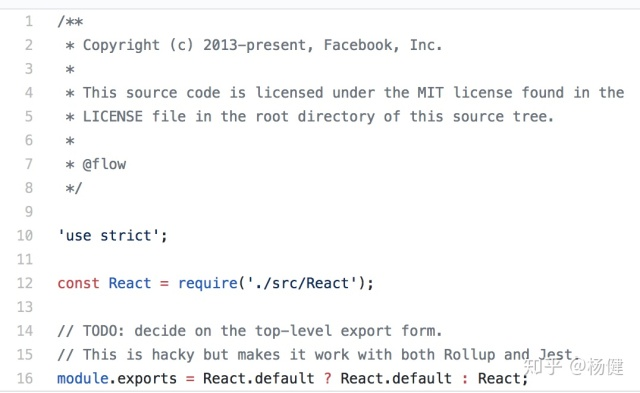

近期对项目进行升级，支持 webpack4 和开启 tree shaking 功能碰到最大的一个坑就是 esm（ES
Module)和 cjs(CommonJS)的互操作性。下面对其详细解释。

直到最近浏览器才对 es module 进行了支持，之前大家虽然写的都是 es
module,但是都是经过 webpack 或者 babel 转换成 cjs。这就导致我们以为只要编译正常，写的代码就没有任何问题。

实际上并不是如此，webpack 和 babel 也可能犯错，实际上 babel5 就错误的支持了某种模块语法，导致你编写的代码（使用了错误的语法）虽然可能存在问题，但仍然可能正常工作，但一旦 babel/webpack 修复了该问题，就导致你的代码就会出错了。

## 不要使用 export default {a, b, c}

一个常见的错误如下

**错误用法 1**

    # lib.js
    export default {
     a: 1,
     b: 2
    }
    # main.js
    import { a,b } from './lib';
    console.log('a:',a);
    console.log('b:',b);

**正确用法 1**

    # lib.js
    // 导出方式1
    const a =1;
    const b = 2;
    export {
     a, b
    }
    // 导出方式2
    export const a = 1;
    export const b = 2;

    #main.js
    // 导入方式1
    import * as lib from './lib';
    console.log(lib.a);
    console.log(lib.b);
    // 导入方式2
    import { a,b} from './lib';
    console.log(a);
    console.log(b);

**正确用法 2**

    #lib.js
    export default {
    a:1,
    b:2
    }
    # main.js
    import lib from './lib';
    console.log('a:',lib.a);
    console.log('b:',lib.b);
    const { a, b}  = lib;
    console.log('a:',a);
    console.log('b:',b);

错误用法 1 这样的写法非常常见，然而该写法是严重的错误，按照 esm 的标准，a,b 的打印结果应该是 undefined,undefined，但是假如你使用 babel5，你会得到打印结果是 1，2，这就加剧了人们的认识，认为上述写法不存在任何问题，然而这种写法导致了非常多的问题。

造成这种错误的原因就在于 对象解构(object destruct)的语法和 命名导出(named
export)的语法长得一模一样.虽然语法一模一样，但是由于两者使用的上下文不一样，import {a，b,c } from
'./xxx'，这种情况下就是 named export,不和 import/export 一起使用时才是对象解构。

babel
发现了 babel5 的这个问题，再 babel6 中已经进行了修复。上述代码在 babel6 中打印的结果就是 undefined,undefined 了。然而由于老代码的原因在迁移 babel5 到 babel6 的过程中，可以使用 babel-
plugin-add-module-exports 插件，恢复 babel5 的功能。

既然有插件支持了，我们为什么不能一直用错误用法 1 呢？这比正确用法的写法简洁很多。原因就是如果要使用插件，就必须要使用 babel 将 esm 转换为 cjs，这导致后面的打包工具难以对代码进行静态分析了。没有了静态分析，就没法做 tree
shaking 了。更主要的原因一切非标准的写法，不同工具难以保证对齐支持方式一致，这会导致各种交互性问题。

## 正确使用 ESM

esm 支持两种导入方式和三种导出方式，如下所示

    // 导出方式
    export default 'hello world'; // default export
    export const name = 'yj'; // named export
    // 导入方式
    import lib from './lib'; // default import
    import * as lib from './lib'; //
    import { method1, method2 } from './lib';

与之相比 cjs 只有一种导入和导出方式,简单很多啊，（为啥 esm 的 module 设计的那么复杂呢。。。）

    # lib.js 导出
    module.exports = {
      a: 1,
      b: 2
    }
    // 和上面等价，算一种
    exports.a = 1;
    exports.b = 2;

    //main.js 导入
    const lib = require('./lib');
    console.log('a:',lib.a);
    console.log('b:',lib.b);

与之相关的还有 dynamic import,dynamic 只有 import 并且只有一种导入方式

    # lib.js
    export default{ a:1,b:2}
    export const c = 3;
    import('./lib').then(module => {
    	console.log(module.default.a);
    	console.log(module.default.b);
    	console.log(module.c);
    });

这就导致了一个很尴尬的问题，esm 和 cjs 如何交互呢。这分为如下几种情况

1. esm 导入 cjs
2. cjs 导入 esm
3. dynamic import 导入 esm
4. dynamic import 导入 cjs

随着因为 esm 的存在多种导入和导出方式，这就导致情况更加复杂。而且不同的平台的处理方式不同，不同工具生成的代码之间又如何处理导入和导出。

这进一步导致了不同平台生成的代码要如何交互,rollup, webpack, babel,
typescript,浏览器，node 这几种工具要怎么处理 cjs 和 esm 的交互性呢。简直一大深坑。

[ https:// github.com/rollup/rollu p/issues/1078
](https://link.zhihu.com/?target=https%3A//github.com/rollup/rollup/issues/1078)
，

[ https:// github.com/Microsoft/Ty peScript/issues/2719
](https://link.zhihu.com/?target=https%3A//github.com/Microsoft/TypeScript/issues/2719)

这几个 issue 深入反映了 esm 转换成 cjs 的坑。

相关的 stackoverflow 讨论 [ https:// stackoverflow.com/quest ions/39276608/is-
there-a-difference-between-export-default-x-and-export-x-as-
default/39277065#39277065
](https://link.zhihu.com/?target=https%3A//stackoverflow.com/questions/39276608/is-
there-a-difference-between-export-default-x-and-export-x-as-
default/39277065%2339277065) ，

React 的实现甚至为了兼容不同打包工具做了相应的 hack。

 react 的 hack

ESM 和 CJS 的互操作的复杂性大部分是来源于 default 的导入和导出。

因此 tslint 特别加了一条规则检验 [ https:// palantir.github.io/tsli nt/rules/no-default-
export/
](https://link.zhihu.com/?target=https%3A//palantir.github.io/tslint/rules/no-
default-export/)

    Named imports/exports promote clarity. In addition, current tooling differs on the correct way to handle default imports/exports. Avoiding them all together can help avoid tooling bugs and conflicts.

主要的出发点在于不同的工具对于 default import/exports 的处理有所不同，这导致将不同工具一起使用时可能会产品诡异的 bug（简单的例子就是
使用 ts-loader 处理 ts，然后在由 babel-loader,然后再由 webpack 处理）。

如果没有 default 的导入和导出。esm 和 cjs 两者的对应关系就简单的多。

## ESM 模块加载 CJS 模块

    // lib.js
    module.exports = {
     a: 1,
     b: 2
    }
    // main.js
    import { a , b} from './lib';
    import * as lib from './lib';
    import lib2 from './lib';
    console.log(a, b, lib, lib2);

webpack4 编译后打印结果是 " { a:1,b:2} 1 2 \\{ a:1, b: 2} ",证明其等价于

    export const a = 1;
    export const b = 2;

## CJS 加载 ES 模块

    // lib.js

    export var a = 1;
    export const b = 2;
    setTimeout(() => {
      a = 10;
    })

    setTimeout(() => {a:1});
    // main.js
    const lib = require('./lib');
    console.log(lib,lib.a, lib.b);
    setTimeout(() => {
      console.log(lib.a);
    },100)

webpack4 编译后的打印结果是 { a: [Getter], b: [Getter] } 1 2,10，这里之所以是 Getter，因为 esm 的 named
export 是 live bind，所以 lib 里 a 的变化会影响到 main.js 里导入的 lib.a 的值。

没有 default 情况下 ESM 和 CJS 的导入和导出关系还是很容易一一对应的。一旦涉及到 default 的导入导出，就变的比较麻烦了。

## **最佳实践**

为了简化 ESM 和 CJS 的互操作性，和支持 webpack tree shaking，以及老代码的兼容性我们对模块的导入和导出加如下限制。

1. **禁止在前端代码使用 commonjs**
2. 导出  
   对于单 class，function，变量、及字面量的导出使用 export default ,禁止对复合对象字面量进行导出操作包括数组和对象

    // lib1.js
    export default 1; // ok
    // lib2.js
    const a = 1;
    // lib3.js
    export default 1; // ok
    // lib4.js
    export default function name() {} // ok
    // lib5.js
    export default class name {}; // ok
    // lib6.js
    export default { a: 1, b: 2 } // not ok

3\. 导入,对于 export default 的导出，使用 import xxx from,对于 named export 的导出使用 import \* as
lib from './lib' 和 import “\\{ a,b,c}" from './lib'

    import A from './lib1';
    import B from './lib2';
    import * as lib from './lib6';
    import { a, b} from './lib6';

## **代码迁移**

代码方案虽然已经定下来了，但是如何迁移老代码实际上是个问题，上百个组件，一个个修改也不太现实，所幸找到了个自动化迁移工具 [ 5to6-codemod
](https://link.zhihu.com/?target=https%3A//github.com/5to6/5to6-codemod)
,其可以先通过 exports 和 cjs
transform 将 module.exports 和 require 转换为 export 和 import，接着可以通过 named-export-
generation 将 export default 进行转换，转换方式如下

    # 源格式 lib.js
    export default { a,b c}
    ## 转换后的格式
    const exported = { a,b ,c}
    export default exported;
    export const { a,b,c} = exported;

之所以进行上述转换是因为兼容两种 import 的写法

     # 方式1
     import Lib from './lib.js'
     console.log(Lib.a,Lib.b)
    // export default exported 为了兼容此写法
    # 方式 2
    import { a,b ,c} from './lib.js';
    // export const { a,b,c} = exported; 为了兼容老代码中使用babel5导致的错误的写法

通过工具我们就自动完成了老代码的迁移，为了进一步防止新代码使用错误的方式，我们可以通过 eslint 进行禁止。通过 eslint-plugin-
import 可以对模块的用法进行精细的控制，对应上面规则，我们开启如下规则

     "import/no-anonymous-default-export": ["error", {
          "allowArrowFunction": true,
          "allowAnonymousClass": true,
          "allowAnonymousFunction": true,
          "allowLiteral": true,
          "allowObject": false,
          "allowArray": true
        }]

## Typescript 对于 CJS 和 ESM 的交互处理

对于初次尝试使用 TS 编写应用来说，碰到的第一个坑就是导入已有的库了，以 React 为例

    # index.ts
    import React from 'react';
    console.log('react:', React);

对上述代码使用 tsc 进行编译会提示如下错误

    Module '".../@types/react/index"' has no default export

错误提示很明显，React 的库并没有提供 default 导出，而是整体导出。TS 在 2.7 以前提供了 allowSyntheticDefaultImports 选项，设置为 ture 再次进行编译。不再报错，但是执行结果如下

    react undefined

很明显，虽然我们在语法检查层面进行了转换，但是实际的代码导入和导出行为并没有进行转换。如何才能成功的导入 React 呢。

方案 1： namespace import

    # 方案1
    // index.ts
    import * as React from 'react';
    console.log('react:',react);

方案 2： default 导入 + allowSyntheticDefaultImports + add-module-exports

    # 方案2
    // index.ts
    import React from 'react';
    console.log('react:',react);

    // .babelrc
    {
    ...
    plugins: ['add-module-exports']
    ...
    }
    // tsconfig.json
    {
        "allowSyntheticDefaultImports": true,
    }

方案 3：default 导入 + esModuleInterop

    // index.ts
    import React from 'react';
    console.log('react:', React);
    // tsconfig.json
    {
        "esModuleInterop": true
    }

方案 4： React 提供 default 导出

    // react.js
    module.exports = react;
    module.exports.default = react;

其中方案 1 最好，但是如果是 js 代码迁移为 ts 代码，则需要对已有的使用方式进行修改。

方案 2 适用于已有的代码已经使用了 add-module-exports 插件，只有 ts 开启语法检查的支持即可

方案 3：适用于已有代码并未使用 add-module-exports 插件，那么需要在代码生成时进行处理

方案 4：需要第三方库提供对打包工具的支持，实际上有的库已经这样干了，如

[ nerv
](https://link.zhihu.com/?target=https%3A//github.com/NervJS/nerv/blob/master/packages/nerv/index.js)

    // nerv/index.js
    module.exports = require('./dist/index.js').default
    module.exports.default = module.exports
